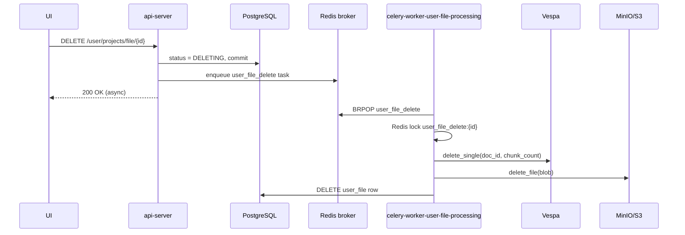
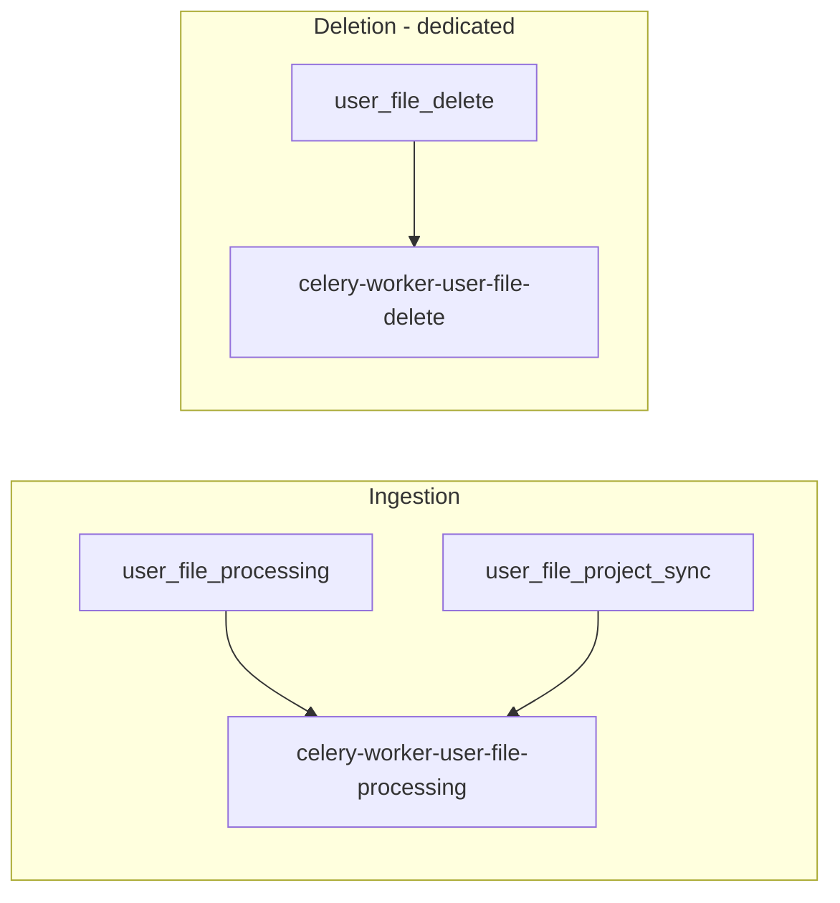

# Stuck `DELETING` User Files — Investigation & Remediation (Senior Runbook)

**Symptom:** Many rows in `public.user_file` with `status = 'DELETING'` (e.g. 110+). UI shows delete initiated, but files never disappear from Postgres; Vespa/MinIO may still hold data.

**Scope:** Onyx on OpenShift/Kubernetes, namespace `onyx-infra`, manifests in `new_manifests_values_yaml/`.

**Related:**

- **[IN-POD-REDIS-CELERY-DELETE-CHECKS.md](./IN-POD-REDIS-CELERY-DELETE-CHECKS.md)** — **start here** if you only use the **pod terminal** (no `oc`/`kubectl`)
- [TESTING-USER-FILE-DELETION-CONSISTENCY.md](./TESTING-USER-FILE-DELETION-CONSISTENCY.md)
- [FILE-DELETION-PROCESS-EXPLAINED.md](../../documentation/FILE-DELETION-PROCESS-EXPLAINED.md)

---

## 1) System design — how delete is supposed to work



| Stage | Component | Failure leaves |
|-------|-----------|----------------|
| Enqueue | API → Redis `user_file_delete` | Row `DELETING`, queue empty (never queued) |
| Consume | Celery worker | Row `DELETING`, queue backlog grows |
| Vespa delete | `process_single_user_file_delete` | Row `DELETING`, Vespa chunks remain |
| Object store | MinIO | Row `DELETING` or row gone, blob orphan |
| DB finalize | Postgres DELETE | Row stuck `DELETING` forever |

**Critical architecture fact (this repo):** One deployment consumes **three** queues:

```text
celery-worker-user-file-processing
  -Q user_file_processing,user_file_project_sync,user_file_delete
```

Heavy **upload/indexing** (`user_file_processing`) can **starve** `user_file_delete` on a single replica with default concurrency.

**Redis in this repo:** `maxmemory 400mb`, `allkeys-lru` — under extreme pressure, broker keys can be evicted (rare but possible). See [§6](#6-redis-specific-investigation).

---

## 2) Root-cause hypothesis matrix

| ID | Hypothesis | How to confirm | Fix |
|----|------------|----------------|-----|
| H1 | Worker down / CrashLoop / OOM | UI: pod not Running for `celery-worker-user-file-processing` | Fix resources, restart pod |
| H2 | Queue backlog, worker saturated | `LLEN user_file_delete` high, slow log progress | Scale workers, dedicated delete queue |
| H3 | Upload queue starves delete (same worker) | `LLEN user_file_processing` high while delete stuck | Split queues to separate deployments |
| H4 | Tasks never enqueued | `DELETING` count high, `LLEN user_file_delete` = 0 | Beat re-queue, manual re-enqueue, fix API/redis |
| H5 | Vespa 429 / timeout on delete | Worker logs `429`, Vespa logs throttle | Throttle indexing, scale Vespa, retry |
| H6 | Task exception (S3, DB, lock) | Worker logs `process_single_user_file_delete` + traceback | Fix credentials, Vespa, lock timeout |
| H7 | Redis memory/eviction | Redis `INFO memory`, evicted_keys | Raise maxmemory, persistence policy review |
| H8 | celery-beat not running | No periodic re-queue for stuck DELETING | Scale/fix beat |
| H9 | Wrong Redis DB / broker URL mismatch | API and workers different `REDIS_*` | Align env on all pods |

---

## 3) Phase 0 — Investigation (30–60 min, copy/paste)

> **Pod terminal only?** Use **[IN-POD-REDIS-CELERY-DELETE-CHECKS.md](./IN-POD-REDIS-CELERY-DELETE-CHECKS.md)** — all steps use shells inside `postgresql`, `redis`, and `celery-worker-*` pods.

### 3.1 Postgres — backlog size

**Pod:** `postgresql`

```sql
SELECT status, COUNT(*) FROM public.user_file GROUP BY status ORDER BY status;

SELECT COUNT(*) AS deleting FROM public.user_file WHERE status = 'DELETING';

SELECT MIN(created_at) AS oldest, MAX(created_at) AS newest
FROM public.user_file WHERE status = 'DELETING';
```

### 3.2 Redis — queue depths

**Pod:** `redis`

```bash
redis-cli -a "$REDIS_PASSWORD" LLEN user_file_delete
redis-cli -a "$REDIS_PASSWORD" LLEN user_file_processing
redis-cli -a "$REDIS_PASSWORD" LLEN user_file_project_sync
```

From **api-server** or **celery-worker** pod if Redis pod has no shell:

```bash
redis-cli -h "$REDIS_HOST" -p "$REDIS_PORT" -a "$REDIS_PASSWORD" LLEN user_file_delete
```

**Interpretation:**

| `user_file_delete` | `DELETING` rows | Likely diagnosis |
|--------------------|-----------------|------------------|
| High (~100+) | High | H2 — worker behind |
| 0 | High | H4/H6 — tasks lost or failing without re-queue |
| Decreasing | Decreasing | Healthy drain |

### 3.3 Worker health

**Pod:** `celery-worker-user-file-processing` (UI → Logs, or terminal):

```bash
celery -A onyx.background.celery.versioned_apps.user_file_processing inspect active
```

Search logs for: `process_single_user_file_delete`, `429`, `Failed`, `Vespa`, `Error`.

**Pod:** `celery-beat` — logs should show periodic tasks if beat is healthy.

### 3.4 Redis server health

**Pod:** `redis`

```bash
redis-cli -a "$REDIS_PASSWORD" PING
redis-cli -a "$REDIS_PASSWORD" INFO memory | grep -E 'used_memory_human|maxmemory|evicted_keys'
```

### 3.5 Vespa (delete step)

**Pod:** `vespa-0` (or your Vespa pod) — open **Logs** in UI, search `429` or `throttl`.

### 3.6 Env consistency (API vs worker)

**Pod:** `api-server` then `celery-worker-user-file-processing`:

```bash
echo "REDIS_HOST=$REDIS_HOST REDIS_PORT=$REDIS_PORT"
```

Values should match.

### 3.7 Record findings (template)

```text
Date:
DELETING count:
user_file_delete LLEN:
user_file_processing LLEN:
Worker pod status:
Top log error line:
Vespa 429 yes/no:
Redis evicted_keys:
Diagnosis (H1–H9):
```

---

## 4) Phase 1 — Unblock production (safe order)

### Step 1 — Stop making it worse

- Pause bulk uploads / connector reindex during drain.
- Optionally lower indexing concurrency in `02-configmap.yaml` (Vespa 429).

### Step 2 — Restore worker capacity

Ask your platform admin to scale **celery-worker-user-file-processing** or deploy **celery-worker-user-file-delete** (manifests in repo).  
You can monitor drain from **redis** pod: `redis-cli -a "$REDIS_PASSWORD" LLEN user_file_delete` every minute.

### Step 3 — Deploy dedicated delete worker (recommended)

Manifests: `new_manifests_values_yaml/10-celery-worker-user-file-delete-dedicated.yaml` + updated `10-celery-workers-additional.yaml` (applied via your GitOps/admin process).

### Step 4 — Watch drain

**Pod:** `redis` — run every minute:

```bash
redis-cli -a "$REDIS_PASSWORD" LLEN user_file_delete
```

**Pod:** `postgresql`:

```sql
SELECT COUNT(*) FROM public.user_file WHERE status = 'DELETING';
```

### Step 5 — Re-queue if queue empty but rows remain (H4)

If `LLEN user_file_delete` is 0 but many `DELETING` rows:

1. Restart beat + user-file workers.
2. Use diagnostic script: `scripts/diagnose-user-file-delete-backlog.sh`
3. Manual re-enqueue from worker pod (per ID or batched) — maintenance window.

Example (single file) — **inside** `celery-worker-user-file-processing` pod terminal:

```bash
celery -A onyx.background.celery.versioned_apps.user_file_processing call \
  onyx.background.celery.tasks.user_file_processing.tasks.process_single_user_file_delete \
  --kwargs='{"user_file_id":"<UUID>","tenant_id":"public"}'
```

> **Tenant ID:** Use your real tenant from `get_current_tenant_id` / deployment config (often `public` for single-tenant).

---

## 5) Phase 2 — Target architecture (prevent recurrence)



| Practice | Why |
|----------|-----|
| **Dedicated `user_file_delete` worker** | Deletes are latency-sensitive for UX and must not starve |
| **2–3 delete replicas** under bulk delete load | Parallel per-file locks |
| **Alerts** on `COUNT(*) WHERE status='DELETING'` and `LLEN user_file_delete` | Early warning |
| **Vespa headroom** | Deletes call Vespa `delete_single`; 429 blocks completion |
| **Redis memory ≥ 1Gi** for busy broker | Reduce eviction risk vs 400mb default |

---

## 6) Redis-specific investigation

Current manifest (`04-redis.yaml`):

- `--maxmemory 400mb`
- `--maxmemory-policy allkeys-lru`
- No AOF (`appendonly no`)

**Risks:**

- High Celery traffic + cache keys → eviction of broker lists (task loss) — **H7**
- Password mismatch → workers cannot consume — **H9**

**Checks (pod `redis`):**

```bash
redis-cli -a "$REDIS_PASSWORD" INFO stats | grep evicted_keys
redis-cli -a "$REDIS_PASSWORD" CLIENT LIST | head
```

**Hardening (optional):** Increase to `1gb`+ and monitor `evicted_keys`. Consider separate Redis for broker vs cache in large deployments (enterprise pattern).

---

## 7) Phase 3 — Consistency audit (after drain)

Pick 5 random former `DELETING` UUIDs (or files that should be gone):

### Postgres

```sql
SELECT id, status FROM public.user_file WHERE id = '<UUID>';
-- Expect: 0 rows
```

### Vespa

```bash
# INDEX_NAME from search_settings
vespa query "yql=select document_id from <INDEX_NAME> where document_id contains \"<UUID>\";" "hits=3"
```

### OpenSearch (if dual-write enabled)

```bash
curl -sk -u admin:PASS "https://opensearch.../<INDEX_NAME>/_search" -H 'Content-Type: application/json' \
  -d '{"size":1,"query":{"term":{"document_id":"<UUID>"}}}'
```

Orphans in Vespa with no `user_file` row → run manual `delete_single` or connector cleanup task.

---

## 8) What NOT to do (without follow-up)

| Action | Risk |
|--------|------|
| `DELETE FROM user_file WHERE status='DELETING'` only | Ghost chunks in Vespa, blobs in MinIO |
| Scale workers without fixing Vespa 429 | Tasks fail faster, still stuck |
| Ignore `DELETING` in UI lists | “Deleted” files reappear in some endpoints |

If SQL bulk cleanup is required as last resort, pair with Vespa delete per `document_id` and object-store cleanup.

---

## 9) Manifest changes in this repo

| File | Purpose |
|------|---------|
| `10-celery-worker-user-file-delete-dedicated.yaml` | Worker only on `user_file_delete`, 2 replicas default |
| `10-celery-workers-additional.yaml` | Mixed worker: **removed** `user_file_delete` from `-Q` |
| `scripts/in-pod-check-delete-backlog.sh` | Run **inside** api/celery pod terminal |
| `scripts/diagnose-user-file-delete-backlog.sh` | Cluster-admin diagnostic (optional) |

---

## 10) Success criteria

- [ ] `SELECT COUNT(*) ... DELETING` → 0 (or only files deleted in last few minutes)
- [ ] `LLEN user_file_delete` → 0
- [ ] Worker logs show `Completed id=` for sample deletes
- [ ] No sustained Vespa 429 during delete window
- [ ] Dedicated delete worker Running with ≥2 replicas

---

*Version 1.0 — 2026-05-29*
