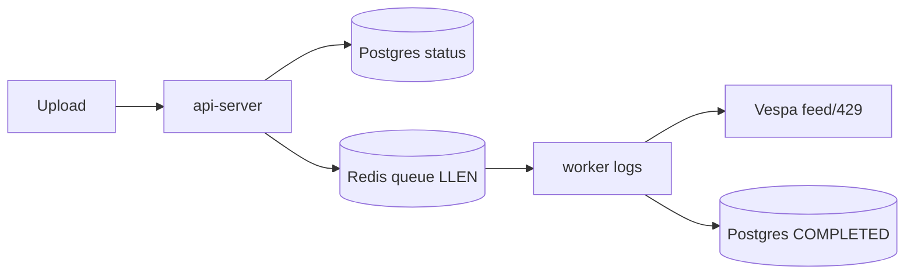

# Investigation Scenario: Local vs OpenShift — Tasks, Redis, Workers

**Goal:** Run the **same controlled file-upload + delete experiment** on two fresh deployments and compare how **Celery tasks**, **Redis queues**, and **workers** behave.

- **Deployment A — Local:** Onyx on your laptop (Docker Compose).
- **Deployment B — OpenShift:** Onyx in cluster, namespace `onyx-infra`, **in-pod terminal** only (no `oc`/`kubectl` on laptop).

**Why:** Isolate whether stuck deletes / slow indexing / Redis backlog are **caused by the environment** (OpenShift networking, SCC, storage, single worker, Vespa 429) versus **inherent Onyx behavior** (reproducible locally).

**Related:**

- [REDIS-IN-ONYX-TECHNICAL-OVERVIEW.md](./REDIS-IN-ONYX-TECHNICAL-OVERVIEW.md)
- [IN-POD-REDIS-CELERY-DELETE-CHECKS.md](./IN-POD-REDIS-CELERY-DELETE-CHECKS.md)
- [DELETING-FILES-STUCK-INVESTIGATION-AND-REMEDIATION.md](./DELETING-FILES-STUCK-INVESTIGATION-AND-REMEDIATION.md)

---

## 0) Technical terms used in this test

| Term | Meaning |
|------|---------|
| **Broker** | Redis store holding Celery task **queues** (db15 in Onyx) |
| **Queue / list** | Ordered task list; length measured by `LLEN` |
| **Priority queue** | Suffix key like `user_file_delete:1` |
| **Enqueue / dequeue** | Producer pushes task / worker pops task |
| **Worker concurrency** | Parallel tasks per worker process |
| **Prefetch** | Tasks a worker reserves ahead |
| **Backlog** | Tasks waiting in queue (`LLEN > 0`) |
| **Throughput** | Tasks completed per unit time |
| **Latency (E2E)** | Upload accepted → searchable; delete requested → row gone |
| **Eventual consistency** | Vespa searchable shortly **after** write returns 200 |
| **Backpressure (429)** | Vespa rejecting feed when overloaded |
| **Idempotency** | Re-running a delete is safe |
| **Chunk** | Embedded text segment stored in Vespa/OpenSearch |
| **`document_id`** | File UUID used as chunk doc id |
| **RPO/RTO** | Recovery point/time (not core here, but note durability) |

---

## 1) Pre-conditions: make both deployments comparable

You can only compare fairly if the **variables are controlled**.

| Variable | Local (A) | OpenShift (B) | Must match? |
|----------|-----------|---------------|-------------|
| Onyx image/version | e.g. `v3.1.1` | `v3.1.1` | **Yes** |
| Embedding model | same | same | **Yes** |
| Redis broker DB | db15 | db15 | Yes |
| Worker concurrency | note value | note value | **Record both** |
| Vespa resources | laptop limits | pod limits | Record (will differ) |
| Storage | local disk | PVC/storage class | Record (will differ) |
| File used for test | **same file** | **same file** | **Yes** |

> Record differences. The **differences** are your hypotheses for divergent behavior.

### Capture baseline config

**Local (A)** — host shell:

```bash
docker compose ps
docker compose exec api_server env | grep -E 'REDIS|VESPA|OPENSEARCH|CELERY|MODEL_SERVER'
```

**OpenShift (B)** — inside `api-server` pod terminal:

```bash
env | grep -E 'REDIS|VESPA|OPENSEARCH|CELERY|MODEL_SERVER'
```

Record: image tag, `CELERY_WORKER_*_CONCURRENCY`, `REDIS_HOST`, queue-related flags.

---

## 2) Test inputs (fixed)

Use **identical** files in both environments.

| File | Size | Purpose |
|------|------|---------|
| `small.pdf` | ~1 MB | Baseline latency, few chunks |
| `medium.pdf` | ~20 MB | Realistic; multiple chunks |
| `large.pdf` | ~100 MB | Stress; triggers Vespa backpressure/429 |
| `bulk/` | 20 × ~5 MB | Concurrency + delete backlog test |

Create deterministic test files if needed (host):

```bash
mkdir -p testdata/bulk
# Example: generate ~20MB dummy (replace with real PDFs for indexing)
head -c 20000000 /dev/urandom > testdata/medium.bin
```

> For **real indexing/searchable** results use actual PDFs/text. Random bytes test the pipeline plumbing but won’t produce meaningful chunks.

---

## 3) Measurement points (what to watch in BOTH)



| # | Signal | Local command | OpenShift (in-pod) |
|---|--------|---------------|--------------------|
| M1 | Postgres status | `docker compose exec relational_db psql -U postgres -c "..."` | `psql -U postgres -d postgres` in **postgresql** pod |
| M2 | Redis queue length | `docker compose exec cache redis-cli -n 15 LLEN ...` | `redis-cli -a "$REDIS_PASSWORD" -n 15 LLEN ...` in **redis** pod |
| M3 | Worker activity | `docker compose logs -f background` | **Logs** tab / `celery ... inspect active` in worker pod |
| M4 | Vespa 429 | `docker compose logs vespa \| grep 429` | **Logs** tab of **vespa** pod, search `429` |
| M5 | Searchable | Ask question in UI / API | Same |

> Local service names depend on your compose file. Common Onyx names: `api_server`, `background` (celery), `cache` (redis), `relational_db` (postgres), `index` / `vespa`. Adjust to your `docker compose ps` output.

---

## 4) Scenario 1 — Single file upload (latency + chunk integrity)

### Step 1.1 — Note start time and queue baseline

**Local:**

```bash
date -u +%H:%M:%S
docker compose exec cache redis-cli -n 15 LLEN user_file_processing:1
```

**OpenShift (redis pod):**

```bash
date -u +%H:%M:%S
redis-cli -a "$REDIS_PASSWORD" -n 15 LLEN user_file_processing:1
```

### Step 1.2 — Upload `medium.pdf` (UI or API)

Use the UI in both, or the upload API. Record the **file UUID** returned.

### Step 1.3 — Watch the queue rise then fall (M2)

Run every ~5s:

**Local:**

```bash
docker compose exec cache redis-cli -n 15 LLEN user_file_processing:1
```

**OpenShift:**

```bash
redis-cli -a "$REDIS_PASSWORD" -n 15 LLEN user_file_processing:1
```

**Expected:** value goes `0 → ≥1 → back to 0` as the worker consumes the task.

### Step 1.4 — Worker picked it up (M3)

**Local:**

```bash
docker compose logs --since=2m background | grep -Ei 'user_file|index|chunk|process_single'
```

**OpenShift:** worker pod **Logs**, search `process_single_user_file` / `index`.

### Step 1.5 — Postgres status transition (M1)

```sql
SELECT id, name, status, chunk_count, created_at
FROM public.user_file
WHERE id = '<UUID>';
```

**Expected:** `PROCESSING` → `COMPLETED`, `chunk_count > 0`.

### Step 1.6 — Searchable check (M5)

Ask a question in the UI that the file answers. Record:

- Did the **first** prompt return it? (eventual consistency)
- How many seconds after `COMPLETED`?

### Metrics to record (Scenario 1)

| Metric | Local | OpenShift | Target |
|--------|-------|-----------|--------|
| Upload accepted → `COMPLETED` (s) | | | OS within ~1.5–3× local |
| `chunk_count` | | | **Equal** in both |
| First-prompt searchable? | | | Ideally yes; note delay |
| Vespa 429 during upload | | | None for medium file |

**Interpretation:** If `chunk_count` differs for the same file → indexing/model difference. If OpenShift is far slower → resource/network/storage gap.

---

## 5) Scenario 2 — Bulk upload (concurrency + backpressure)

Upload **20 files** (`bulk/`) as fast as possible in both.

### Step 2.1 — Watch processing backlog (M2)

**Local:**

```bash
watch -n 3 'docker compose exec -T cache redis-cli -n 15 LLEN user_file_processing:1'
```

**OpenShift (redis pod):**

```bash
while true; do redis-cli -a "$REDIS_PASSWORD" -n 15 LLEN user_file_processing:1; sleep 3; done
```

### Step 2.2 — Vespa backpressure (M4)

**Local:**

```bash
docker compose logs --since=5m vespa | grep -Ei '429|pending|throttl'
```

**OpenShift:** **vespa** pod Logs, search `429` / `PendingLids`.

### Step 2.3 — Final state (M1)

```sql
SELECT status, COUNT(*), SUM(CASE WHEN chunk_count>0 THEN 1 ELSE 0 END) AS with_chunks
FROM public.user_file
GROUP BY status ORDER BY status;
```

### Metrics to record (Scenario 2)

| Metric | Local | OpenShift | Target |
|--------|-------|-----------|--------|
| Peak `LLEN user_file_processing:1` | | | Both drain to 0 |
| Time to drain queue (s) | | | OS comparable, not stuck |
| # `FAILED` | | | 0 |
| # `COMPLETED` with `chunk_count=0` | | | 0 |
| Vespa 429 count | | | Low/zero; high = under-provisioned |

**Interpretation:**

- OpenShift **429 storm** but local clean → OpenShift Vespa under-resourced or concurrency too high.
- OpenShift queue **never drains** → worker capacity / starvation problem.

---

## 6) Scenario 3 — Delete behavior (the core comparison)

This reproduces your stuck `DELETING` issue.

### Step 3.1 — Delete the 20 bulk files (UI or API)

### Step 3.2 — Delete backlog (M2) — **use `:1` and db15**

**Local:**

```bash
docker compose exec cache redis-cli -n 15 LLEN user_file_delete:1
```

**OpenShift (redis pod):**

```bash
redis-cli -a "$REDIS_PASSWORD" -n 15 LLEN user_file_delete:1
```

Poll every 5–10s in both.

### Step 3.3 — Worker delete execution (M3)

**Local:**

```bash
docker compose logs --since=3m background | grep process_single_user_file_delete
```

**OpenShift:** worker pod Logs, search `process_single_user_file_delete` (look for `Starting` / `Completed` / `Failed` / `429`).

### Step 3.4 — Postgres drain (M1)

```sql
SELECT COUNT(*) FROM public.user_file WHERE status = 'DELETING';
```

### Step 3.5 — Orphan check (consistency)

Pick one deleted UUID:

```sql
SELECT id, status FROM public.user_file WHERE id = '<UUID>';  -- expect 0 rows
```

OpenShift Vespa (vespa pod):

```bash
vespa query "yql=select document_id from <INDEX_NAME> where document_id contains \"<UUID>\";" "hits=3"
```

### Metrics to record (Scenario 3)

| Metric | Local | OpenShift | Target |
|--------|-------|-----------|--------|
| Peak `LLEN user_file_delete:1` | | | Both drain to 0 |
| Time to drain (s) | | | OS not “stuck” |
| `DELETING` count after 10 min | | | 0 in both |
| Worker `Completed` lines | | | One per file |
| Vespa orphans after delete | | | 0 |

**Interpretation (your real issue):**

| Pattern | Conclusion |
|---------|------------|
| Local drains, OpenShift stuck at high `LLEN` | OS worker capacity / starvation (uploads vs deletes on one worker) |
| Both stuck | Vespa delete / code behavior, not OS-specific |
| `LLEN=0` both but OS rows remain `DELETING` | Tasks failing after dequeue (Vespa 429, exceptions) — check worker logs |
| OS Redis `evicted_keys` rising | Broker eviction (400mb limit) dropping tasks |

---

## 7) Redis deep comparison (both)

| Check | Local | OpenShift |
|-------|-------|-----------|
| Keyspace / DBs | `docker compose exec cache redis-cli INFO keyspace` | `redis-cli -a "$REDIS_PASSWORD" INFO keyspace` |
| Broker DB size | `... -n 15 DBSIZE` | `redis-cli -a "$REDIS_PASSWORD" -n 15 DBSIZE` |
| Queue keys | `... -n 15 --scan --pattern '*user_file*'` | `redis-cli -a "$REDIS_PASSWORD" -n 15 --scan --pattern '*user_file*'` |
| Eviction | `... INFO stats \| grep evicted_keys` | `redis-cli -a "$REDIS_PASSWORD" INFO stats \| grep evicted_keys` |
| Clients connected | `... CLIENT LIST \| wc -l` | `redis-cli -a "$REDIS_PASSWORD" CLIENT LIST \| wc -l` |
| Memory | `... INFO memory \| grep used_memory_human` | `redis-cli -a "$REDIS_PASSWORD" INFO memory \| grep used_memory_human` |

**Key comparison:** `maxmemory`. Local default may be unlimited; OpenShift is **400mb** (`04-redis.yaml`). This alone can cause **eviction divergence**.

---

## 8) Worker deep comparison (both)

| Check | Local | OpenShift (worker pod) |
|-------|-------|------------------------|
| Worker alive | `docker compose logs background \| tail` | `celery -A onyx.background.celery.versioned_apps.user_file_processing inspect ping` |
| Active tasks | (logs) | `... inspect active` |
| Reserved tasks | (logs) | `... inspect reserved` |
| Registered queues | (logs at startup) | `... inspect stats` |
| Concurrency | compose env | `env \| grep CONCURRENCY` |
| Restarts/OOM | `docker compose ps` | pod **Events** / restart count in UI |

**Key comparison:** number of worker **replicas/concurrency**, and whether **one worker serves both `user_file_processing` and `user_file_delete`** (starvation source on OpenShift).

---

## 9) Result scorecard (fill this in)

| Dimension | Local (A) | OpenShift (B) | Divergence cause? |
|-----------|-----------|---------------|-------------------|
| Single upload latency | | | |
| chunk_count parity | | | |
| Bulk drain time | | | |
| Vespa 429 count | | | |
| Delete drain time | | | |
| Stuck DELETING after 10m | | | |
| Redis evicted_keys | | | |
| Worker replicas/concurrency | | | |
| Storage class / disk | | | |

---

## 10) Hypothesis → action map

| If OpenShift differs by… | Likely cause | Action |
|--------------------------|--------------|--------|
| Delete queue stuck high | One worker, uploads starve deletes | Dedicated delete worker (`10-celery-worker-user-file-delete-dedicated.yaml`), scale replicas |
| Vespa 429 only on OS | Vespa under-resourced / NFS latency | More CPU/RAM, faster storage, lower concurrency |
| Redis eviction only on OS | 400mb maxmemory | Raise Redis memory; separate broker/cache |
| chunk_count mismatch | Model/version drift | Align image + embedding settings |
| Searchable delay only on OS | Network/eventual consistency tail | Tune retry/delay; storage latency |
| Tasks vanish (LLEN 0, rows stuck) | Worker exceptions / eviction | Worker logs, raise memory, re-enqueue |

---

## 11) Reproducibility checklist

- [ ] Same Onyx version both sides
- [ ] Same test files
- [ ] Recorded worker concurrency/replicas both
- [ ] Recorded Redis maxmemory both
- [ ] Used **db15** and **`:1`** queue keys
- [ ] Captured Postgres status counts before/after
- [ ] Captured Vespa 429 counts
- [ ] Filled scorecard (§9)

---

## 12) One-paragraph summary

Run an **identical upload → bulk upload → delete** experiment on **local Docker Compose** and **OpenShift**, measuring four signals at each stage: **Postgres status** (`user_file.status`, `chunk_count`), **Redis queue length** (`LLEN user_file_processing:1` and `user_file_delete:1` on **db15**), **worker execution** (Celery `inspect`/logs for `process_single_user_file_delete`), and **Vespa backpressure** (`429`). Compare **throughput**, **drain time**, **failures**, and **consistency** (no orphans). Divergence pinpoints whether your stuck deletes are **environmental** (single worker starvation, Vespa under-provisioning, 400mb Redis eviction, storage latency on OpenShift) or **inherent** (reproducible locally).

---

*Version 1.0 — 2026-06-01*
