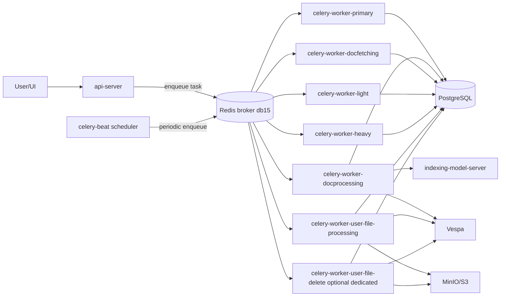
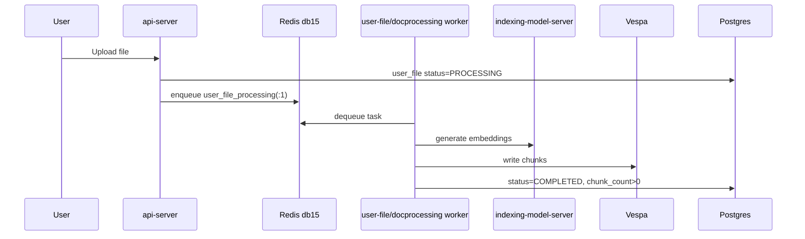
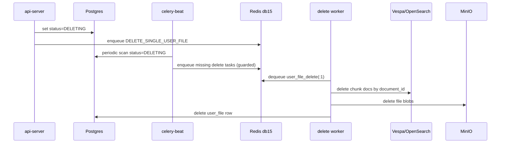

# Onyx Celery Workers — Deep Research, Architecture, and Easy Mechanism

This guide explains how Celery workers work in Onyx from a senior engineering perspective, but in simple words.
It is grounded in:

- Your current Kubernetes manifests under `new_manifests_values_yaml/`
- The current Onyx task code path (`backend/onyx/background/celery/tasks/user_file_processing/tasks.py`)
- The Redis/Celery behavior you observed in your cluster (`db15`, `user_file_delete:1` backlog)

---

## 1) The simple explanation (easy words)

Onyx uses Celery so the API can answer quickly instead of waiting for heavy work like chunking, embedding, indexing, and deleting files.

- API receives a request (upload/delete)
- API puts a job message in Redis (queue)
- A Celery worker takes that job and does the real work in background
- Worker updates Postgres status (`PROCESSING`, `COMPLETED`, `DELETING`, etc.)

If workers are slow, broken, or starved, Redis queues grow and statuses stay stuck.

---

## 2) End-to-end architecture



---

## 3) What each worker does in your deployment

From your manifests:

### `celery-worker-primary`
- App: `onyx.background.celery.versioned_apps.primary`
- Queues: `celery,periodic_tasks`
- Purpose: orchestration, generic background tasks

### `celery-worker-docprocessing`
- App: `...versioned_apps.docprocessing`
- Queue: `docprocessing`
- Purpose: chunking + embedding + document index writes
- Config: threads pool, `--concurrency=6`, `--prefetch-multiplier=1`

### `celery-worker-docfetching`
- Queue: `connector_doc_fetching`
- Purpose: fetch docs from connectors, enqueue processing work

### `celery-worker-light`
- Queues: `vespa_metadata_sync,connector_deletion,doc_permissions_upsert,checkpoint_cleanup,index_attempt_cleanup,opensearch_migration`
- Purpose: fast metadata and cleanup tasks

### `celery-worker-heavy`
- Queues: `connector_pruning,connector_doc_permissions_sync,connector_external_group_sync,csv_generation,sandbox`
- Purpose: heavier connector and export operations

### `celery-worker-user-file-processing`
- Queue: `user_file_processing,user_file_project_sync`
- Purpose: direct user upload processing and project sync

### `celery-worker-user-file-delete` (new dedicated manifest)
- Queue: `user_file_delete`
- Purpose: isolate delete throughput from upload/index starvation
- Config: threads pool, `--concurrency=4`, replicas `2`

### `celery-beat`
- App: `...versioned_apps.beat`
- Purpose: scheduler that periodically scans DB and enqueues tasks (critical for self-healing)

---

## 4) Celery + Redis technical mechanics (important)

## 4.1 Redis logical DBs

In your cluster, Celery broker queues are on **db15**.

- `db0` often contains cache/session keys
- `db15` contains broker queues and Kombu bindings
- queue checks must use `-n 15`

## 4.2 Queue key names and priority

Celery with priority can use suffixed list keys:

- `user_file_delete` (base)
- `user_file_delete:1` (priority list)

Your real backlog appeared on `user_file_delete:1`.

## 4.3 Kombu binding keys are NOT queue lists

Keys like `_kombu.binding.user_file_delete` are routing metadata (set type).
`LLEN` on those returns `WRONGTYPE` by design.

---

## 5) Upload workflow (what really happens)



### Key details
- API returns before heavy work is done
- Worker does CPU + network heavy pipeline
- Vespa write success and search visibility are not always same instant (eventual consistency window)

---

## 6) Delete workflow (and why files get stuck in DELETING)

This is where your current incident lives.



### Code-level safeguards (from Onyx task file)

`check_for_user_file_delete` uses 3 protections:

1. **Queue depth backpressure**
   - if queue depth > `USER_FILE_DELETE_MAX_QUEUE_DEPTH`, beat skips enqueue that cycle

2. **Per-file queued guard key**
   - Redis `SET NX EX` key prevents duplicate enqueue for same file

3. **Task expiry**
   - enqueued task has `expires=CELERY_USER_FILE_DELETE_TASK_EXPIRES`
   - if task waits too long in queue, Celery discards it without touching DB

### Why this can create stuck DELETING rows

If worker throughput is low and backlog high:

- tasks wait in queue too long
- some expire
- beat may skip enqueue due to queue-depth threshold
- rows stay DELETING indefinitely

This is the queue deadlock pattern you are close to.

---

## 7) Failure modes (ranked by probability for your environment)

## A) Worker starvation (high)
- One worker handling upload + delete paths
- delete queue (`user_file_delete:1`) grows faster than drain

## B) Missing or unstable celery-beat (high)
- no periodic reconciliation/re-enqueue for stuck DELETING
- one failed task can become permanent stuck row

## C) Vespa backpressure 429 (high)
- delete or index calls fail/retry
- tasks take longer, queue depth grows

## D) OpenSearch dual-index side effects (medium-high)
- if OpenSearch indexing enabled, delete path may touch more than one index backend
- failure in one backend can fail whole task

## E) Redis resource policy (medium)
- Redis configured with `maxmemory 400mb`, `allkeys-lru`
- under pressure, key eviction can disrupt broker semantics

## F) Lock contention (medium)
- per-file delete lock held; repeated attempts skip with "Lock held"

## G) Pod restarts / OOM on workers (medium)
- in-flight tasks interrupted, retries/expiry race

---

## 8) What “healthy” looks like (SLO-style)

| Signal | Healthy target |
|-------|-----------------|
| `LLEN user_file_delete:1` | Drains to near 0 between bursts |
| `COUNT(status='DELETING')` | Temporary spikes only, then returns to near 0 |
| Worker logs | Mostly `Completed id=...`, low exceptions |
| Vespa logs | Rare/zero 429 on normal load |
| Beat logs | Regular schedule ticks + enqueue summaries |
| Redis `evicted_keys` | 0 or stable low |

---

## 9) Operational commands (pod terminal style)

## Redis pod

```bash
redis-cli -a "$REDIS_PASSWORD" -n 15 LLEN user_file_delete:1
redis-cli -a "$REDIS_PASSWORD" -n 15 LLEN user_file_processing:1
redis-cli -a "$REDIS_PASSWORD" INFO keyspace
redis-cli -a "$REDIS_PASSWORD" INFO stats | grep evicted_keys
```

## Postgres pod

```sql
SELECT COUNT(*) FROM public.user_file WHERE status='DELETING';
SELECT status, COUNT(*) FROM public.user_file GROUP BY status;
```

## Worker pod (`celery-worker-user-file-processing` or dedicated delete)

```bash
celery -A onyx.background.celery.versioned_apps.user_file_processing inspect active
celery -A onyx.background.celery.versioned_apps.user_file_processing inspect ping
```

Check logs for:
- `delete_user_file_impl - Completed`
- `Lock held, skipping`
- `Queue depth ... exceeds`
- `429`, `Error processing`

---

## 10) Senior engineering recommendations

1. **Keep celery-beat always deployed** (replicas 1 is fine; must be alive).
2. **Keep delete queue isolated** via dedicated worker deployment.
3. **Use low prefetch (`--prefetch-multiplier=1`)** for fairness under mixed queues.
4. **Tune delete worker replicas by backlog**, not by guesswork.
5. **Increase Redis memory** for production broker role (400mb is thin with heavy async traffic).
6. **Alert on queue + DB status together**:
   - `LLEN user_file_delete:1`
   - `COUNT user_file status=DELETING`
7. **Treat Vespa 429 as first-class capacity signal**, not just log noise.
8. **Version-lock all Celery components** (api/workers/beat image parity).

---

## 11) Easy summary for junior engineers

Celery is Onyx’s background engine: API puts jobs in Redis, workers do the heavy work, and beat keeps the system healthy by scheduling periodic checks.
If Redis queues grow and workers can’t keep up, jobs wait too long and can expire, which leaves rows stuck in `DELETING`.
That is why we check three places together: Redis queue length, worker logs, and Postgres status counts.
The safest fix is to run beat, separate delete workers from upload workers, and scale workers while reducing Vespa overload.

---

*Document version: 1.0 — 2026-06-02*
