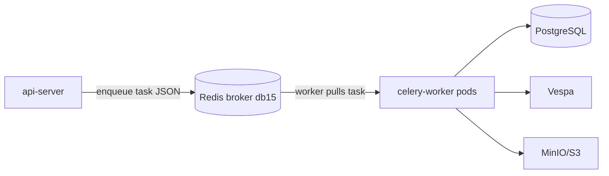
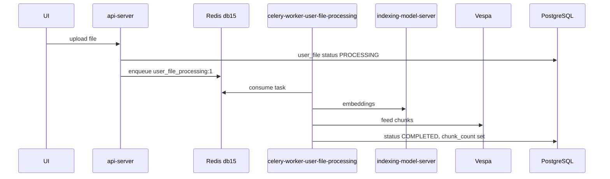

# Redis in Onyx — Technical Overview (Broker, Queues, Workflow)

**Audience:** Engineers investigating Celery, file uploads, deletes, and stuck `DELETING` rows.

**Environment:** OpenShift/Kubernetes, namespace `onyx-infra`, Redis Deployment `redis`, password in Secret `onyx-redis` / env `REDIS_PASSWORD`.

**Related:**

- [IN-POD-REDIS-CELERY-DELETE-CHECKS.md](./IN-POD-REDIS-CELERY-DELETE-CHECKS.md)
- [DELETING-FILES-STUCK-INVESTIGATION-AND-REMEDIATION.md](./DELETING-FILES-STUCK-INVESTIGATION-AND-REMEDIATION.md)

---

## 1) What Redis is in this architecture

**Redis** is an in-memory **key-value store** used here as:

| Role | Purpose in Onyx |
|------|-----------------|
| **Message broker** | Holds **Celery task queues** (async work: index files, delete files, connector sync) |
| **Result backend** (optional) | Stores task return values / state (separate logical DB) |
| **Application cache** | Session-like or short-lived app data (separate logical DB) |

Redis is **not** the system of record for users, files, or search indexes. **PostgreSQL** is. Redis is the **work queue transport** between API and background workers.



---

## 2) Glossary (technical terms)

| Term | Definition |
|------|------------|
| **Redis** | In-memory data store; supports strings, lists, sets, hashes, etc. |
| **Key** | Named entry in Redis (e.g. `user_file_delete:1`) |
| **Database index (`db`)** | Logical partition inside one Redis server (`0`–`15`…). Keys in `db0` are invisible from `db15` unless you `-n 15`. |
| **List** | Redis data type: ordered queue. Celery task queues are **lists**. |
| **`LLEN`** | Redis command: **length of a list** = number of tasks waiting in that queue |
| **`LRANGE`** | Read elements from a list (inspect queued task payloads) |
| **`TYPE`** | Redis command: returns data type (`list`, `set`, `string`, …) |
| **`SCAN`** | Iterate keys by pattern (safer than `KEYS` on large instances) |
| **Broker** | Middleware that stores messages (tasks) between producer (API) and consumer (worker) |
| **Celery** | Python **distributed task queue** framework used by Onyx background jobs |
| **Worker** | Long-running process that **consumes** tasks from Redis and executes Python functions |
| **Task** | Unit of async work (e.g. `process_single_user_file_delete`) |
| **Queue** | Named pipe of tasks. In Redis broker, implemented as a **list** whose name matches the queue name |
| **Enqueue / publish** | API pushes a task message onto the tail of the queue list |
| **Dequeue / consume** | Worker pops a task from the head (blocking `BRPOP`-style behavior via Kombu) |
| **Kombu** | Messaging library Celery uses to talk to Redis (and other brokers) |
| **`_kombu.binding.*`** | Redis **set** keys: routing metadata (which exchanges map to which queues). **Not** the task queue itself — `LLEN` on them fails with `WRONGTYPE` |
| **Priority queue suffix (`:1`)** | Celery can use separate list keys per priority, e.g. `user_file_delete:1` instead of `user_file_delete` |
| **Prefetch** | How many tasks a worker reserves ahead of time (affects fairness and backlog drain) |
| **Concurrency** | How many tasks one worker process runs in parallel (threads/processes) |
| **Beat** | Celery scheduler pod that enqueues **periodic** tasks (cron-like) |
| **Result backend** | Where Celery stores task results (often another Redis `db`, e.g. `16`) |
| **Eviction (`allkeys-lru`)** | When Redis hits `maxmemory`, it may **delete keys** to free RAM — can drop broker data if mis-sized |

---

## 3) Redis logical databases in your cluster

From `INFO keyspace` you may see:

```text
db0:keys=21,expires=17     # often cache / short TTL keys
db15:keys=20,...           # Celery **broker** (task queues) — primary for investigations
db16:...                   # Celery **result backend** (common in Onyx docs)
```

**Always specify `-n 15`** when inspecting Celery queues:

```bash
redis-cli -a "$REDIS_PASSWORD" -n 15 LLEN user_file_delete:1
```

Inspecting **db0 only** (default) explains empty `*user_file*` / `*celery*` scans while db15 has data.

**Config reference (Onyx pattern):**

```text
broker_url      → redis://...:6379/15
result_backend  → redis://...:6379/16
```

(Exact URLs come from app env inside `api-server` / workers.)

---

## 4) Onyx Celery queues (names you will see)

| Queue name (logical) | Redis list key (examples) | Producer | Consumer worker (typical) |
|----------------------|---------------------------|----------|---------------------------|
| `user_file_delete` | `user_file_delete`, **`user_file_delete:1`** | API on file delete | `celery-worker-user-file-processing` |
| `user_file_processing` | `user_file_processing`, `user_file_processing:1` | API on upload | same |
| `user_file_project_sync` | `user_file_project_sync`, … | project sync | same |
| `docprocessing` | `docprocessing`, … | connector pipeline | `celery-worker-docprocessing` |
| `connector_doc_fetching` | … | beat / primary | `celery-worker-docfetching` |
| `celery` | default queue | various | `celery-worker-primary` |

**Priority suffix:** High-priority tasks often land on `queue_name:1`. Your investigation showed:

```text
LLEN user_file_delete     → 0
LLEN user_file_delete:1   → 292   ← real delete backlog
```

---

## 5) End-to-end workflow: file delete

```mermaid
sequenceDiagram
  participant UI
  participant API as api-server
  participant PG as PostgreSQL
  participant R as Redis db15
  participant W as celery-worker
  participant V as Vespa
  participant S3 as MinIO

  UI->>API: DELETE /user/projects/file/{id}
  API->>PG: UPDATE user_file SET status='DELETING'
  API->>R: LPUSH/LPUSH-style enqueue to list user_file_delete:1
  Note over R: LLEN user_file_delete:1 increases
  API-->>UI: 200 OK

  W->>R: BRPOP user_file_delete:1
  Note over R: LLEN decreases by 1
  W->>V: delete chunks (document_id = file UUID)
  W->>S3: delete object(s)
  W->>PG: DELETE FROM user_file WHERE id=...
  Note over PG: row gone; not DELETING anymore
```

**States:**

| Location | State while waiting | State when done |
|----------|---------------------|-----------------|
| PostgreSQL | `status = DELETING` | row **deleted** |
| Redis list `user_file_delete:1` | task JSON in list (`LLEN > 0`) | task removed (`LLEN` lower) |
| Vespa | chunks may still exist | chunks removed |
| MinIO | file blob exists | blob removed |

**Stuck pattern you hit:**

- Postgres: many `DELETING`
- Redis: `LLEN user_file_delete:1 = 292`
- Meaning: **tasks are queued but workers are behind or failing after dequeue**

---

## 6) End-to-end workflow: file upload / index



Same broker (db15), **different queue lists**. Heavy `user_file_processing` traffic can delay `user_file_delete` if one worker serves both queues.

---

## 7) What each Redis key type is in your scan

Example from **db15**:

| Key | TYPE (typical) | Role |
|-----|----------------|------|
| `user_file_delete:1` | **list** | Pending **delete** tasks — use `LLEN` |
| `user_file_processing:1` | **list** | Pending **upload/index** tasks — use `LLEN` |
| `_kombu.binding.user_file_delete` | **set** | Kombu routing table — use `TYPE`, not `LLEN` |
| `_kombu.binding.celery.pidbox` | **set** | Celery worker control/monitoring (pidbox) |

---

## 8) How to investigate (in-pod, db15)

**Pod:** `redis`

```bash
# Broker DB size
redis-cli -a "$REDIS_PASSWORD" -n 15 DBSIZE

# Delete backlog (priority 1)
redis-cli -a "$REDIS_PASSWORD" -n 15 LLEN user_file_delete:1

# Upload backlog
redis-cli -a "$REDIS_PASSWORD" -n 15 LLEN user_file_processing:1

# List related keys
redis-cli -a "$REDIS_PASSWORD" -n 15 --scan --pattern '*user_file*'

# Peek one task payload
redis-cli -a "$REDIS_PASSWORD" -n 15 LRANGE user_file_delete:1 0 0
```

**Pod:** `postgresql` — ground truth for completed deletes:

```sql
SELECT COUNT(*) FROM public.user_file WHERE status = 'DELETING';
```

**Pod:** `celery-worker-user-file-processing` — proof of execution:

```bash
celery -A onyx.background.celery.versioned_apps.user_file_processing inspect active
```

---

## 9) Redis deployment settings (this repo)

From `new_manifests_values_yaml/04-redis.yaml`:

| Setting | Value | Implication |
|---------|-------|-------------|
| `maxmemory` | 400mb | Broker + cache share one instance |
| `maxmemory-policy` | `allkeys-lru` | Under pressure, **any** key can be evicted |
| `appendonly` | `no` | No AOF durability — broker is ephemeral |
| `requirepass` | from Secret | All clients must authenticate |

**Risk:** If memory is full, **queue lists can be evicted** → tasks lost while Postgres still shows `DELETING`.

Check:

```bash
redis-cli -a "$REDIS_PASSWORD" INFO stats | grep evicted_keys
```

---

## 10) Application connection env

From `new_manifests_values_yaml/02-configmap.yaml`:

```yaml
REDIS_HOST: "redis.onyx-infra.svc.cluster.local"
REDIS_PORT: "6379"
```

Workers and API also need `REDIS_PASSWORD` from Secret `onyx-redis`.

Celery constructs **broker URL** internally (typically `/15` for broker, `/16` for results) — not always visible as a single env var in ConfigMap.

---

## 11) Operational metrics that matter

| Metric | Command / query | Healthy |
|--------|-----------------|--------|
| Delete backlog | `LLEN user_file_delete:1` on **db15** | Trending **down** |
| DB stuck rows | `COUNT(*) WHERE status='DELETING'` | Trending **down** |
| Worker activity | Logs: `process_single_user_file_delete` | `Completed` lines |
| Redis memory | `INFO memory`, `evicted_keys` | Low eviction |
| Wrong DB mistake | `LLEN` without `-n 15` | Misleading `0` |

---

## 12) Architecture improvement (repo)

To prevent upload queues from starving deletes:

- **Dedicated worker:** `celery-worker-user-file-delete` — listens only to `user_file_delete`
- **Mixed worker:** `celery-worker-user-file-processing` — `user_file_processing`, `user_file_project_sync` only

See `new_manifests_values_yaml/10-celery-worker-user-file-delete-dedicated.yaml`.

---

## 13) One-paragraph summary

In Onyx, **Redis is the Celery message broker**: the API **enqueues** serialized task messages onto **list**-backed **queues** in **database 15** (e.g. `user_file_delete:1`). **Celery workers** **dequeue** those messages, run Python tasks (`process_single_user_file_delete`, etc.), then update **PostgreSQL**, **Vespa**, and **MinIO**. **`LLEN`** on the correct list key measures **backlog**. **`_kombu.binding.*`** keys are routing **sets**, not queues. **`DELETING`** in Postgres means “delete requested”; **`LLEN user_file_delete:1 > 0`** means “delete work still waiting in Redis”; both should drop together when the system is healthy.

---

*Version 1.0 — 2026-05-29*
