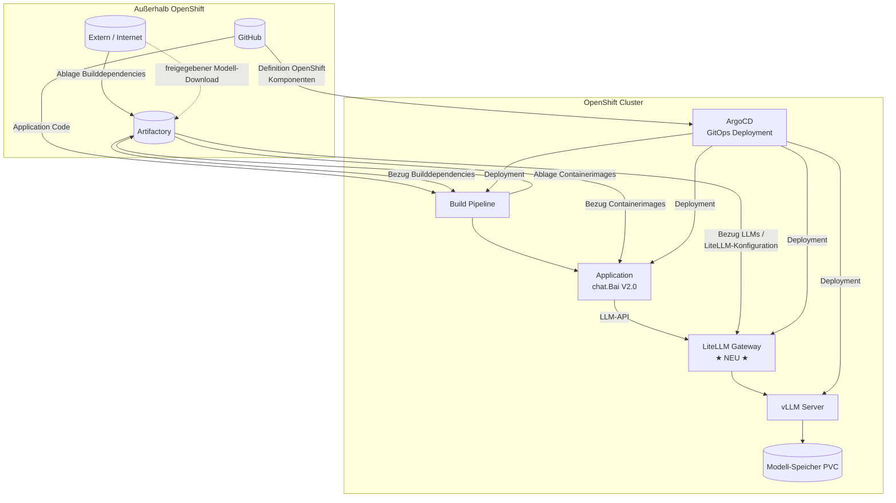

# OpenShift Deployment-Architektur (CI/CD) — mit LiteLLM-Gateway

Architekturdiagramm für **chat.Bai V2.0** auf OpenShift: GitHub, Artifactory, Build Pipeline, ArgoCD, Application — plus **LiteLLM** als LLM-Gateway im Cluster.

> **Laufzeit / Chat-Flow:** [INTERFACE-DIAGRAM-chatBai-V2-LITELLM.de.md](./INTERFACE-DIAGRAM-chatBai-V2-LITELLM.de.md)  
> **English:** [ARCHITECTURE-DIAGRAM-OPENSHIFT-CICD-LITELLM.md](./ARCHITECTURE-DIAGRAM-OPENSHIFT-CICD-LITELLM.md)

---

## Kurzüberblick (was sich ändert)

**Vorher:** Application bezog LLMs direkt von **Extern / Internet** (`Bezug LLMs`).

**Nachher:** Application ruft **LiteLLM Gateway** im OpenShift auf. LiteLLM leitet an **vLLM** weiter. Modell-Gewichte / Images weiter über **Artifactory** oder freigegebene externe Quellen.

```
  VORHER:  Application ──────────► Extern/Internet (LLMs)

  NACHHER: Application ──► LiteLLM Gateway ──► vLLM Server
                                ▲
                                └── Modell-Konfiguration
                                    (Artifactory oder Extern)
```

---

## Gesamtdiagramm (ASCII)

```
┌─────────────────┐     ┌─────────────────┐     ┌─────────────────┐
│   Artifactory   │     │ Extern /        │     │    GitHub       │
│                 │     │ Internet        │     │                 │
│ Ablage Build-   │◄────│ Ablage Build-   │     │ Application     │
│ dependencies    │     │ dependencies    │     │ Code            │
│ Containerimages │────►│ Bezug Container-│     │                 │
└────────┬────────┘     │ images          │     └────────┬────────┘
         │              └────────┬────────┘              │
         │ Bezug von             │                       │ Definition
         │ Builddependencies     │                       │ OpenShift
         │                       │                       │ Komponenten
         │                       │                       │
         ▼                       ▼                       ▼
┌────────────────────────────────────────────────────────────────────────┐
│                         OPENSHIFT CLUSTER                              │
│                                                                        │
│  ┌──────────────────┐         ┌──────────────────────────────────┐  │
│  │  Build Pipeline  │         │  Application (chat.Bai V2.0)     │  │
│  │                  │────────►│  API, Web, Worker, OpenSearch…   │  │
│  └────────┬─────────┘         └───────────────┬──────────────────┘  │
│           │                                   │ LLM-API              │
│           │ Ablage erstellter                 ▼                      │
│           │ Containerimages    ┌──────────────────────────────┐    │
│           ▼                    │  LiteLLM Gateway  ★ NEU ★     │    │
│      (→ Artifactory)           │  Routing, Auth, Logging       │    │
│                                └──────────────┬───────────────┘    │
│                                               ▼                      │
│                                ┌──────────────────────────────┐    │
│                                │  vLLM Server                 │    │
│                                └──────────────┬───────────────┘    │
│                                               ▼                      │
│                                ┌──────────────────────────────┐    │
│                                │  Modell-Speicher (PVC)       │    │
│                                └──────────────────────────────┘    │
│                                                                        │
│  ┌────────────────────────────────────────────────────────────────┐  │
│  │  ArgoCD — Deployment aller Komponenten inkl. LiteLLM + vLLM    │  │
│  └────────────────────────────────────────────────────────────────┘  │
└────────────────────────────────────────────────────────────────────────┘

Bezug LLMs / Modell-Artefakte  →  LiteLLM + vLLM  (nicht mehr direkt → Application)
```

---

## Mermaid-Diagramm



---

## Komponenten

| Komponente | Rolle | Änderung |
|------------|-------|----------|
| GitHub | Code + Manifeste | unverändert |
| Artifactory | Dependencies, Images, Modell-Artefakte | unverändert |
| Extern / Internet | Kein direkter LLM-Pfad mehr zur Application | **angepasst** |
| Build Pipeline | Images bauen | unverändert |
| Application | chat.Bai Laufzeit | unverändert |
| **LiteLLM Gateway** | LLM-API-Gateway | **neu** |
| vLLM Server | GPU-Inferenz | explizit dargestellt |
| ArgoCD | GitOps | deployt auch LiteLLM |

---

## Datenflüsse (Original-Bezeichnungen)

| Bezeichnung | Von → Nach | Status |
|-------------|------------|--------|
| Application Code | GitHub → Build Pipeline | unverändert |
| Definition OpenShift Komponenten | GitHub → ArgoCD | + LiteLLM-Manifeste |
| Bezug Builddependencies | Artifactory → Build Pipeline | unverändert |
| Ablage Containerimages | Build Pipeline → Artifactory | unverändert |
| Bezug Containerimages | Artifactory → Application | unverändert |
| ~~Bezug LLMs → Application~~ | — | **entfernt** |
| Bezug LLMs | Artifactory/Extern → LiteLLM, vLLM | **neu** |
| LLM-API | Application → LiteLLM → vLLM | **neu** |
| Deployment | ArgoCD → alle Workloads | + LiteLLM |

---

## GitHub / ArgoCD — was ergänzen

```text
litellm-integration/manifests/
implementation/openshift/manifests/
```

Siehe [litellm-integration/LITELLM-DEPLOYMENT-GUIDE.md](../litellm-integration/LITELLM-DEPLOYMENT-GUIDE.md).

---

*Stand: Juni 2026 — OpenShift CI/CD mit LiteLLM-Gateway*
