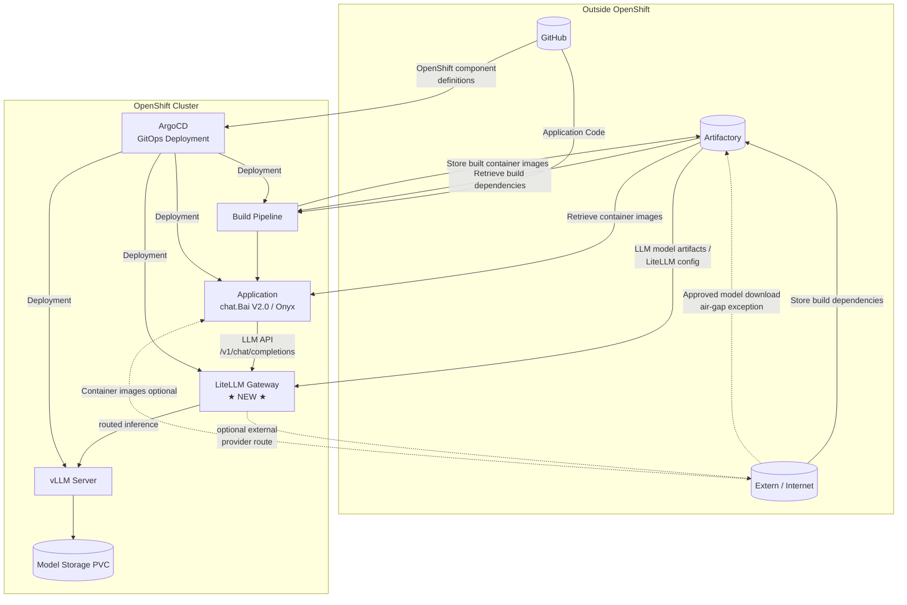

# OpenShift Deployment Architecture (CI/CD) — with LiteLLM Gateway

Architecture diagram for **chat.Bai V2.0** on OpenShift: GitHub, Artifactory, Build Pipeline, ArgoCD, Application — plus **LiteLLM** as the LLM gateway inside the cluster.

> **Runtime / chat flow:** [INTERFACE-DIAGRAM-chatBai-V2-LITELLM.md](./INTERFACE-DIAGRAM-chatBai-V2-LITELLM.md)  
> **German:** [ARCHITECTURE-DIAGRAM-OPENSHIFT-CICD-LITELLM.de.md](./ARCHITECTURE-DIAGRAM-OPENSHIFT-CICD-LITELLM.de.md)

---

## Simple overview (what changed)

**Before:** Application pulled LLMs directly from **Extern / Internet** (`Bezug LLMs`).

**After:** Application calls **LiteLLM Gateway** inside OpenShift. LiteLLM routes to **vLLM** (and optionally external providers). Model weights / images still come from **Artifactory** or approved external sources.

```
  BEFORE:  Application ──────────► Extern/Internet (LLMs)

  AFTER:   Application ──► LiteLLM Gateway ──► vLLM Server
                                ▲
                                └── model config / endpoints
                                    (Artifactory or Extern)
```

---

## Full diagram (ASCII)

```
┌─────────────────┐     ┌─────────────────┐     ┌─────────────────┐
│   Artifactory   │     │ Extern /        │     │    GitHub       │
│                 │     │ Internet        │     │                 │
│ Build deps      │◄────│ Ablage Build-   │     │ Application     │
│ Container imgs  │────►│ dependencies    │     │ Code            │
└────────┬────────┘     └────────┬────────┘     └────────┬────────┘
         │                         │                       │
         │ Bezug Build-            │ Bezug Container-      │ Definition
         │ dependencies              │ images (optional)     │ OpenShift
         │                         │                       │ Komponenten
         │                         │                       │
         │              ┌──────────┴───────────────────────┤
         │              │                                  │
         ▼              ▼                                  ▼
┌────────────────────────────────────────────────────────────────────────┐
│                         OPENSHIFT CLUSTER                              │
│                                                                        │
│  ┌──────────────────┐         ┌──────────────────────────────────┐  │
│  │  Build Pipeline  │         │  Application (chat.Bai / Onyx)    │  │
│  │  (Tekton/CI)     │────────►│  • API Server                    │  │
│  │                  │ deploy  │  • Web Server                    │  │
│  │  Bezug Code ◄────┼─────────│  • Workers, OpenSearch, Redis... │  │
│  │  from GitHub     │         └───────────────┬──────────────────┘  │
│  └────────┬─────────┘                         │                      │
│           │                                   │ LLM API              │
│           │ Ablage Container-                 │ (OpenAI-compatible)  │
│           │ images                          ▼                      │
│           ▼                    ┌──────────────────────────────┐    │
│      (to Artifactory)          │  LiteLLM Gateway  ★ NEW ★     │    │
│                                │  • Routing Qwen / GLM         │    │
│                                │  • Auth, retries, logging     │    │
│                                └──────────────┬───────────────┘    │
│                                               │                      │
│                                               ▼                      │
│                                ┌──────────────────────────────┐    │
│                                │  vLLM Server                 │    │
│                                │  • GPU inference             │    │
│                                └──────────────┬───────────────┘    │
│                                               │                      │
│                                               ▼                      │
│                                ┌──────────────────────────────┐    │
│                                │  Model Storage (PVC)         │    │
│                                └──────────────────────────────┘    │
│                                                                        │
│  ┌────────────────────────────────────────────────────────────────┐  │
│  │  ArgoCD (GitOps)                                               │  │
│  │  • Syncs manifests from GitHub                                 │  │
│  │  • Deployment → Build Pipeline, Application, LiteLLM, vLLM       │  │
│  └────────────────────────────────────────────────────────────────┘  │
└────────────────────────────────────────────────────────────────────────┘
         ▲
         │ Bezug LLM-Modelle / Modell-Konfiguration
         │ (via Artifactory or approved Extern path → LiteLLM/vLLM)
         │
┌────────┴────────┐
│  Artifactory /  │
│  Extern         │
└─────────────────┘
```

---

## Mermaid diagram



---

## Component roles

| Component | Role | Unchanged? |
|-----------|------|------------|
| **GitHub** | Source code + Kubernetes/OpenShift manifests | Yes |
| **Artifactory** | Build dependencies, container images, optional model artifacts | Yes |
| **Extern / Internet** | Upstream deps; **no direct LLM path to Application** | Updated |
| **Build Pipeline** | Build images from GitHub code, push to Artifactory | Yes |
| **Application** | Running chat.Bai (API, web, workers, DB clients) | Yes |
| **LiteLLM Gateway** | LLM API gateway between Application and vLLM | **Added** |
| **vLLM Server** | GPU inference for Qwen, GLM, etc. | Yes (was implicit) |
| **Model Storage** | PVC with LLM weights | Yes |
| **ArgoCD** | GitOps sync from GitHub to cluster | Yes (+ LiteLLM manifests) |

---

## Data flows (German labels from original diagram)

| Label (DE) | English | From → To | Notes |
|------------|---------|-----------|-------|
| Application Code | Application source | GitHub → Build Pipeline | Unchanged |
| Definition von OpenShift Komponenten | K8s/OpenShift manifests | GitHub → ArgoCD | Add LiteLLM YAML here |
| Bezug von Builddependencies | Get build dependencies | Artifactory → Build Pipeline | Unchanged |
| Ablage der erstellten Containerimages | Store built images | Build Pipeline → Artifactory | Unchanged |
| Bezug der Containerimages | Pull container images | Artifactory → Application | Unchanged |
| ~~Bezug LLMs → Application~~ | ~~Direct LLM pull~~ | **Removed** | **Was direct; now via LiteLLM** |
| Bezug LLMs / Modell-Konfiguration | Model weights & LiteLLM config | Artifactory / Extern → LiteLLM & vLLM | Updated |
| LLM API | Chat completions | Application → LiteLLM → vLLM | **New path** |
| Deployment | GitOps sync | ArgoCD → all workloads | Include LiteLLM |

---

## What to add in GitHub / ArgoCD

Repo paths (this project):

```text
litellm-integration/manifests/     # LiteLLM Deployment, Service, ConfigMap
implementation/openshift/manifests/ # Application, vLLM references
```

ArgoCD should sync at minimum:

- `litellm-proxy` Deployment + Service (`:4000`)
- `litellm-config` ConfigMap (model list → vLLM endpoints)
- Application env: `LITELLM_PROXY_URL`, `LITELLM_PROXY_API_KEY`

See [litellm-integration/LITELLM-DEPLOYMENT-GUIDE.md](../litellm-integration/LITELLM-DEPLOYMENT-GUIDE.md).

---

## Air-gapped production note

In restricted environments (e.g. Bayern cloud):

1. **Container images** — only from Artifactory (no direct `Extern → Application`).
2. **LLM weights** — downloaded once to Artifactory or PVC; mounted on vLLM.
3. **LiteLLM config** — points only to internal `vLLM` URLs (no external provider).
4. **Application** — never calls Hugging Face or public LLM APIs directly; only `http://litellm-proxy:4000`.

---

## Related documents

| Document | Topic |
|----------|-------|
| [INTERFACE-DIAGRAM-chatBai-V2-LITELLM.md](./INTERFACE-DIAGRAM-chatBai-V2-LITELLM.md) | Runtime chat architecture |
| [GITHUB-TO-OPENSHIFT-PIPELINE-EXPLAINED.md](./GITHUB-TO-OPENSHIFT-PIPELINE-EXPLAINED.md) | GitHub → Tekton pipeline |
| [litellm-integration/ONYX-LITELLM-INTEGRATION.md](../litellm-integration/ONYX-LITELLM-INTEGRATION.md) | Wire Onyx to LiteLLM |

---

*Last updated: June 2026 — OpenShift CI/CD with LiteLLM gateway*
