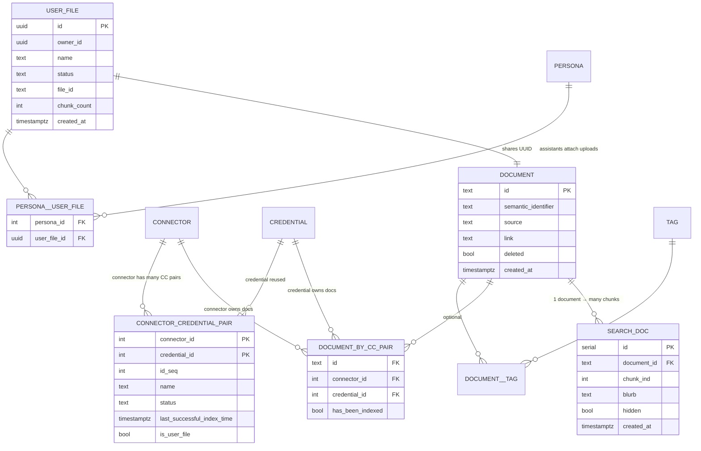

# Onyx Document Database Relationships

**Legend**

- `|` = exactly one, `o` = zero or more
- USER_FILE and DOCUMENT share the same UUID (user upload row + canonical doc row)
- DOCUMENT_BY_CC_PAIR links canonical documents to connectors/credentials
- SEARCH_DOC rows are the individual chunks indexed in Vespa/pgvector
- CONNECTOR_CREDENTIAL_PAIR stores connector+credential configurations
- PERSONA__USER_FILE shows how assistants/personas consume user uploads
- DOCUMENT__TAG (not expanded) represents tagging relationships

