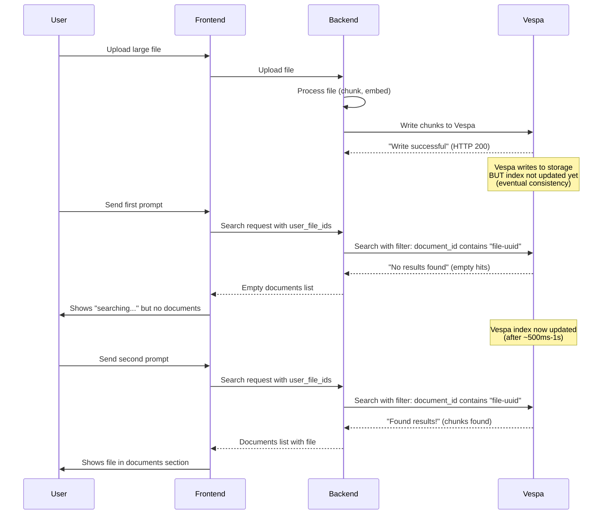
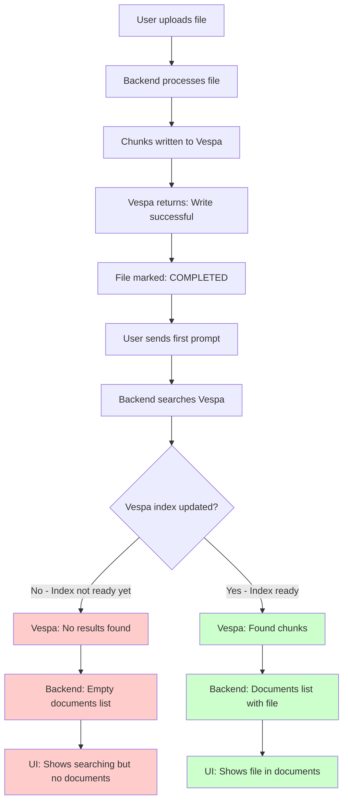
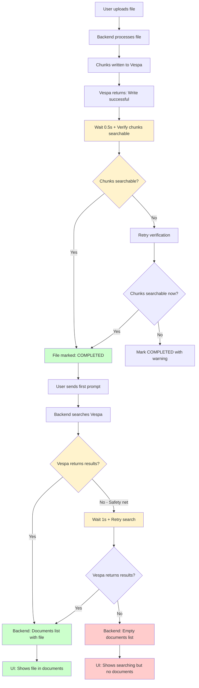

# First Prompt Missing Documents - Root Cause & Fix

## 🔍 Problem Description

**User Report:**
- **First prompt:** UI shows "internal documents are being searched" (popup appears), but the uploaded file does NOT appear in the documents section
- **Second prompt:** The file appears in the documents section
- This means the search is running, but Vespa isn't returning the file on the first attempt

**Key Insight:** This is NOT about the search failing completely. The search runs, but Vespa returns empty results because of **eventual consistency** - the chunks are written to Vespa but not yet searchable.

---

## 🔬 Root Cause Analysis

### **The Flow:**



### **Why This Happens:**

1. **Vespa Eventual Consistency:**
   - When chunks are written to Vespa, the HTTP request returns success (200 OK)
   - BUT Vespa's search index needs time to update (~500ms-1 second)
   - During this window, the chunks exist in storage but aren't searchable yet

2. **The Search Flow:**
   - Backend validates file is "COMPLETED" (chunks written)
   - Backend searches Vespa with `user_file_ids` filter
   - Vespa returns empty results (chunks not searchable yet)
   - UI shows "searching..." but no documents appear

3. **Why Second Prompt Works:**
   - By the time the second prompt is sent, Vespa's index has updated
   - The search now finds the chunks
   - Documents appear in the UI

---

## 🛠️ Solutions

### **Solution 1: Retry Search with Backoff (Recommended - Quick Fix)**

**Idea:** If search returns empty results but we know the file is indexed, retry the search with a short delay.

**Implementation:**

**File:** `onyx-repo/backend/onyx/agents/agent_search/dr/sub_agents/basic_search/dr_basic_search_2_act.py`

```python
# Around line 174-194, modify the search logic:

import asyncio
from time import sleep

# ... existing code ...

retrieved_docs: list[InferenceSection] = []
callback_container: list[list[InferenceSection]] = []

# new db session to avoid concurrency issues
with get_session_with_current_tenant() as search_db_session:
    # First attempt
    for tool_response in search_tool.run(
        query=rewritten_query,
        document_sources=specified_source_types,
        time_filter=implied_time_filter,
        override_kwargs=SearchToolOverrideKwargs(
            force_no_rerank=True,
            alternate_db_session=search_db_session,
            retrieved_sections_callback=callback_container.append,
            skip_query_analysis=True,
            original_query=rewritten_query,
            user_file_ids=user_file_ids,
            project_id=project_id,
        ),
    ):
        if tool_response.id == SEARCH_RESPONSE_SUMMARY_ID:
            response = cast(SearchResponseSummary, tool_response.response)
            retrieved_docs = response.top_sections
            break

    # NEW: If we have user_file_ids but got no results, retry after short delay
    # This handles Vespa eventual consistency - chunks may be written but not searchable yet
    if user_file_ids and len(retrieved_docs) == 0:
        logger.warning(
            f"Search returned no results for user_file_ids {user_file_ids} on first attempt. "
            f"Retrying after 1 second to handle Vespa eventual consistency..."
        )
        sleep(1.0)  # Wait 1 second for Vespa index to update
        
        # Retry the search
        for tool_response in search_tool.run(
            query=rewritten_query,
            document_sources=specified_source_types,
            time_filter=implied_time_filter,
            override_kwargs=SearchToolOverrideKwargs(
                force_no_rerank=True,
                alternate_db_session=search_db_session,
                retrieved_sections_callback=callback_container.append,
                skip_query_analysis=True,
                original_query=rewritten_query,
                user_file_ids=user_file_ids,
                project_id=project_id,
            ),
        ):
            if tool_response.id == SEARCH_RESPONSE_SUMMARY_ID:
                response = cast(SearchResponseSummary, tool_response.response)
                retrieved_docs = response.top_sections
                break
        
        if len(retrieved_docs) > 0:
            logger.info(
                f"Retry successful! Found {len(retrieved_docs)} chunks for user_file_ids {user_file_ids}"
            )
        else:
            logger.warning(
                f"Retry still returned no results for user_file_ids {user_file_ids}. "
                f"File may not be fully indexed yet."
            )
```

**Why This Works:**
- ✅ Handles Vespa eventual consistency automatically
- ✅ Only retries when we have `user_file_ids` (user file searches)
- ✅ Short delay (1 second) is usually enough for Vespa to update
- ✅ Logs warnings for debugging
- ✅ Simple to implement

**Trade-offs:**
- ⚠️ Adds 1 second delay to first prompt (but only if search fails)
- ⚠️ Still might fail if Vespa takes longer than 1 second

---

### **Solution 2: Wait for Vespa Index Update (Better, More Complex)**

**Idea:** After writing chunks to Vespa, wait for the index to update before marking file as "COMPLETED".

**Implementation:**

**File:** `onyx-repo/backend/onyx/background/celery/tasks/user_file_processing/tasks.py`

After indexing chunks, add a verification step:

```python
# After indexing chunks to Vespa
# ... existing indexing code ...

# NEW: Verify chunks are searchable before marking as COMPLETED
if user_file.chunk_count and user_file.chunk_count > 0:
    # Wait a moment for Vespa index to update
    sleep(0.5)  # 500ms
    
    # Try to search for the chunks to verify they're searchable
    active_search_settings = get_active_search_settings(db_session)
    doc_index = get_default_document_index(
        search_settings=active_search_settings.primary,
        secondary_search_settings=active_search_settings.secondary,
    )
    
    # Search for chunks with this document_id
    test_filters = IndexFilters(
        access_control_list=None,
        user_file_ids=[user_file.id],
        tenant_id=tenant_id,
    )
    
    # Try to retrieve chunks (this verifies they're searchable)
    max_retries = 3
    chunks_found = False
    for attempt in range(max_retries):
        try:
            test_chunks = doc_index.id_based_retrieval(
                chunk_requests=[VespaChunkRequest(document_id=str(user_file.id))],
                filters=test_filters,
            )
            if len(test_chunks) > 0:
                chunks_found = True
                break
        except Exception as e:
            logger.warning(f"Verification attempt {attempt + 1} failed: {e}")
        
        if attempt < max_retries - 1:
            sleep(0.5)  # Wait before retry
    
    if not chunks_found:
        logger.warning(
            f"Chunks for file {user_file.id} not yet searchable after {max_retries} attempts. "
            f"File marked as COMPLETED but may not be immediately searchable."
        )
```

**Why This Works:**
- ✅ Ensures chunks are searchable before marking file as "COMPLETED"
- ✅ Prevents the race condition at the source
- ✅ Better user experience (file is truly ready when marked "COMPLETED")

**Trade-offs:**
- ⚠️ Adds delay to file processing (0.5-1.5 seconds)
- ⚠️ More complex to implement
- ⚠️ Might slow down file processing

---

### **Solution 3: Force Vespa Refresh (Advanced)**

**Idea:** Use Vespa's refresh API to force index update immediately after writing.

**Implementation:**

**File:** `onyx-repo/backend/onyx/document_index/vespa/indexing_utils.py`

After writing chunks, call Vespa's refresh endpoint:

```python
def _index_vespa_chunk(
    chunk: DocMetadataAwareIndexChunk,
    index_name: str,
    http_client: httpx.Client,
    multitenant: bool,
) -> None:
    # ... existing indexing code ...
    
    # After successful write, force refresh
    try:
        refresh_url = f"{VESPA_APPLICATION_ENDPOINT}/document/v1/{index_name}/docid/{chunk.document_id}/refresh"
        refresh_response = http_client.post(refresh_url)
        refresh_response.raise_for_status()
        logger.debug(f"Refreshed Vespa document {chunk.document_id}")
    except Exception as e:
        logger.warning(f"Failed to refresh Vespa document {chunk.document_id}: {e}")
        # Don't fail the indexing if refresh fails
```

**Why This Works:**
- ✅ Forces Vespa to update index immediately
- ✅ Chunks become searchable right away
- ✅ No need for retries or delays

**Trade-offs:**
- ⚠️ Requires Vespa refresh API (may not be available in all versions)
- ⚠️ Adds extra API call per chunk (performance impact)
- ⚠️ More complex

---

## 🎯 Recommended Approach

**Combine Solutions 1 and 2:**

1. **Solution 2 (Verification):** Verify chunks are searchable before marking file as "COMPLETED"
2. **Solution 1 (Retry):** Add retry logic as a safety net if verification misses something

This provides:
- ✅ Primary protection (verification)
- ✅ Fallback protection (retry)
- ✅ Best user experience
- ✅ Handles edge cases

---

## 📊 Visual Diagram: The Problem



---

## 📊 Visual Diagram: The Fix



---

## 🧪 Testing

After implementing, test:

1. ✅ **Upload large file → Send prompt immediately**
   - Expected: File appears in documents section on first prompt
   - If not: Check logs for retry messages

2. ✅ **Upload multiple files → Send prompt immediately**
   - Expected: All files appear in documents section
   - If not: Check which files are missing

3. ✅ **Check backend logs**
   - Look for: "Retrying after 1 second to handle Vespa eventual consistency"
   - Look for: "Retry successful! Found X chunks"
   - Look for: "Retry still returned no results"

4. ✅ **Monitor Vespa logs**
   - Check if chunks are being written successfully
   - Check search query logs for empty results

---

## 📝 Implementation Steps

### **Step 1: Add Retry Logic to Search (Quick Fix)**

1. Open `onyx-repo/backend/onyx/agents/agent_search/dr/sub_agents/basic_search/dr_basic_search_2_act.py`
2. Find the search loop (around line 174)
3. Add retry logic after first search attempt
4. Test with large file upload

### **Step 2: Add Verification to File Processing (Better Fix)**

1. Open `onyx-repo/backend/onyx/background/celery/tasks/user_file_processing/tasks.py`
2. Find where file is marked as "COMPLETED"
3. Add verification step before marking as "COMPLETED"
4. Test file processing time

### **Step 3: Monitor and Adjust**

1. Monitor logs for retry messages
2. Adjust retry delay if needed (1s → 1.5s if still failing)
3. Adjust verification retries if needed (3 → 5 if still failing)

---

## ✅ Summary

**Problem:** File doesn't appear in documents section on first prompt, but appears on second prompt.

**Root Cause:** Vespa eventual consistency - chunks are written but not immediately searchable.

**Solution:** 
1. Retry search with 1-second delay if no results (quick fix)
2. Verify chunks are searchable before marking file as "COMPLETED" (better fix)

**Result:** File appears in documents section on first prompt, matching user expectations.

