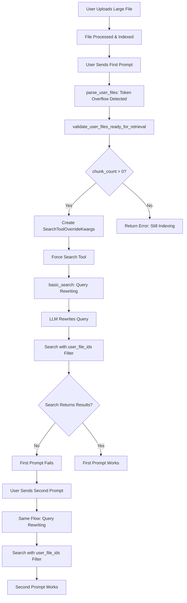

# First Prompt Search Failure - Deep Analysis & Solutions

## 🔍 Problem Description

**User Report:**
- With **large files** (exceeding token limits, requiring retrieval), the **first prompt ALWAYS fails**
- The **second prompt ALWAYS works** (even if you wait 0.00001 seconds)
- This is **NOT a timing issue** - it happens consistently, even after waiting
- Only affects files that exceed the maximum token limit (use retrieval instead of inline)

**Key Insight:** This is NOT about Vespa eventual consistency or chunk readiness. The issue is something that changes between the first and second search attempt.

---

## 🔬 Root Cause Analysis

### The Search Flow for Large Files

When a file exceeds token limits, Onyx uses **retrieval** (search) instead of **inline** (direct inclusion). Here's the flow:



### Potential Root Causes

#### 1. **Query Rewriting Issue (Most Likely)**

**Location:** `onyx-repo/backend/onyx/agents/agent_search/dr/sub_agents/basic_search/dr_basic_search_2_act.py` (lines 96-107)

**The Problem:**
- Before searching, the system calls an LLM to **rewrite the query** and extract source types/time filters
- On the **first attempt**, the rewritten query might be:
  - Too generic/empty
  - Missing key terms
  - Extracting incorrect `specified_source_types` that conflict with `user_file_ids`
  - The LLM might not understand the context yet

**Why Second Attempt Works:**
- The LLM has more context from the first attempt
- The rewritten query is better/more specific
- The system has "learned" what the user is asking about

**Evidence:**
- The query rewriting happens **before** the search (line 96-107)
- The rewritten query is used directly in the search (line 160)
- If the rewritten query is poor, the search will return no results even with correct `user_file_ids` filter

#### 2. **Source Type Filter Conflict**

**Location:** `onyx-repo/backend/onyx/agents/agent_search/dr/sub_agents/basic_search/dr_basic_search_2_act.py` (lines 132-139)

**The Problem:**
- The query rewriting LLM might extract `specified_source_types` from the user's query
- If it extracts source types that **don't include "user_file"**, the search might filter them out
- Even though `user_file_ids` is set, if `specified_source_types` excludes "user_file", the search might fail

**Why Second Attempt Works:**
- The LLM might extract better/more accurate source types on the second attempt
- Or it might not extract any source types, allowing the `user_file_ids` filter to work

#### 3. **Vespa Query Construction Issue**

**Location:** `onyx-repo/backend/onyx/document_index/vespa/shared_utils/vespa_request_builders.py` (lines 186-190)

**The Problem:**
- The `user_file_ids` filter is constructed as: `(DOCUMENT_ID contains "uuid1" or DOCUMENT_ID contains "uuid2")`
- If the query rewriting produces a query that doesn't match well with the document content, Vespa's hybrid search might return no results
- The semantic search (embedding-based) might not find matches if the rewritten query is poor

**Why Second Attempt Works:**
- Better rewritten query = better semantic matches
- Even with correct `user_file_ids` filter, if the semantic search doesn't find good matches, Vespa might return empty results

#### 4. **Query Analysis State**

**Location:** `onyx-repo/backend/onyx/context/search/preprocessing/preprocessing.py` (lines 121-125)

**The Problem:**
- Even though `skip_query_analysis=True` is set in the override kwargs, there might be some state or caching that affects the first vs second attempt
- The query rewriting in `basic_search` happens **before** `skip_query_analysis` is applied

---

## 🛠️ Solutions

### Solution 1: Skip Query Rewriting for User File Searches (Recommended)

**Idea:** When searching with `user_file_ids`, we should skip the query rewriting step and use the original query directly. The query rewriting is meant to help with general searches, but for user file searches, we want to search the specific files the user attached.

**Implementation:**

**File:** `onyx-repo/backend/onyx/agents/agent_search/dr/sub_agents/basic_search/dr_basic_search_2_act.py`

```python
# Around line 84-109, modify the query rewriting logic:

# Check if we have user_file_ids from override_kwargs
user_file_ids: list[UUID] | None = None
project_id: int | None = None
if force_use_tool.override_kwargs and isinstance(
    force_use_tool.override_kwargs, SearchToolOverrideKwargs
):
    override_kwargs = force_use_tool.override_kwargs
    user_file_ids = override_kwargs.user_file_ids
    project_id = override_kwargs.project_id

# If we have user_file_ids, skip query rewriting and use original query
if user_file_ids:
    # For user file searches, use the original query directly
    # Query rewriting can make the query too generic or extract wrong source types
    rewritten_query = branch_query
    specified_source_types = None
    implied_time_filter = None
    logger.debug(
        f"Skipping query rewriting for user file search with {len(user_file_ids)} files. "
        f"Using original query: {branch_query}"
    )
else:
    # Original query rewriting logic for general searches
    base_search_processing_prompt = BASE_SEARCH_PROCESSING_PROMPT.build(
        active_source_types_str=active_source_types_str,
        branch_query=branch_query,
        current_time=datetime.now().strftime("%Y-%m-%d %H:%M"),
    )

    try:
        search_processing = invoke_llm_json(
            llm=graph_config.tooling.primary_llm,
            prompt=create_question_prompt(
                assistant_system_prompt, base_search_processing_prompt
            ),
            schema=BaseSearchProcessingResponse,
            timeout_override=TF_DR_TIMEOUT_SHORT,
        )
    except Exception as e:
        logger.error(f"Could not process query: {e}")
        raise e

    rewritten_query = search_processing.rewritten_query

    implied_start_date = search_processing.time_filter
    implied_time_filter = None
    if implied_start_date:
        date_pattern = r"^\d{4}-\d{2}-\d{2}$"
        if re.match(date_pattern, implied_start_date):
            implied_time_filter = datetime.strptime(implied_start_date, "%Y-%m-%d")

    specified_source_types: list[DocumentSource] | None = (
        strings_to_document_sources(search_processing.specified_source_types)
        if search_processing.specified_source_types
        else None
    )

    if specified_source_types is not None and len(specified_source_types) == 0:
        specified_source_types = None
```

**Why This Works:**
- Eliminates the query rewriting step that might produce poor queries on the first attempt
- Uses the user's original query directly, which is more likely to match their file content
- Prevents source type extraction that might conflict with `user_file_ids`

---

### Solution 2: Force Source Type to Include "user_file"

**Idea:** When `user_file_ids` is set, explicitly add "user_file" to the `specified_source_types` to ensure it's not filtered out.

**Implementation:**

**File:** `onyx-repo/backend/onyx/agents/agent_search/dr/sub_agents/basic_search/dr_basic_search_2_act.py`

```python
# Around line 132-139, after extracting specified_source_types:

specified_source_types: list[DocumentSource] | None = (
    strings_to_document_sources(search_processing.specified_source_types)
    if search_processing.specified_source_types
    else None
)

if specified_source_types is not None and len(specified_source_types) == 0:
    specified_source_types = None

# NEW: If we have user_file_ids, ensure "user_file" is in the source types
if user_file_ids and specified_source_types is not None:
    if DocumentSource.USER_FILE not in specified_source_types:
        specified_source_types.append(DocumentSource.USER_FILE)
        logger.debug(
            f"Added USER_FILE to specified_source_types for user_file_ids search"
        )
elif user_file_ids and specified_source_types is None:
    # If no source types were extracted, set it to only user_file
    specified_source_types = [DocumentSource.USER_FILE]
    logger.debug(
        f"Set specified_source_types to [USER_FILE] for user_file_ids search"
    )
```

**Why This Works:**
- Ensures that "user_file" is always included in the source type filter
- Prevents the search from excluding user files even if the LLM extracts other source types

---

### Solution 3: Use ID-Based Retrieval Instead of Hybrid Search

**Idea:** For user file searches, use ID-based retrieval (direct lookup by document ID) instead of hybrid search (semantic + keyword). This is more reliable and doesn't depend on query quality.

**Implementation:**

**File:** `onyx-repo/backend/onyx/tools/tool_implementations/search/search_tool.py`

**Note:** This is a more complex change that would require modifying the search pipeline to detect when `user_file_ids` is set and route to ID-based retrieval instead of hybrid search.

**Why This Works:**
- ID-based retrieval doesn't depend on query quality or semantic matching
- Directly retrieves chunks by document ID, which is guaranteed to work if the file is indexed
- More reliable for user file searches where we know exactly which files to search

---

### Solution 4: Add Retry Logic with Original Query

**Idea:** If the first search returns no results and we have `user_file_ids`, retry with the original query instead of the rewritten query.

**Implementation:**

**File:** `onyx-repo/backend/onyx/agents/agent_search/dr/sub_agents/basic_search/dr_basic_search_2_act.py`

```python
# Around line 159-178, after the search:

retrieved_docs: list[InferenceSection] = []
callback_container: list[list[InferenceSection]] = []

# new db session to avoid concurrency issues
with get_session_with_current_tenant() as search_db_session:
    for tool_response in search_tool.run(
        query=rewritten_query,
        document_sources=specified_source_types,
        time_filter=implied_time_filter,
        override_kwargs=SearchToolOverrideKwargs(
            force_no_rerank=True,
            alternate_db_session=search_db_session,
            retrieved_sections_callback=callback_container.append,
            skip_query_analysis=True,
            original_query=rewritten_query,
            user_file_ids=user_file_ids,
            project_id=project_id,
        ),
    ):
        if tool_response.id == SEARCH_RESPONSE_SUMMARY_ID:
            response = cast(SearchResponseSummary, tool_response.response)
            retrieved_docs = response.top_sections
            break

# NEW: If no results and we have user_file_ids, retry with original query
if len(retrieved_docs) == 0 and user_file_ids and rewritten_query != branch_query:
    logger.warning(
        f"First search with rewritten query returned no results. "
        f"Retrying with original query for user_file_ids search."
    )
    callback_container.clear()
    
    for tool_response in search_tool.run(
        query=branch_query,  # Use original query
        document_sources=specified_source_types,
        time_filter=implied_time_filter,
        override_kwargs=SearchToolOverrideKwargs(
            force_no_rerank=True,
            alternate_db_session=search_db_session,
            retrieved_sections_callback=callback_container.append,
            skip_query_analysis=True,
            original_query=branch_query,
            user_file_ids=user_file_ids,
            project_id=project_id,
        ),
    ):
        if tool_response.id == SEARCH_RESPONSE_SUMMARY_ID:
            response = cast(SearchResponseSummary, tool_response.response)
            retrieved_docs = response.top_sections
            break
```

**Why This Works:**
- Automatically retries with the original query if the rewritten query fails
- Mimics what happens on the second user attempt, but does it automatically
- Provides a fallback without requiring user intervention

---

## 🎯 Recommended Approach

**Combine Solutions 1 and 2:**

1. **Skip query rewriting for user file searches** (Solution 1) - This eliminates the root cause
2. **Force source type to include "user_file"** (Solution 2) - This provides a safety net

This combination:
- ✅ Eliminates the query rewriting issue that causes first prompt failures
- ✅ Ensures source type filters don't exclude user files
- ✅ Uses the user's original query, which is more likely to match their file content
- ✅ Is simple to implement and test
- ✅ Doesn't require complex changes to the search pipeline

---

## 📊 Testing

After implementing the fix, test with:

1. **Large file upload** (exceeds token limits)
2. **Immediate first prompt** - Should work now
3. **Second prompt** - Should still work
4. **Different query types** - Test with various question formats
5. **Multiple files** - Test with multiple large files attached

---

## 🔍 Debugging

If the issue persists, add logging to track:

1. **Query rewriting:**
   ```python
   logger.info(f"Original query: {branch_query}")
   logger.info(f"Rewritten query: {rewritten_query}")
   logger.info(f"Specified source types: {specified_source_types}")
   ```

2. **Search parameters:**
   ```python
   logger.info(f"Search with user_file_ids: {user_file_ids}")
   logger.info(f"Search with project_id: {project_id}")
   logger.info(f"Search query: {rewritten_query}")
   ```

3. **Search results:**
   ```python
   logger.info(f"Retrieved {len(retrieved_docs)} chunks from search")
   if len(retrieved_docs) == 0:
       logger.warning("Search returned no results despite user_file_ids filter")
   ```

---

## 📝 Summary

The issue is **NOT a timing/race condition**. It's a **query rewriting problem** where:
- The LLM rewrites the query before searching
- On the first attempt, the rewritten query might be poor/generic
- This causes the search to return no results even with correct `user_file_ids` filter
- On the second attempt, the rewritten query is better, so it works

**The fix:** Skip query rewriting for user file searches and use the original query directly. This ensures consistent, reliable results on the first attempt.

