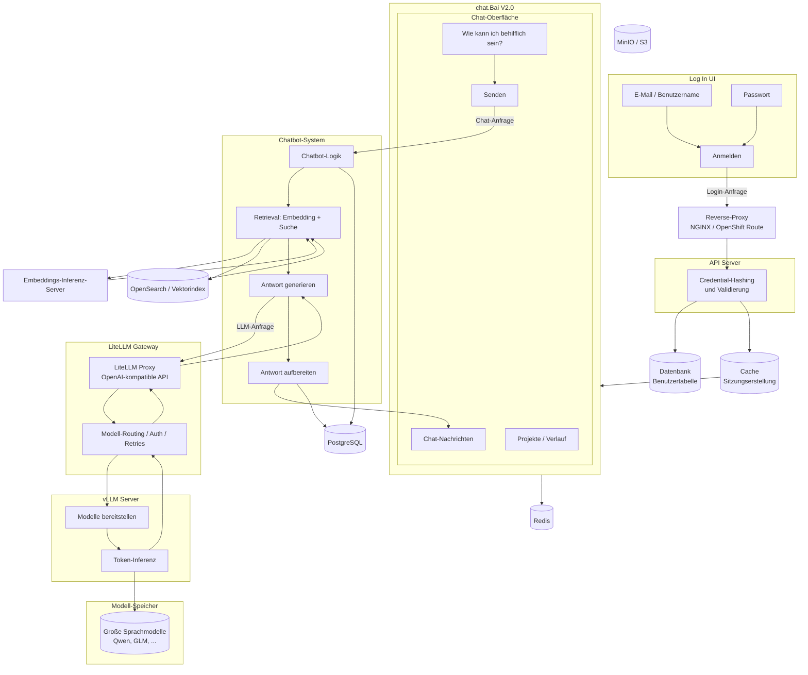

# chat.Bai V2.0 — Architekturdiagramm (mit LiteLLM-Gateway)

Vereinfachte Architektur für chat.Bai V2.0: Login, Reverse-Proxy, API, Session-Cache, Chat-UI, Chatbot-System (Retrieval + Generierung), **LiteLLM-Gateway**, vLLM-Server und Modell-Speicher.

> **Änderung gegenüber V1:** LLM-Anfragen gehen nicht mehr direkt vom Chatbot-System zum vLLM-Server. Sie laufen über den **LiteLLM Proxy** (OpenAI-kompatibles Gateway) für Routing, Authentifizierung, Retries und einheitlichen Modellzugriff.

---

## Übersicht (einfaches Diagramm)

```
┌─────────────┐     ┌──────────────┐     ┌─────────────┐     ┌──────────┐
│  Log In UI  │────►│ Reverse-     │────►│ API Server  │────►│ Datenbank│
│             │     │ Proxy        │     │ (Hash/      │     │ Benutzer │
└─────────────┘     └──────────────┘     │ Validierung)│     └──────────┘
                                         └──────┬──────┘
                                                │
                                                ▼
                                         ┌──────────────┐
                                         │ Cache        │
                                         │ (Sitzungen)  │
                                         └──────┬───────┘
                                                │
                                                ▼
┌──────────────────────────────────────────────────────────────────────┐
│  chat.Bai V2.0 — Chat-UI (Projekte, Verlauf, Eingabefeld)            │
└───────────────────────────────┬──────────────────────────────────────┘
                                │ Chat-Anfrage
                                ▼
┌──────────────────────────────────────────────────────────────────────┐
│  Chatbot-System                                                      │
│  Logik → Retrieval (embed + search) → Antwort generieren             │
│       → LiteLLM Gateway → vLLM → Antwort aufbereiten → UI            │
└──────────────────────────────────────────────────────────────────────┘

        Antwort generieren ──►  LiteLLM Gateway  ──►  vLLM Server
                                      │                    │
                                      └────────┬───────────┘
                                               ▼
                                        Modell-Speicher
                                        (LLM-Gewichte)
```

---

## Detailliertes Mermaid-Diagramm



---

## Rolle von LiteLLM

| Aspekt | Ohne LiteLLM | Mit LiteLLM-Gateway |
|--------|--------------|---------------------|
| API → LLM | Direkt zu vLLM | API → LiteLLM → vLLM |
| Modellliste | Ein Endpoint pro Pool | Eine LiteLLM-URL, Routing zu Qwen/GLM |
| Authentifizierung | Pro Dienst | Zentraler `LITELLM_MASTER_KEY` |
| Retries | In App | LiteLLM-Konfiguration |
| Monitoring | Nur vLLM-Logs | LiteLLM-Metriken + Request-Logs |

**Typische interne URL (OpenShift):**

```text
http://litellm-proxy.onyx-infra.svc.cluster.local:4000
```

---

## Komponenten

| Komponente | Status | Zweck |
|------------|--------|-------|
| Log In UI | unverändert | Anmeldung |
| Reverse-Proxy | unverändert | TLS, Routing, Timeouts |
| API Server | unverändert | Logik, Auth, Chat-Orchestrierung |
| Datenbank | unverändert | Benutzer, Metadaten |
| Cache | unverändert | Sitzungen (Redis) |
| chat.Bai V2.0 UI | unverändert | Projekte, Verlauf, Chat |
| Chatbot-System | unverändert | Logik, Retrieval, Antwort |
| **LiteLLM Gateway** | **neu** | LLM-API-Gateway |
| vLLM Server | unverändert | GPU-Inferenz |
| Modell-Speicher | unverändert | Modellgewichte |

---

## Verwandte Dokumente

- [INTERFACE-DIAGRAM-chatBai-V2-LITELLM.md](./INTERFACE-DIAGRAM-chatBai-V2-LITELLM.md) — English version
- [litellm-integration/LITELLM-DEPLOYMENT-GUIDE.md](../litellm-integration/LITELLM-DEPLOYMENT-GUIDE.md)

---

*Stand: Juni 2026 — chat.Bai V2.0 mit LiteLLM-Gateway*
