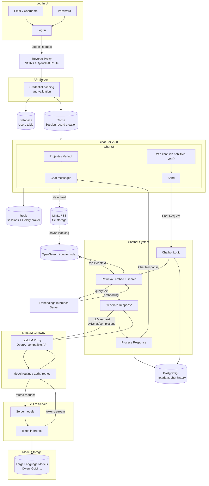

# chat.Bai V2.0 — Architecture Diagram (with LiteLLM Gateway)

Simplified architecture matching the chat.Bai V2.0 design: login, reverse proxy, API, session cache, chat UI, chatbot system (retrieval + generation), **LiteLLM gateway**, vLLM server, and model storage.

> **Change from V1 diagram:** LLM requests no longer go directly from the Chatbot System to vLLM. They pass through **LiteLLM Proxy** (OpenAI-compatible gateway) for routing, auth, retries, and unified model access.

---

## High-level diagram (simple)

```
┌─────────────┐     ┌──────────────┐     ┌─────────────┐     ┌──────────┐
│  Log In UI  │────►│ Reverse-     │────►│ API Server  │────►│ Database │
│             │     │ Proxy        │     │ (hash/      │     │ Users    │
└─────────────┘     └──────────────┘     │  validate)  │     └──────────┘
                                         └──────┬──────┘
                                                │
                                                ▼
                                         ┌──────────────┐
                                         │ Cache        │
                                         │ (sessions)   │
                                         └──────┬───────┘
                                                │
                                                ▼
┌──────────────────────────────────────────────────────────────────────┐
│  chat.Bai V2.0 — Chat UI (Projekte, Verlauf, message input)          │
└───────────────────────────────┬──────────────────────────────────────┘
                                │ Chat request
                                ▼
┌──────────────────────────────────────────────────────────────────────┐
│  Chatbot System                                                      │
│  ┌──────────────┐   ┌─────────────────────┐   ┌──────────────────┐  │
│  │ Chatbot      │──►│ Retrieval:          │──►│ Generate         │  │
│  │ Logic        │   │ embed + search      │   │ Response         │  │
│  └──────────────┘   └─────────────────────┘   └────────┬─────────┘  │
│                                                         │            │
│                              ┌──────────────────────────┘            │
│                              ▼                                       │
│                    ┌──────────────────┐   ┌──────────────────┐        │
│                    │ Process Response │◄──│ (stream tokens)  │        │
│                    └────────┬─────────┘   └──────────────────┘        │
└─────────────────────────────┼────────────────────────────────────────┘
                              │ Chat response
                              ▼
                         Back to Chat UI

        Generate Response ──►  ┌─────────────────────┐  ──►  ┌─────────────┐
                               │ LiteLLM Gateway     │       │ vLLM Server │
                               │ (proxy :4000)       │       │             │
                               └──────────┬──────────┘       └──────┬──────┘
                                          │                         │
                                          └───────────┬─────────────┘
                                                      ▼
                                              ┌───────────────┐
                                              │ Model Storage │
                                              │ (LLM weights) │
                                              └───────────────┘
```

---

## Detailed Mermaid diagram



---

## What LiteLLM does in this architecture

| Role | Without LiteLLM | With LiteLLM gateway |
|------|-----------------|---------------------|
| **API to LLM** | API / Chatbot talks directly to vLLM | API talks to LiteLLM; LiteLLM talks to vLLM |
| **Model list** | One vLLM endpoint per model pool | One LiteLLM URL; routes to Qwen, GLM, etc. |
| **Auth** | Per-service keys | Central `LITELLM_MASTER_KEY` |
| **Retries / fallback** | Custom in app | LiteLLM config (`routing`, fallbacks) |
| **Observability** | vLLM logs only | LiteLLM metrics + request logging |

**Typical internal URL (OpenShift):**

```text
http://litellm-proxy.onyx-infra.svc.cluster.local:4000
```

Onyx API uses OpenAI-compatible `chat/completions` against this URL instead of calling vLLM directly.

---

## Request flow: one chat message

```
1. User types in chat.Bai V2.0 UI
2. Reverse-Proxy forwards to API Server
3. Chatbot Logic:
      • load session (Cache / Redis)
      • load history (PostgreSQL)
4. Retrieval (if needed):
      • Embeddings Inference Server → embed question
      • OpenSearch → hybrid search → top chunks
5. Generate Response:
      • build prompt (history + context + tools)
      • POST → LiteLLM Gateway /v1/chat/completions
6. LiteLLM Gateway:
      • pick model (e.g. qwen, glm)
      • forward to correct vLLM Server pool
      • stream tokens back
7. Process Response → stream to UI
8. Save message to PostgreSQL
```

---

## Components (unchanged vs added)

| Component | Status | Purpose |
|-----------|--------|---------|
| Log In UI | unchanged | Authentication screen |
| Reverse-Proxy | unchanged | TLS, routing, timeouts |
| API Server | unchanged | Business logic, auth, chat orchestration |
| Database (Users) | unchanged | Credentials, profiles |
| Cache (sessions) | unchanged | Session / JWT state (Redis) |
| chat.Bai V2.0 UI | unchanged | Projects, history, chat |
| Chatbot System | unchanged | Logic, retrieval, response processing |
| Retrieval (embed + search) | unchanged | RAG / `internal_search` path |
| Embeddings server | unchanged | Query + index embeddings |
| OpenSearch / index | unchanged | Chunk storage for search |
| MinIO / S3 | unchanged | File blobs |
| **LiteLLM Gateway** | **added** | LLM API gateway between app and vLLM |
| vLLM Server | unchanged | GPU inference |
| Model Storage | unchanged | Model weights on disk/PVC |

---

## Internal service calls (updated)

| Caller | Callee | Protocol | Purpose |
|--------|--------|----------|---------|
| Browser | Reverse-Proxy | HTTPS 443 | All external traffic |
| Reverse-Proxy | API Server | HTTP | `/api/*` |
| API Server | Redis | redis | Sessions, Celery broker |
| API Server | PostgreSQL | postgres | Users, chat, metadata |
| API Server | Embeddings Server | HTTP | Query embeddings |
| API Server | OpenSearch | HTTP | Retrieval / RAG |
| API Server | **LiteLLM Proxy** | **HTTP :4000** | **Chat completions (OpenAI API)** |
| **LiteLLM Proxy** | **vLLM Server** | **HTTP :8000** | **Routed inference** |
| vLLM Server | Model Storage | local/PVC | Load weights |
| API Server | MinIO/S3 | HTTPS | File storage |

---

## Related docs

- [INTERFACE-DIAGRAM-vLLM.md](./INTERFACE-DIAGRAM-vLLM.md) — original diagram (pre-LiteLLM)
- [litellm-integration/LITELLM-DEPLOYMENT-GUIDE.md](../litellm-integration/LITELLM-DEPLOYMENT-GUIDE.md) — deploy LiteLLM on OpenShift
- [litellm-integration/ONYX-LITELLM-INTEGRATION.md](../litellm-integration/ONYX-LITELLM-INTEGRATION.md) — wire Onyx to LiteLLM

---

*Last updated: June 2026 — chat.Bai V2.0 with LiteLLM gateway*
