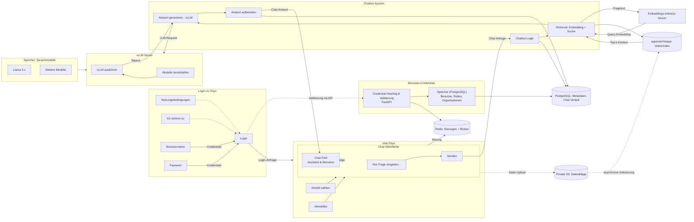

# Onyx Schnittstellen-Diagramm (Vereinfachte Ansicht, vLLM)

Das folgende Diagramm spiegelt die vereinfachte Oberfläche wider: Login-Bereich, Haupt-App/Chat-UI, Benutzer-Credentials, Modell-Speicher, vLLM-Server und Chatbot-System mit Anfrage-/Antwort-Fluss. Nur wesentliche Komponenten sind dargestellt.

---

## Ende-zu-Ende Ablauf (Aktionen und Ergebnisse)

### 1) Login
1. Browser sendet POST `/api/auth/login` mit E-Mail/Passwort.
2. NGINX leitet zur API weiter.
3. API:
   - Prüft Credentials gegen `PostgreSQL` (mit Salted-Hashing).
   - Bei Erfolg: erstellt Sitzung/JWT, speichert Status in `Redis`, antwortet 200.
   - Bei Fehler: 401/403 ohne Token, evtl. Rate-Limiting.
4. Browser speichert Token sicher; UI wechselt zur Chat-Ansicht.

### 2) Sitzungsprüfung (bei jeder Anfrage)
1. Browser sendet `Authorization: Bearer <token>`.
2. API validiert Signatur/Ablauf und prüft Status in `Redis` (revoked/TTL/Mandant).
3. Ungültig → 401, UI zurück zum Login.

### 3) Modell wählen
1. POST `/api/chat/model` mit Modell-ID.
2. API prüft Berechtigung, speichert Präferenz in `PostgreSQL`, 200.

### 4) Chat-Anfrage
1. POST `/api/chat/query` mit Nachricht und optionalem Kontext (Dateien/Projekt).
2. API:
   - Autorisierung: Benutzer/Mandant/Projekt in `PostgreSQL` prüfen.
   - Embeddings: Anfrage an Embeddings-Server.
   - Retrieval: Vektorsuche in `pgvector` oder `Vespa` mit Mandantenfiltern.
   - Prompt-Aufbau: Kontexte + Zitate.
   - Generation: Anfrage an `vLLM` (Streaming bevorzugt).
3. Streaming: API streamt Tokens (SSE/WebSocket). NGINX setzt `Connection: upgrade` nur für Stream-Endpunkt.
4. UI rendert fortlaufend; Abschluss wird in `PostgreSQL` gespeichert (inkl. Quellen).

Fehlerfälle:
- Sitzung ungültig → 401.
- Kein Kontext → Fallback-Prompt, niedrige Konfidenz.
- vLLM-Timeout → 504/500 mit Retry-Hinweis.

### 5) Datei-Upload (optional)
1. POST `/api/files/upload` (multipart).
2. API: Validierung → `Private S3` speichern, Metadaten in `PostgreSQL`.
3. Enqueue Indexierung via `Celery` (Broker `Redis`).
4. Worker: fetch → chunk → embed (Embeddings) → index (pgvector/Vespa).
5. Neue Inhalte sind danach im Retrieval sichtbar.

### 6) Dateien auflisten
- GET `/api/user/files/recent` → `PostgreSQL` mit Mandantenscope.

### 7) Datei löschen/entkoppeln
- DELETE `/api/user/projects/file/{fileId}` → Prüfung der Berechtigung; Link oder Datei entfernen, Index-Cleanup; S3-Delete bei Hard-Delete.

### 8) Logout
- POST `/api/auth/logout` → Sitzung/JWT in `Redis` invalidieren; UI entfernt Token.

---

## Fehlerbehandlung & Observability
- Strukturierte Fehler: `code`, `message`, `hint` (optional).
- Korrelation: Request-ID durch UI, API, Worker.
- Metriken: Latenzen, Token/s bei vLLM, Retrieval-Trefferquoten, Index-Backlog.
- Alarme: vLLM-Timeouts, Redis/DB, Indexierungsfehler, Auth-Anomalien.

---

## Credential-Hashing: Zweck und Umsetzung (Technisch)

### Warum Hashing?
- Keine Klartext-Passwörter im Speicher/Logs; Leak-Schutz.
- Einweg-Funktion, erschwert Rückgewinnung; Salt verhindert Rainbow-Table-Angriffe.

### Empfohlene Verfahren
- `argon2id` (bevorzugt) oder `bcrypt` mit angemessener Arbeitsfaktor/Parametern.
- Keine rein schnellen Hashes (SHA-2/3) für Passwörter verwenden.

### Ablauf in der API
- Registrierung/Änderung: pro Benutzer zufälliges Salt, Hash mit `argon2id`/`bcrypt`, Speicherung von `algo`, `parametern`, `salt`, `hash` in `PostgreSQL`.
- Login: Parameter laden → Hash berechnen → konstante Zeit vergleichen → Sitzung/JWT in `Redis`.

### Betrieb
- Passwort-Policy, Rate-Limits, MFA, TLS überall, Re-Hash bei Parameter-Upgrade, niemals Klartext loggen.
- Optionaler Pepper als Server-Geheimnis (nicht in der DB speichern).

Datenorte:
- `PostgreSQL`: Benutzer, Salt, Parameter, Hash.
- `Redis`: Sitzungen/Blacklist.
- `Secrets`: Pepper, JWT-Schlüssel.

---

## Kommunikationsschnittstellen (Protokolle, Methoden, Pfade, Ports)

Hinweis für restriktive Umgebungen:
- Externer Verkehr ausschließlich `HTTPS` (TLS 1.2+). TLS-Terminierung an NGINX, HSTS aktivieren, HTTP deaktivieren.
- Interner Verkehr im Cluster; optional mTLS/Service-Mesh oder Dienst-TLS.

### Externe HTTP-APIs (über NGINX → API)

| Protokoll | Port | Methode | Pfad | Zweck | Auth? | Hinweise |
|---|---|---|---|---|---|---|
| HTTPS | 443 | POST | `/api/auth/login` | Anmeldung | Nein (Credentials im Body) | Prüft `PostgreSQL`, erstellt Sitzung in `Redis`, Token zurück |
| HTTPS | 443 | POST | `/api/auth/logout` | Abmeldung | Ja | Session/JWT in `Redis` widerrufen |
| HTTPS | 443 | GET | `/api/healthz` | Health-Check | Nein | Leichtgewichtiger Status |
| HTTPS | 443 | POST | `/api/chat/model` | Modell wählen | Ja | Präferenz in `PostgreSQL` speichern |
| HTTPS | 443 | POST | `/api/chat/query` | Chat-Anfrage | Ja | Retrieval (pgvector/Vespa) + Generation (vLLM) |
| HTTPS | 443 | GET | `/api/stream` | Token-Streaming | Ja | SSE/WebSocket; `Connection: upgrade` nur hier |
| HTTPS | 443 | POST | `/api/files/upload` | Datei-Upload | Ja | S3-Blob, Metadaten `PostgreSQL`, Indexierung anstoßen |
| HTTPS | 443 | GET | `/api/user/files/recent` | Dateien auflisten | Ja | Mandantenscoped aus `PostgreSQL` |
| HTTPS | 443 | DELETE | `/api/user/projects/file/{fileId}` | Löschen/Unlink | Ja | Link entfernen; Index-Cleanup; S3-Delete bei Hard-Delete |

### Interne Dienste (Service-zu-Service)

| Aufrufer | Ziel | Protokoll | Port (typisch) | Zweck |
|---|---|---|---|---|
| API | Redis | redis/rediss | 6379 (6380) | Sitzungen, Token-Revocation, Celery-Broker |
| API | PostgreSQL | postgres (TLS optional) | 5432 | Benutzer, Metadaten, Chat, pgvector |
| API | Vespa | HTTP/HTTPS | 8080 (Admin 19071) | Retrieval |
| API | Embeddings-Server | HTTP/HTTPS | 8000/8080 | Embeddings für Query/Chunks |
| API | vLLM | HTTP/HTTPS | 8000 | Textgenerierung (Streaming) |
| API | Private S3 | S3 HTTPS | 443 | Dateiablage |
| Worker | Redis | redis/rediss | 6379 (6380) | Job-Queue |
| Worker | Embeddings-Server | HTTP/HTTPS | 8000/8080 | Chunk-Embeddings |
| Worker | pgvector/Vespa | postgres/HTTP(S) | 5432 / 8080 | Index-Updates |
| Worker | Private S3 | S3 HTTPS | 443 | Dateiinhalt laden |

Sicherheitszusammenfassung:
- TLS nur extern, optional mTLS intern; Autorisierung in der API bei jeder Anfrage; Mandantentrennung in allen Abfragen; Secrets getrennt verwalten.
