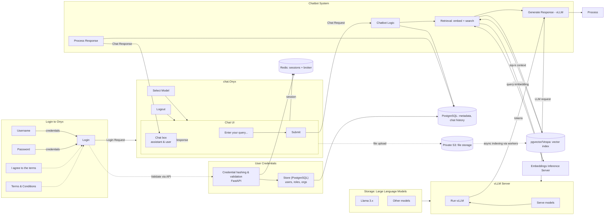

# Onyx Interface Diagram (Simplified, vLLM)

The following diagram mirrors the attached example: login pane on the left, main app/chat UI, user credentials box, model storage, vLLM server, and chatbot system with request/response loops. Only key components are shown.

Notes:
- User credentials are stored in PostgreSQL; validation and hashing are done by the API (FastAPI). Sessions are maintained in Redis.
- Retrieval uses embeddings from the Embeddings Inference Server and vector search via pgvector or Vespa.
- Generation is performed by vLLM (replacing Ollama). The UI receives streamed tokens and renders progressively.
- Optional: file uploads go to Private S3 and are indexed asynchronously by workers into pgvector/Vespa.
