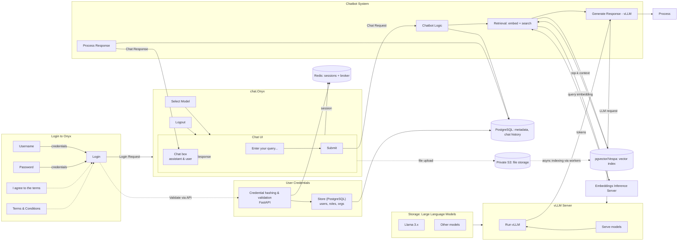

# Onyx Interface Diagram (Simplified, vLLM)

The following diagram mirrors the attached example: login pane on the left, main app/chat UI, user credentials box, model storage, vLLM server, and chatbot system with request/response loops. Only key components are shown.

Notes:
- User credentials are stored in PostgreSQL; validation and hashing are done by the API (FastAPI). Sessions are maintained in Redis.
- Retrieval uses embeddings from the Embeddings Inference Server and vector search via pgvector or Vespa.
- Generation is performed by vLLM (replacing Ollama). The UI receives streamed tokens and renders progressively.
- Optional: file uploads go to Private S3 and are indexed asynchronously by workers into pgvector/Vespa.

---

## End-to-End Request Details (What happens for each action)

### 1) Login request
1. Browser submits POST `/api/auth/login` with email/password.
2. NGINX forwards to the API Server.
3. API Server steps:
   - Hashes and verifies credentials against `PostgreSQL` users table.
   - If valid: creates a session record and/or JWT, stores session in `Redis` (TTL), returns 200 with token and profile payload.
   - If invalid: returns 401/403 with error message and no token; rate limits may apply.
4. Browser stores token securely and switches UI to the chat screen.

### 2) Session validation (every request)
1. Browser attaches `Authorization: Bearer <token>` to all subsequent API calls.
2. API Server validates token signature and expiration, and checks `Redis` for session state (e.g., revoked, expired, tenant).
3. If invalid/expired: 401 returned; UI redirects to Login.

### 3) Select model
1. Browser calls `POST /api/chat/model` with selected model ID.
2. API validates the model is allowed for the user/org, persists preference in `PostgreSQL` (user settings or session-scoped), responds 200.
3. UI reflects the active model; subsequent generations target this model on `vLLM`.

### 4) Send chat message (query)
1. Browser sends `POST /api/chat/query` with message text and optional context (selected files/projects).
2. API flow:
   - Authorization: verify user/org membership and project access via `PostgreSQL`.
   - Embeddings: call Embeddings Inference Server to embed the question.
   - Retrieval: execute vector search in `pgvector` (PostgreSQL) or `Vespa` to fetch top-k passages; apply tenant/project filters.
   - Prompt assembly: construct system/user prompts with citations and context.
   - Generation: call `vLLM` with assembled prompt; prefer streaming.
3. Streaming: API streams tokens back to the browser (SSE/WebSocket), NGINX routes `/api/stream` with `Connection: upgrade` only for stream endpoints.
4. UI renders tokens progressively; on complete, message is committed to `PostgreSQL` (chat history) along with references to sources.

Failure cases:
- Missing/invalid session → 401.
- Retrieval empty → API still calls `vLLM` with fallback instructions (answer from general knowledge or ask for clarification), and marks low-confidence.
- `vLLM` timeout → API returns 504/500 with a user-friendly retry message.

### 5) Upload file (optional context)
1. Browser sends `POST /api/files/upload` (multipart) with file and project.
2. API validates size/type; stores blob in `Private S3` (encrypted-at-rest), creates file metadata in `PostgreSQL`.
3. API enqueues indexing via `Celery` (broker: `Redis`).
4. Workers perform: fetch → chunk → embed (Embeddings Server) → index (pgvector/Vespa).
5. When done, index reflects new content; subsequent retrievals can surface these snippets.

Failure cases:
- Exceeds NGINX `client_max_body_size` → 413; UI prompts to adjust or compress.
- Unsupported type → 400 with guidance; no job queued.

### 6) List recent files
1. Browser calls `GET /api/user/files/recent`.
2. API checks user/org and returns file metadata from `PostgreSQL` (with project scoping).

### 7) Delete/unlink file
1. Browser calls either `DELETE /api/user/projects/file/{fileId}` (hard delete for user files) or an unlink endpoint (detach from project).
2. API checks ownership/role and either:
   - Deletes metadata and schedules index cleanup, or
   - Removes linkage from project only.
3. Index cleanup job removes vectors from pgvector/Vespa; S3 object may be deleted if it’s a full delete.

### 8) Logout
1. Browser calls `POST /api/auth/logout`.
2. API marks session/JWT as revoked/expired in `Redis` and returns 200.
3. UI clears local token and redirects to Login.

### 9) Health checks and liveness
- NGINX/Platform periodically probes web and API endpoints.
- API exposes `/healthz` and dependency checks (PostgreSQL, Redis, vLLM reachable, embeddings reachable).

---

## Error Handling and Observability
- Structured errors: consistent JSON with `code`, `message`, optional `hint`.
- Correlation IDs: each request logs an ID tying UI, API, and worker logs.
- Metrics: request latency, vLLM/token throughput, retrieval hit rates, indexing backlog.
- Alerts: timeouts to vLLM, Redis/DB connectivity, indexing failures, auth anomalies.

---

## Credential Hashing: Why and How (Technical)

### Why hash credentials?
- Storing raw passwords is unacceptable: a DB leak would immediately compromise every account.
- Hashing turns a password into a one-way, irreversible digest. Even if the DB is leaked, attackers cannot easily recover the original password.
- Salts ensure identical passwords produce different hashes and defeat rainbow tables.

### Recommended algorithms
- Prefer memory-hard algorithms designed for passwords: `argon2id` (preferred) or `bcrypt` with a strong cost factor.
- Avoid fast general-purpose hashes (SHA-2, SHA-3) for passwords; they are too fast to brute force.

### How it works in the API
1. Registration/Password change:
   - API generates a unique random salt per user.
   - Derives a hash using `argon2id` (or `bcrypt`) with configured parameters (memory/cost, time, parallelism).
   - Stores only: `algorithm`, `parameters`, `salt`, and `password_hash` in `PostgreSQL`.
   - Never stores raw passwords or reversible encryption keys.
2. Login:
   - API fetches the user’s salt and hashing parameters from `PostgreSQL`.
   - Recomputes the hash over the submitted password.
   - Compares using constant-time comparison to avoid timing attacks.
   - On success, issues a session/JWT and stores session state in `Redis`.

### Parameters and security knobs
- Argon2id: tune `memory_cost`, `time_cost`, and `parallelism` to slow attackers while staying acceptable for user latency.
- Bcrypt: tune `cost` (work factor). Typical values: 12–14 in production depending on CPU.
- Pepper (optional): a server-side secret added before hashing; stored outside the DB (e.g., in a secrets manager). Increases defense if DB is compromised but app server secrets are not.

### Operational guidance
- Enforce password policies: minimum length, block common/breached passwords, throttle login attempts.
- Rate limiting and exponential backoff on login endpoints reduce online brute-force.
- MFA can be added on top of hashing for high-assurance accounts.
- Use TLS everywhere (NGINX) so credentials are never sent in cleartext.
- Rotation and migration: support hash upgrades (e.g., bcrypt→argon2id) by rehashing on next successful login when parameters are outdated.
- Audit and logging: never log raw passwords; log only authentication outcomes and reasons (redacted).

### Where data lives
- `PostgreSQL`: stores user records, per-user salt, hashing params, and password hash.
- `Redis`: stores session state/blacklist; never stores raw passwords.
- `Secrets Manager` (or Kubernetes secrets): stores pepper and signing keys for JWT.

### Common pitfalls to avoid
- Using a single global salt for all users (must be per-user unique salts).
- Hashing with bare SHA-256/512 without KDF parameters.
- Storing or logging plaintext passwords anywhere.

---

## Communication Interfaces (Protocols, Methods, Paths)

Deployment note for restricted environments:
- External client traffic MUST be `HTTPS` only (TLS 1.2+). NGINX terminates TLS; enable HSTS and disable plain HTTP.
- Internal service traffic is cluster-internal. If you require encryption-in-transit internally, use mTLS (service mesh) or per-service TLS where supported.

### External HTTP APIs (via NGINX → API Server)

| Protocol | Port | Method | Path | Purpose | Auth Required | Upstream/Notes |
|---|---|---|---|---|---|---|
| HTTPS | 443 | POST | `/api/auth/login` | Authenticate user (email/password) | No (credentials in body) | Checks `PostgreSQL`, creates session in `Redis`, returns token |
| HTTPS | 443 | POST | `/api/auth/logout` | End session | Yes | Revokes/blacklists session/JWT in `Redis` |
| HTTPS | 443 | GET | `/api/healthz` | Health probe | No | Lightweight status: DB/Redis/connectivity |
| HTTPS | 443 | POST | `/api/chat/model` | Select active model | Yes | Persists preference in `PostgreSQL` |
| HTTPS | 443 | POST | `/api/chat/query` | Submit chat message | Yes | Retrieval (pgvector/Vespa) + generation (vLLM); persists history |
| HTTPS | 443 | GET | `/api/stream` | Stream chat tokens | Yes | SSE/WebSocket; NGINX `Connection: upgrade` only here |
| HTTPS | 443 | POST | `/api/files/upload` | Upload file into a project | Yes | S3 blob; metadata in `PostgreSQL`; enqueues indexing |
| HTTPS | 443 | GET | `/api/user/files/recent` | List recent files | Yes | From `PostgreSQL` with tenant scoping |
| HTTPS | 443 | DELETE | `/api/user/projects/file/{fileId}` | Delete/unlink file | Yes | Removes linkage; index cleanup; S3 delete if hard delete |

Note: Exact paths may vary slightly per Onyx version; these are the standard stable shapes used in this deployment.

### Internal Service Calls (service-to-service)

| Caller | Callee | Protocol | Port (typical) | Purpose |
|---|---|---|---|---|
| API Server | Redis | redis (or rediss for TLS) | 6379 (rediss: 6380) | Session storage, token revocation, Celery broker |
| API Server | PostgreSQL | postgres (TLS if enabled) | 5432 | Users, orgs, chat history, metadata; pgvector index |
| API Server | Vespa | HTTP (or HTTPS) | 8080 (admin 19071) | Vector/keyword retrieval when Vespa is enabled |
| API Server | Embeddings Server | HTTP (or HTTPS) | 8000/8080 | Generate embeddings for queries/chunks |
| API Server | vLLM | HTTP (or HTTPS) | 8000 | Text generation; supports streaming |
| API Server | Private S3 | S3 (HTTPS) | 443 | Store/retrieve user file blobs |
| Celery Workers | Redis | redis (or rediss) | 6379 (6380) | Job queue (enqueue/dequeue, statuses) |
| Celery Workers | Embeddings Server | HTTP (or HTTPS) | 8000/8080 | Chunk embeddings during indexing |
| Celery Workers | pgvector/Vespa | postgres/HTTP(S) | 5432 / 8080 | Index vectors and metadata |
| Celery Workers | Private S3 | S3 (HTTPS) | 443 | Fetch file content for processing |

Security summary:
- All external traffic terminates TLS at NGINX; services communicate over cluster-internal networks. For restricted environments, disable plain HTTP listeners and enforce TLS everywhere.
- Authorization enforced at API on every request; tenant scoping applied to all DB/index queries.
- Credentials and keys (JWT signing, pepper) stored in secrets, not in code or DB.
