```mermaid
graph TD
    Layer1[🔐 Layer 1: JWT Authentication<br/>Token Validation<br/>Signature Check]
    Layer2[🔒 Layer 2: Authorization<br/>Ownership Verification<br/>User ID Check]
    Layer3[🛡️ Layer 3: Database RLS<br/>Row-Level Security<br/>Foreign Key Constraints]
    Layer4[🔑 Layer 4: Cache Isolation<br/>Tenant-Aware Keys<br/>TTL Expiration]
    
    Layer1 --> Layer2
    Layer2 --> Layer3
    Layer3 --> Layer4
    
    classDef layerClass fill:#fff9c4,stroke:#f57f17,stroke-width:2px
    class Layer1,Layer2,Layer3,Layer4 layerClass
```

# Onyx Sessions Architecture - Simple Visual Diagram

## 🎯 Simple Architecture Overview

This diagram shows the clean architecture of how sessions work in Onyx, with all key components and their relationships.

```mermaid
graph LR
    %% User
    User[👤 User Browser<br/>Stores JWT Token]
    
    %% Gateway
    NGINX[🔐 NGINX Gateway<br/>Routes Requests]
    
    %% API Server
    API[⚙️ API Server<br/>Validates & Processes]
    
    %% Cache
    Redis[💾 Redis Cache<br/>JWT Tokens & Sessions<br/>TTL: 24h]
    
    %% Database
    DB[(🗄️ PostgreSQL<br/>Users, Sessions, Messages<br/>RLS Policies)]
    
    %% Flow
    User -->|1. Login Request| NGINX
    NGINX -->|2. Forward| API
    API -->|3. Validate| DB
    API -->|4. Generate Token| Redis
    Redis -->|5. Return Token| API
    API -->|6. Return Token| NGINX
    NGINX -->|7. Set Cookie| User
    
    User -->|8. API Request<br/>with JWT| NGINX
    NGINX -->|9. Extract Token| API
    API -->|10. Validate Token| Redis
    Redis -->|11. Return user_id| API
    API -->|12. Query Data| DB
    DB -->|13. Filtered Results| API
    API -->|14. Response| NGINX
    NGINX -->|15. Return Data| User
    
    %% Styling
    classDef userClass fill:#e1f5ff,stroke:#01579b,stroke-width:3px
    classDef gatewayClass fill:#fff3e0,stroke:#e65100,stroke-width:3px
    classDef apiClass fill:#f3e5f5,stroke:#4a148c,stroke-width:3px
    classDef cacheClass fill:#ffebee,stroke:#b71c1c,stroke-width:3px
    classDef dbClass fill:#e8f5e9,stroke:#1b5e20,stroke-width:3px
    
    class User userClass
    class NGINX gatewayClass
    class API apiClass
    class Redis cacheClass
    class DB dbClass
```

---

## 📊 Component Architecture

```mermaid
graph TB
    subgraph Client["👤 CLIENT LAYER"]
        Browser[User Browser<br/>JWT Token Storage]
    end
    
    subgraph Gateway["🔐 GATEWAY LAYER"]
        NGINX[NGINX<br/>Request Routing<br/>Token Extraction]
    end
    
    subgraph Application["⚙️ APPLICATION LAYER"]
        APIServer[API Server FastAPI<br/>Token Validation<br/>User Context<br/>Data Processing]
    end
    
    subgraph Cache["💾 CACHE LAYER"]
        RedisCache[Redis Cache<br/>JWT Tokens<br/>Active Sessions<br/>TTL Management]
    end
    
    subgraph Database["🗄️ DATABASE LAYER"]
        PostgreSQL[(PostgreSQL<br/>Users Table<br/>Chat Sessions<br/>Messages<br/>RLS Policies)]
    end
    
    Browser -->|HTTP Requests<br/>with JWT| NGINX
    NGINX -->|Forward Request| APIServer
    APIServer <-->|Validate Token<br/>Store Sessions| RedisCache
    APIServer <-->|Query Data<br/>Filter by user_id| PostgreSQL
    
    %% Styling
    classDef clientClass fill:#e1f5ff,stroke:#01579b,stroke-width:2px
    classDef gatewayClass fill:#fff3e0,stroke:#e65100,stroke-width:2px
    classDef appClass fill:#f3e5f5,stroke:#4a148c,stroke-width:2px
    classDef cacheClass fill:#ffebee,stroke:#b71c1c,stroke-width:2px
    classDef dbClass fill:#e8f5e9,stroke:#1b5e20,stroke-width:2px
    
    class Browser clientClass
    class NGINX gatewayClass
    class APIServer appClass
    class RedisCache cacheClass
    class PostgreSQL dbClass
```

---

## 🔄 Simple Flow Explanation

### **Login Flow (Steps 1-7):**
1. User sends login credentials
2. NGINX routes to API Server
3. API validates credentials against PostgreSQL
4. API generates JWT token
5. Token stored in Redis (24h TTL)
6. Token returned to user
7. Browser stores token in HTTP-only cookie

### **Data Access Flow (Steps 8-15):**
8. User sends API request with JWT token
9. NGINX extracts token from request
10. API validates token in Redis
11. Redis returns user_id and tenant_id
12. API queries PostgreSQL with user_id filter
13. Database returns only user's data (RLS enforced)
14. API returns filtered results
15. User receives their data

---

## 🔐 Security Layers

---

## 📋 Key Components

### **👤 User Browser**
- Stores JWT token in HTTP-only cookie
- Sends token with every API request
- Manages client-side session state

### **🔐 NGINX Gateway**
- Routes all incoming requests
- Extracts JWT tokens from cookies/headers
- Load balances across API servers
- SSL/TLS termination

### **⚙️ API Server (FastAPI)**
- Validates JWT token signature and expiration
- Extracts user_id and tenant_id from token
- Sets current_user context for request
- Verifies user ownership of data
- Processes business logic
- Filters responses by user_id

### **💾 Redis Cache**
- Stores JWT tokens: `auth:session:{token}` (TTL: 24h)
- Stores active sessions: `session:{session_id}` (TTL: 1h)
- Tenant-aware key namespacing
- Fast sub-second lookups

### **🗄️ PostgreSQL Database**
- **user table**: User accounts and credentials
- **chat_session table**: Chat conversations (linked to user_id)
- **chat_message table**: Individual messages (linked to session_id)
- **Row-Level Security (RLS)**: Policies enforce user isolation
- **Foreign Keys**: All tables link to user_id for data integrity

---

## ✅ Data Isolation Guarantees

1. **User Isolation**: Every record has `user_id` foreign key → Users can only see their own data
2. **Tenant Isolation**: `tenant_id` in JWT token → Organizations completely separated
3. **Session Isolation**: Sessions belong to one user → No cross-user access
4. **Database RLS**: Policies enforce isolation at database level → Even SQL bypasses blocked

---

## 📋 Component Breakdown

### **1. User Browser Layer**
- **Login**: User enters credentials (email + password)
- **Token Storage**: JWT token stored in HTTP-only cookie
- **Requests**: All API requests include JWT token
- **Session Management**: Creates and manages chat sessions
- **Message Sending**: Sends messages to chat sessions

### **2. NGINX Gateway Layer**
- **Request Routing**: Receives all incoming requests
- **Token Extraction**: Extracts JWT from cookie/header
- **Load Balancing**: Routes to appropriate API server
- **SSL Termination**: Handles HTTPS/TLS encryption

### **3. API Server Layer (FastAPI)**
- **Token Validation**: Validates JWT signature and expiration
- **User Extraction**: Extracts `user_id` and `tenant_id` from token
- **Context Setting**: Sets `current_user` context for request
- **Ownership Verification**: Checks user owns the data being accessed
- **Request Processing**: Processes business logic
- **Response Return**: Returns data filtered by user_id

### **4. Redis Cache Layer**
- **Authentication Cache**: Stores JWT tokens with TTL (24h)
  - Key: `auth:session:{token}`
  - Value: `{user_id, tenant_id, expires_at}`
- **Session Cache**: Stores active session data (TTL: 1h)
  - Key: `session:{session_id}`
  - Value: `{user_id, last_accessed, data}`
- **Tenant Isolation**: Uses tenant-aware key namespacing

### **5. PostgreSQL Database Layer**
- **User Table**: Stores user accounts and credentials
  - Primary Key: `id` (UUID)
  - Fields: `email`, `password_hash`, `role`, `preferences`
- **Chat Session Table**: Stores chat conversations
  - Primary Key: `id` (UUID)
  - Foreign Key: `user_id` → `user.id`
  - Fields: `description`, `time_created`, `time_updated`
- **Chat Message Table**: Stores individual messages
  - Primary Key: `id` (UUID)
  - Foreign Key: `chat_session_id` → `chat_session.id`
  - Fields: `message`, `message_type`, `token_count`
- **Row-Level Security (RLS)**: Database-level policies enforcing user isolation

---

## 🔄 Complete Flow Explanation

### **Step 1-9: Authentication Flow**
1. User submits login credentials
2. NGINX extracts credentials and routes to API Server
3. API Server validates credentials against PostgreSQL `user` table
4. If valid, generates JWT token with `user_id` and `tenant_id` claims
5. Stores token in Redis with key `auth:session:{token}` (TTL: 24h)
6. Returns token to client as HTTP-only cookie
7. Client stores token for future requests

### **Step 10-22: Session Creation Flow**
8. User creates new chat session (POST with JWT token)
9. NGINX extracts JWT token from request
10. API Server validates token signature and expiration
11. Checks Redis cache for token validity
12. Extracts `user_id` from token claims
13. Creates new record in `chat_session` table with `user_id` FK
14. PostgreSQL RLS policy verifies user owns the session
15. Caches session data in Redis for fast access
16. Returns `session_id` to client

### **Step 23-35: Message Flow**
17. User sends message (POST with JWT + session_id)
18. NGINX extracts JWT token
19. API Server validates token and extracts `user_id`
20. Verifies user owns the chat session (ownership check)
21. PostgreSQL RLS policy enforces user isolation
22. Creates message record in `chat_message` table with `chat_session_id` FK
23. Returns message confirmation to client

---

## 🔐 Security Layers

### **Layer 1: Authentication (JWT Tokens)**
- Secure token generation using secrets
- Token signature validation
- Expiration handling (24h TTL)
- Token refresh mechanism

### **Layer 2: Authorization (Ownership Verification)**
- User ID extraction from token
- Ownership checks before data access
- API endpoint permission validation
- Role-based access control (RBAC)

### **Layer 3: Database Isolation (RLS Policies)**
- Row-Level Security policies
- Foreign key constraints
- User ID filtering in all queries
- Tenant schema isolation

### **Layer 4: Cache Isolation (Tenant-Aware Keys)**
- Tenant ID in Redis keys
- Namespace isolation
- TTL-based expiration
- Cache invalidation on logout

---

## 📊 Data Isolation Guarantees

### **User Isolation:**
- ✅ Every table has `user_id` foreign key
- ✅ All queries filter by `user_id`
- ✅ RLS policies enforce user-level access
- ✅ No cross-user data access possible

### **Tenant Isolation:**
- ✅ `tenant_id` in JWT token claims
- ✅ Tenant-aware Redis key namespacing
- ✅ Schema-level separation (multi-tenant)
- ✅ Complete data isolation between organizations

### **Session Isolation:**
- ✅ Each chat session belongs to one user
- ✅ Messages linked via `chat_session_id` → `user_id`
- ✅ Ownership verification on every request
- ✅ Session cache scoped by user

---

## 🎯 Key Takeaways

1. **Multi-Layer Security**: Authentication (JWT) → Authorization (Ownership) → Database (RLS) → Cache (Tenant Isolation)

2. **Complete Data Isolation**: Every data record is linked to `user_id` via foreign keys, enforced by RLS policies

3. **Fast Access**: Redis cache stores sessions and tokens for sub-second retrieval

4. **Persistent Storage**: PostgreSQL stores all data permanently with ACID guarantees

5. **Scalable Architecture**: Stateless API servers with Redis caching enable horizontal scaling

---

**Document Version:** 1.0  
**Last Updated:** [Current Date]  
**Visualization:** Mermaid Diagram

