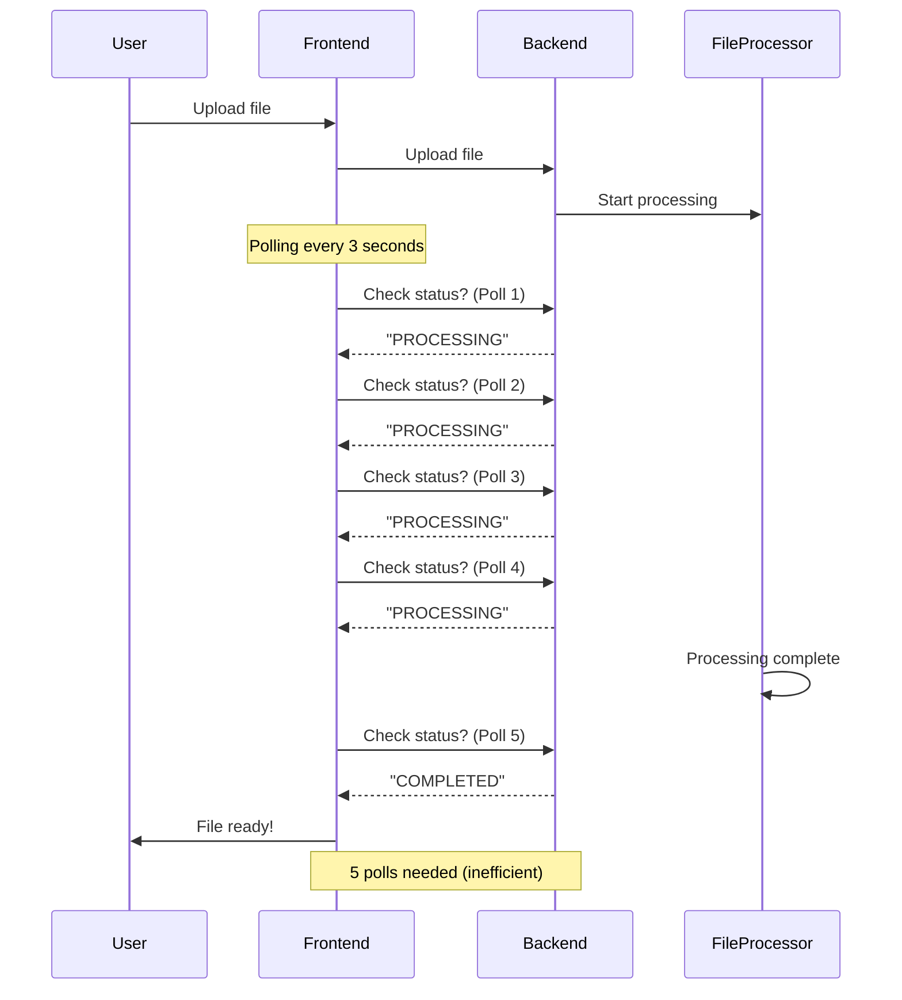
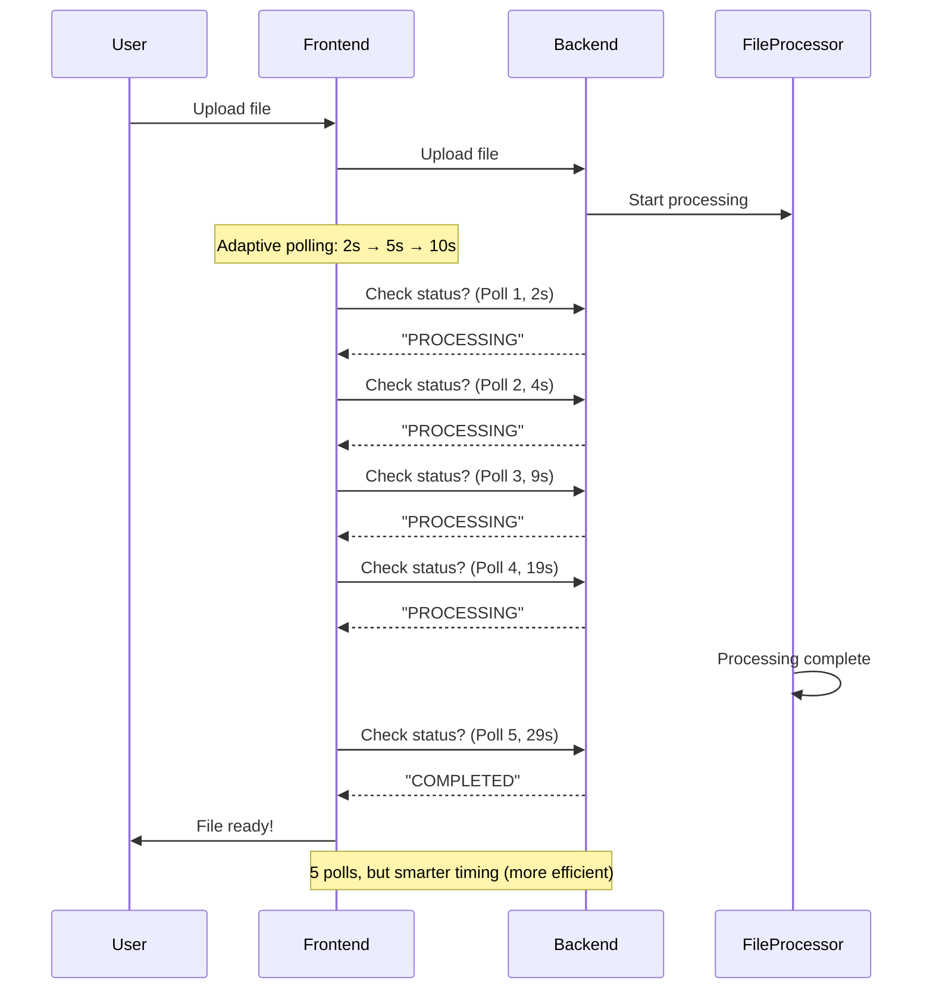
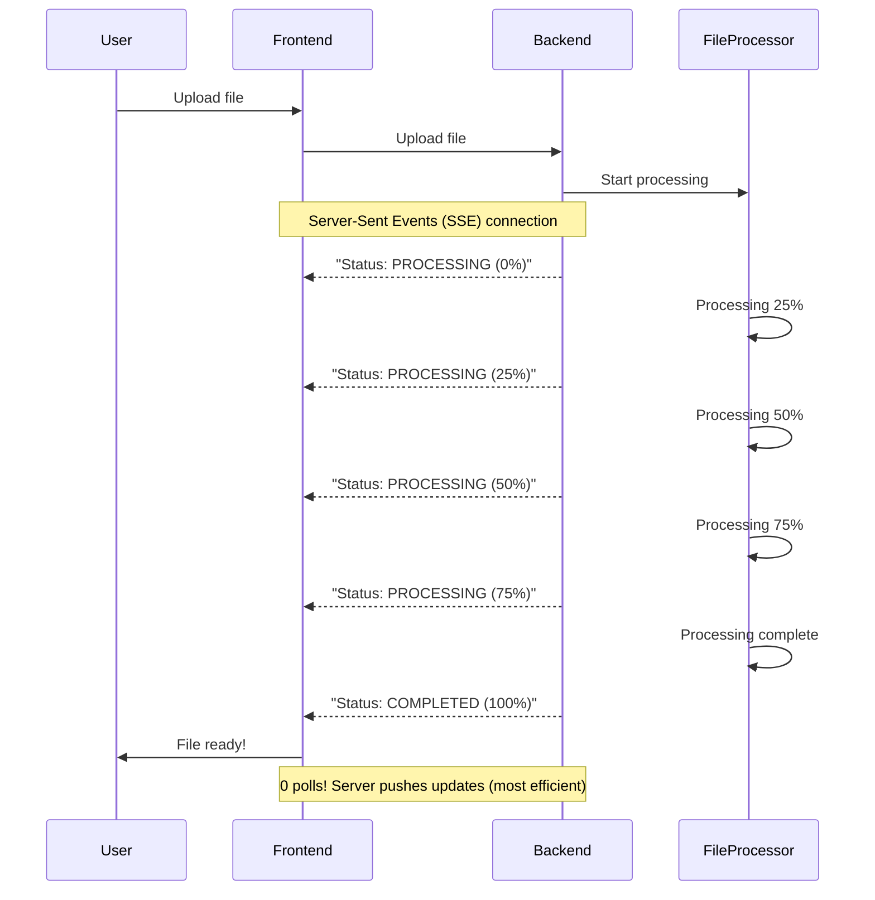
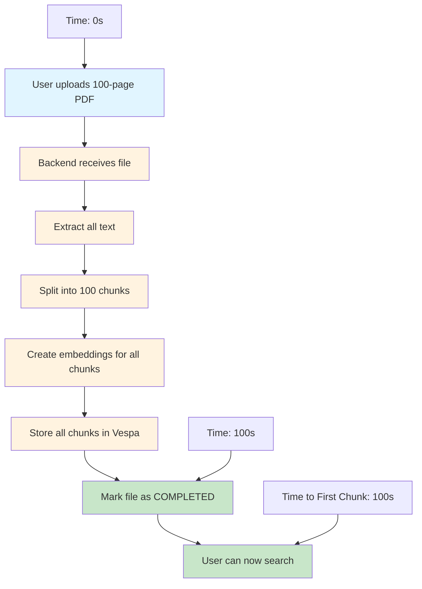
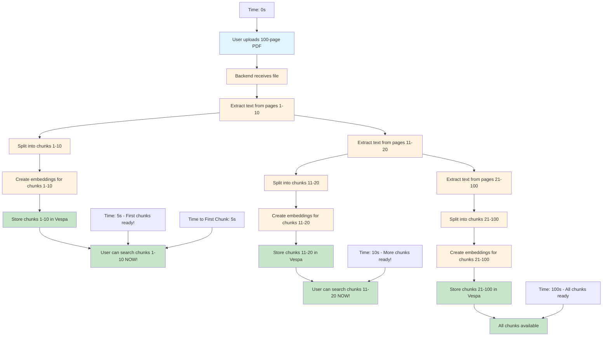

# Polling Efficiency & Time to First Chunk - Explained Simply

## 📚 What is "Polling Efficiency"?

### **Simple Explanation:**

Imagine you're waiting for a package to arrive. You have two options:

**Option 1: Check the mailbox every 5 minutes**
- You walk to the mailbox, check if it's there, walk back
- If the package arrives at 2:30 PM, but you check at 2:00, 2:05, 2:10, 2:15, 2:20, 2:25, 2:30...
- You checked **7 times** before finding it
- That's **inefficient** - you wasted time checking when nothing was there

**Option 2: Check the mailbox every 30 minutes**
- You check at 2:00, 2:30, 3:00...
- If the package arrives at 2:15 PM, you don't find it until 2:30 PM
- You only checked **2 times**, but you waited longer
- That's **efficient** (fewer checks) but **slower** (longer wait)

**Polling Efficiency = How many times you check before finding what you're looking for**

### **In Onyx Terms:**

When you upload a file, Onyx needs to know when it's done processing. It does this by **"polling"** (asking the server): "Is the file ready yet?"

**Current System:**
```
Time: 0s  → Check: "Ready?" → "No, still processing"
Time: 3s  → Check: "Ready?" → "No, still processing"
Time: 6s  → Check: "Ready?" → "No, still processing"
Time: 9s  → Check: "Ready?" → "No, still processing"
Time: 12s → Check: "Ready?" → "Yes! Ready!"
```

**Polling Efficiency = 5 checks** (we checked 5 times before finding it ready)

**Better System (Adaptive Polling):**
```
Time: 0s  → Check: "Ready?" → "No, still processing"
Time: 2s  → Check: "Ready?" → "No, still processing"
Time: 4s  → Check: "Ready?" → "No, still processing"
Time: 7s  → Check: "Ready?" → "No, still processing"
Time: 12s → Check: "Ready?" → "Yes! Ready!"
```

**Polling Efficiency = 5 checks** (same number, but smarter timing)

**Even Better System (SSE - Server Pushes Updates):**
```
Time: 0s  → Server: "File is processing..."
Time: 5s  → Server: "File is processing... (50% done)"
Time: 10s → Server: "File is ready!"
```

**Polling Efficiency = 0 checks** (server tells us, we don't ask!)

---

## 📚 What is "Time to First Chunk"?

### **Simple Explanation:**

Imagine you're baking cookies. You have a big batch of cookie dough:

**Traditional Way (Current System):**
1. Make all the dough
2. Cut all the cookies
3. Bake all the cookies
4. **Only then** can you eat cookies

**Time to First Cookie = 2 hours** (you wait until ALL cookies are done)

**Better Way (Incremental Processing):**
1. Make some dough
2. Cut some cookies
3. Bake those cookies
4. **Eat cookies while still making more!**

**Time to First Cookie = 30 minutes** (you can eat cookies while still baking)

### **In Onyx Terms:**

When you upload a large document (like a 100-page PDF), Onyx needs to:
1. Extract the text
2. Split it into "chunks" (small pieces)
3. Create "embeddings" (searchable representations)
4. Store them in the search system

**Current System (All-or-Nothing):**
```
Time: 0s   → Start processing 100-page PDF
Time: 10s  → Processing page 10/100
Time: 20s  → Processing page 20/100
Time: 30s  → Processing page 30/100
...
Time: 100s → ALL pages processed → NOW you can search
```

**Time to First Chunk = 100 seconds** (you wait until ALL chunks are ready)

**Better System (Incremental):**
```
Time: 0s   → Start processing 100-page PDF
Time: 5s   → Pages 1-10 processed → You can search these NOW!
Time: 10s  → Pages 11-20 processed → You can search these NOW!
Time: 15s  → Pages 21-30 processed → You can search these NOW!
...
Time: 100s → ALL pages processed
```

**Time to First Chunk = 5 seconds** (you can search after just 5 seconds!)

---

## 🎯 Why These Metrics Matter

### **Polling Efficiency:**

**Bad (Inefficient):**
- ❌ Checks every 1 second → 100 checks for a 100-second file
- ❌ Wastes network bandwidth
- ❌ Wastes server resources
- ❌ Slows down the system

**Good (Efficient):**
- ✅ Checks every 2-10 seconds (adaptive)
- ✅ Only 10-50 checks for a 100-second file
- ✅ Uses less bandwidth
- ✅ Uses less server resources
- ✅ Faster system

**Target:** < 10 polls per file (for a typical 30-60 second file)

### **Time to First Chunk:**

**Bad (Slow):**
- ❌ Wait 60 seconds for a large file
- ❌ User gets frustrated
- ❌ Can't use the file immediately
- ❌ Poor user experience

**Good (Fast):**
- ✅ Wait only 5-10 seconds
- ✅ User can start using the file quickly
- ✅ Better user experience
- ✅ More responsive system

**Target:** < 10 seconds for typical files

---

## 📊 Visual Diagrams

### **Diagram 1: Current Polling System**



**Problems:**
- ❌ Frontend keeps asking "Is it ready?" every 3 seconds
- ❌ Wastes network requests
- ❌ Fixed interval (not adaptive)

---

### **Diagram 2: Adaptive Polling System**



**Benefits:**
- ✅ Checks more frequently at first (when file is likely to finish soon)
- ✅ Checks less frequently later (when file takes longer)
- ✅ Fewer total polls for long files
- ✅ Still responsive for short files

---

### **Diagram 3: SSE/WebSocket System (Best)**



**Benefits:**
- ✅ **Zero polling** - Server tells frontend when status changes
- ✅ **Real-time updates** - Instant feedback
- ✅ **Less network traffic** - Only updates when status changes
- ✅ **Better user experience** - See progress in real-time

---

### **Diagram 4: Current Chunking System (All-or-Nothing)**



**Problems:**
- ❌ User waits 100 seconds before they can search
- ❌ All-or-nothing approach
- ❌ Poor user experience

---

### **Diagram 5: Incremental Chunking System (Better)**



**Benefits:**
- ✅ User can search after just 5 seconds
- ✅ More chunks become available over time
- ✅ Better user experience
- ✅ Can start using file immediately

---

## 🎯 Suggested Solution: Combined Approach

### **Phase 1: Adaptive Polling (Easy, Quick Win)**

**What it does:**
- Check more frequently at first (when file is likely to finish soon)
- Check less frequently later (when file takes longer)
- Stop checking when all files are done

**Implementation:**
```typescript
// Current: Fixed 3-second interval
setInterval(poll, 3000);

// Better: Adaptive interval
const getPollInterval = (elapsedTime: number) => {
  if (elapsedTime < 30000) return 2000;   // First 30s: Check every 2s
  if (elapsedTime < 120000) return 5000;  // Next 90s: Check every 5s
  return 10000;                            // After 2min: Check every 10s
};
```

**Result:**
- ✅ Fewer polls for long files
- ✅ Still responsive for short files
- ✅ Easy to implement
- ✅ Immediate improvement

---

### **Phase 2: SSE Status Updates (Better, Medium Effort)**

**What it does:**
- Server pushes status updates to frontend
- No polling needed
- Real-time updates

**Implementation:**
```python
# Backend: SSE endpoint
@app.get("/api/user/files/status/stream")
async def stream_file_statuses(file_ids: list[UUID]):
    async def event_generator():
        while True:
            statuses = get_file_statuses(file_ids)
            yield f"data: {json.dumps(statuses)}\n\n"
            await asyncio.sleep(2)
    
    return StreamingResponse(event_generator(), media_type="text/event-stream")
```

```typescript
// Frontend: Listen to SSE
const eventSource = new EventSource(`/api/user/files/status/stream?ids=${fileIds}`);
eventSource.onmessage = (event) => {
  const statuses = JSON.parse(event.data);
  updateFileStatuses(statuses);
};
```

**Result:**
- ✅ Zero polling
- ✅ Real-time updates
- ✅ Better performance
- ✅ Better user experience

---

### **Phase 3: Incremental Processing (Best, More Complex)**

**What it does:**
- Process file in batches
- Make chunks available as soon as they're ready
- User can search while file is still processing

**Implementation:**
```python
# Backend: Process in batches
def process_file_incrementally(file_id: UUID):
    chunks_ready = []
    for batch in process_in_batches(file_id, batch_size=10):
        chunks = process_batch(batch)
        chunks_ready.extend(chunks)
        
        # Make available immediately
        index_chunks(chunks_ready)
        
        # Update status with progress
        update_file_status(file_id, {
            "status": "PROCESSING",
            "chunks_ready": len(chunks_ready),
            "chunks_total": total_chunks,
            "progress": len(chunks_ready) / total_chunks * 100
        })
```

**Result:**
- ✅ Time to first chunk: 5-10 seconds (instead of 60+ seconds)
- ✅ User can start using file immediately
- ✅ Better user experience
- ✅ More complex to implement

---

## 📊 Comparison Table

| Metric | Current System | Adaptive Polling | SSE Updates | Incremental Processing |
|--------|---------------|-----------------|-------------|------------------------|
| **Polling Efficiency** | 20 polls (3s interval) | 10 polls (adaptive) | 0 polls (server pushes) | 0 polls (server pushes) |
| **Time to First Chunk** | 60s (all-or-nothing) | 60s (all-or-nothing) | 60s (all-or-nothing) | 5-10s (incremental) |
| **Network Traffic** | High (constant polling) | Medium (adaptive) | Low (only on changes) | Low (only on changes) |
| **User Experience** | ⭐⭐ (waiting) | ⭐⭐⭐ (better feedback) | ⭐⭐⭐⭐ (real-time) | ⭐⭐⭐⭐⭐ (instant use) |
| **Implementation Difficulty** | ✅ Easy | ✅ Easy | ⚠️ Medium | ⚠️ Hard |
| **Recommended Priority** | - | 🥇 Phase 1 | 🥈 Phase 2 | 🥉 Phase 3 |

---

## 🎯 Recommended Implementation Order

### **Step 1: Adaptive Polling (This Week)**
- ✅ Easy to implement
- ✅ Immediate improvement
- ✅ Better polling efficiency

### **Step 2: SSE Updates (Next Month)**
- ⚠️ Medium effort
- ✅ Zero polling
- ✅ Real-time updates

### **Step 3: Incremental Processing (Next Quarter)**
- ⚠️ More complex
- ✅ Best user experience
- ✅ Fastest time to first chunk

---

## 📝 Summary

**Polling Efficiency:**
- How many times we check before finding the file ready
- **Current:** 20+ checks (inefficient)
- **Target:** < 10 checks (efficient)
- **Best:** 0 checks (SSE - server pushes updates)

**Time to First Chunk:**
- How long until user can search the file
- **Current:** 60+ seconds (all-or-nothing)
- **Target:** < 10 seconds (incremental processing)
- **Best:** 5 seconds (process in batches)

**Solution:**
1. **Adaptive Polling** - Check smarter (fewer checks)
2. **SSE Updates** - Server pushes updates (zero checks)
3. **Incremental Processing** - Make chunks available as ready (fast first chunk)

