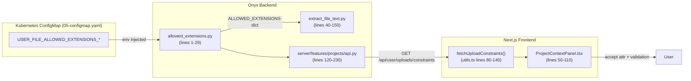

# Simple Guide: Make Allowed File Extensions Configurable

Follow these steps exactly. Each step shows **where** to change the code, the **old block**, and the **new block**.

---

## Architecture Snapshot – How the Environment Variable Flows



- **ConfigMap** defines the env vars.
- **allowed_extensions.py** reads env vars once and exports `ALLOWED_EXTENSIONS`.
- **extract_file_text.py** and `upload_user_files` import the same dict, so processing + validation stay in sync.
- **GET /api/user/uploads/constraints** returns the dict to the frontend.
- **Frontend utilities** fetch it once, then components build the `<input accept="...">` string and UI checks.

### Quick Line Reference Table

| File | Lines to edit | Purpose |
|------|---------------|---------|
| `backend/onyx/file_processing/allowed_extensions.py` | new file | Load env vars (required) and expose `ALLOWED_EXTENSIONS`. |
| `backend/onyx/file_processing/extract_file_text.py` | ~43-140 | Replace hard-coded lists + helper functions. |
| `backend/onyx/server/features/projects/api.py` | ~120-250 | Validate uploads + add optional `/uploads/constraints`. |
| `web/src/lib/utils.ts` | ~80-150 | Add `fetchUploadConstraints()` and remove `IMAGE_EXTENSIONS`. |
| `web/src/app/chat/components/projects/ProjectContextPanel.tsx` | ~40-120 | Fetch constraints and wire to `<input accept>`. |
| `manifests/05-configmap.yaml` | `data:` block | Set `USER_FILE_ALLOWED_EXTENSIONS_*` env vars. |

Use these line ranges as anchors when applying the steps below.

---

## Step 1 – Create a Shared Extension List (Backend)

**File:** `backend/onyx/file_processing/allowed_extensions.py` (new file)

```python
# NEW FILE CONTENT (all values come from env)
import os

def _load_required(key: str) -> list[str]:
    raw = os.environ.get(key)
    if not raw:
        raise RuntimeError(
            f"{key} must be set (comma-separated list). Define it in 05-configmap.yaml."
        )
    extensions = []
    for part in raw.split(","):
        cleaned = part.strip().lower()
        if not cleaned:
            continue
        if not cleaned.startswith("."):
            cleaned = "." + cleaned
        extensions.append(cleaned)
    if not extensions:
        raise RuntimeError(f"{key} resolved to an empty list. Provide at least one extension.")
    return extensions


ALLOWED_EXTENSIONS = {
    "plain_text": _load_required("USER_FILE_ALLOWED_EXTENSIONS_PLAIN"),
    "document": _load_required("USER_FILE_ALLOWED_EXTENSIONS_DOC"),
    "image": _load_required("USER_FILE_ALLOWED_EXTENSIONS_IMG"),
}

ALLOWED_EXTENSIONS["all"] = sorted(
    set(
        ALLOWED_EXTENSIONS["plain_text"]
        + ALLOWED_EXTENSIONS["document"]
        + ALLOWED_EXTENSIONS["image"]
    )
)
```

---

## Step 2 – Update Extractor to Use the Shared List

**File:** `backend/onyx/file_processing/extract_file_text.py`

### 2.1 Replace the hard-coded lists at the top

```diff
-ACCEPTED_PLAIN_TEXT_FILE_EXTENSIONS = [".txt", ...]
-ACCEPTED_DOCUMENT_FILE_EXTENSIONS = [".pdf", ...]
-ACCEPTED_IMAGE_FILE_EXTENSIONS = [".png", ...]
-ALL_ACCEPTED_FILE_EXTENSIONS = (
-    ACCEPTED_PLAIN_TEXT_FILE_EXTENSIONS
-    + ACCEPTED_DOCUMENT_FILE_EXTENSIONS
-    + ACCEPTED_IMAGE_FILE_EXTENSIONS
-)
+from onyx.file_processing.allowed_extensions import ALLOWED_EXTENSIONS
```

### 2.2 Update helper functions

```diff
-def is_text_file_extension(file_name: str) -> bool:
-    return any(file_name.endswith(ext) for ext in ACCEPTED_PLAIN_TEXT_FILE_EXTENSIONS)
+def is_text_file_extension(file_name: str) -> bool:
+    lowered = file_name.lower()
+    return any(lowered.endswith(ext) for ext in ALLOWED_EXTENSIONS["plain_text"])
```

```diff
-def is_accepted_file_ext(ext: str, ext_type: OnyxExtensionType) -> bool:
-    if ext_type & OnyxExtensionType.Plain:
-        if ext in ACCEPTED_PLAIN_TEXT_FILE_EXTENSIONS:
-            return True
-    ...
-    return False
+def is_accepted_file_ext(ext: str, ext_type: OnyxExtensionType) -> bool:
+    if ext_type & OnyxExtensionType.Plain and ext in ALLOWED_EXTENSIONS["plain_text"]:
+        return True
+    if ext_type & OnyxExtensionType.Document and ext in ALLOWED_EXTENSIONS["document"]:
+        return True
+    if ext_type & OnyxExtensionType.Multimedia and ext in ALLOWED_EXTENSIONS["image"]:
+        return True
+    return False
```

### 2.3 Whenever you need the full list

```diff
-ALL_ACCEPTED_FILE_EXTENSIONS
+ALLOWED_EXTENSIONS["all"]
```

---

## Step 3 – Validate Uploads Against the Same List

**File:** `backend/onyx/server/features/projects/api.py`

Locate `_validate_extension` (or create it right above `upload_user_files`).

```diff
-from fastapi import HTTPException
-...
-def _validate_extension(filename: str) -> None:
-    # existing logic
+from fastapi import HTTPException
+from onyx.file_processing.allowed_extensions import ALLOWED_EXTENSIONS
+
+
+def _validate_extension(filename: str) -> None:
+    ext = f".{filename.rsplit('.', 1)[-1].lower()}" if "." in filename else ""
+    if ext not in ALLOWED_EXTENSIONS["all"]:
+        allowed_str = ", ".join(ALLOWED_EXTENSIONS["all"])
+        raise HTTPException(
+            status_code=400,
+            detail=f"File type '{ext or 'unknown'}' is not allowed. Allowed: {allowed_str}",
+        )
```

Right after reading each upload:

```diff
 for upload_file in files:
+    _validate_extension(upload_file.filename)
     # continue handling
```

---

## Step 4 – Optional: Expose the List to the Frontend

**File:** `backend/onyx/server/features/projects/api.py`

```python
@router.get("/uploads/constraints")
def get_upload_constraints():
    return ALLOWED_EXTENSIONS
```

This endpoint simply returns the dictionary from Step 1.

---

## Step 5 – Update the Frontend Utilities

**File:** `web/src/lib/utils.ts`

Replace the hard-coded image array.

**Old:**
```ts
export const IMAGE_EXTENSIONS = ["png", "jpg", "jpeg", "gif", "webp", "svg", "bmp"] as const;
```

**New (read from backend):**
```ts
export type UploadConstraints = {
  plain_text: string[];
  document: string[];
  image: string[];
  all: string[];
};

let cachedConstraints: UploadConstraints | null = null;

export async function fetchUploadConstraints(): Promise<UploadConstraints> {
  if (cachedConstraints) return cachedConstraints;
  const res = await fetch("/api/user/uploads/constraints");
  if (!res.ok) throw new Error("Failed to load upload constraints");
  cachedConstraints = await res.json();
  return cachedConstraints;
}
```

Then, in any component (example: `ProjectContextPanel.tsx`), load once and set the `accept` attribute. You can keep a fallback list while wiring up the hook.

```tsx
const [constraints, setConstraints] = useState<UploadConstraints | null>(null);

useEffect(() => {
  fetchUploadConstraints().then(setConstraints).catch(() => {
    setConstraints({
      plain_text: [".txt", ".md"],
      document: [".pdf", ".docx"],
      image: [".png", ".jpg"],
      all: [".txt", ".md", ".pdf", ".docx", ".png", ".jpg"],
    });
  });
}, []);

<input type="file" accept={constraints?.all.join(",") ?? ".pdf,.docx"} ... />
```

---

## Step 6 – Wire the Environment Variables

**File:** `manifests/05-configmap.yaml`

All three variables below are required because the backend has **no code defaults**.

```yaml
data:
  USER_FILE_ALLOWED_EXTENSIONS_PLAIN: "txt,md,mdx,log,csv"
  USER_FILE_ALLOWED_EXTENSIONS_DOC: "pdf,docx,pptx,xlsx,eml,epub,html"
  USER_FILE_ALLOWED_EXTENSIONS_IMG: "png,jpg,jpeg,webp"
```

Apply and restart:

```bash
kubectl apply -f manifests/05-configmap.yaml
kubectl rollout restart deployment/api-server
```

---

## Done!

Now the backend, frontend, and manifests all point to the same, configurable list of extensions. Update the ConfigMap later to add/remove extensions without touching the code again.
