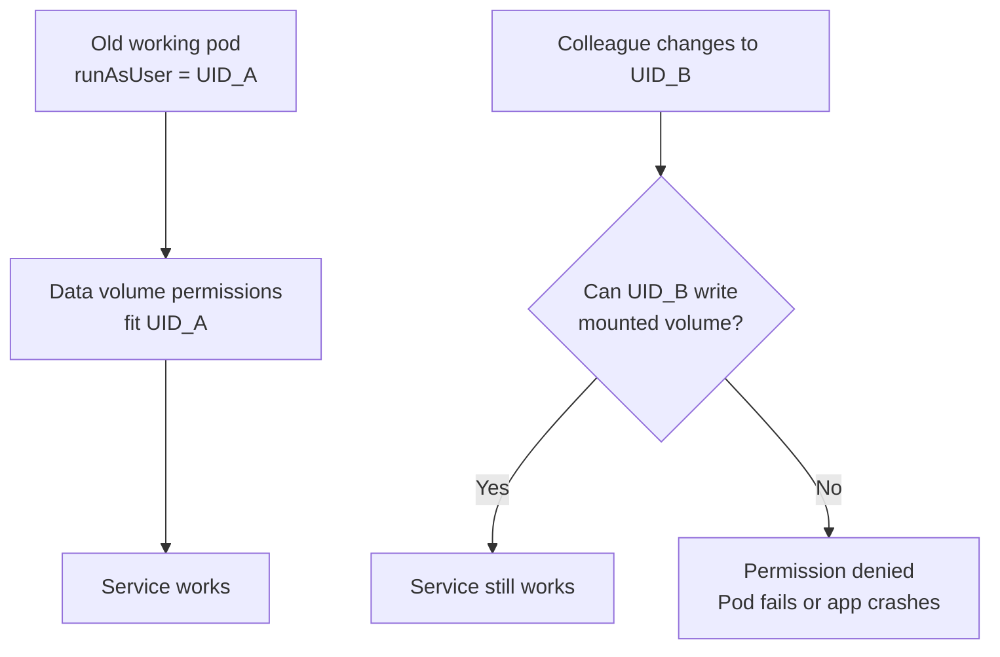

# Easy Explanation: What Your Colleague Did (UID Test)

This is a simple explanation of your colleague's change and what he expects you to understand.

---

## What he changed

He changed the pod/deployment `runAsUser` (static UID) in the live manifest.

He did this on purpose to test:
- does the app still start?
- can it still write to mounted volume?

If it breaks after changing UID, that means permissions are tightly coupled to one UID and not robust.

---

## Easy diagram

---

## What he is trying to prove

He is checking if your deployment is:

- **Robust**: works for a valid non-root UID in allowed OpenShift range
- **or Fragile**: works only with one exact UID/ownership state

So his goal is not to break things randomly.
His goal is to reveal hidden permission dependency before production incidents.

---

## What he wants you to do

1. Pick a clear UID strategy:
   - either static UID policy
   - or OpenShift arbitrary UID-safe policy

2. Ensure mounted data paths match that strategy:
   - runtime UID must be able to write (`touch` test)

3. Keep security hardening:
   - `runAsNonRoot: true`
   - `allowPrivilegeEscalation: false`
   - `capabilities.drop: [ALL]`

4. Validate from inside pods:
   - `id`
   - `ls -ld <data-path>`
   - `touch <data-path>/.perm_test`

---

## One-line summary

Your colleague changed UID to test if the platform is permission-safe.
If small UID change causes failure, permission model must be fixed, not ignored.

