# Dev → Prod Deployment Guide (Diagrams, Steps, Focus Areas)

**Audience:** Team preparing Onyx for production on OpenShift/Kubernetes.

**Companion doc:** [POSTGRES-OPENSEARCH-OPERATOR-MIGRATION-RESEARCH.md](./POSTGRES-OPENSEARCH-OPERATOR-MIGRATION-RESEARCH.md)

**Key idea:** Dev and prod share **deployment patterns**, not **running data**. Prod is a new deploy with production sizing; migrating to operators later is possible but is a **planned project**, not a toggle.

---

## 1) Big picture — two layers (do not mix them up)

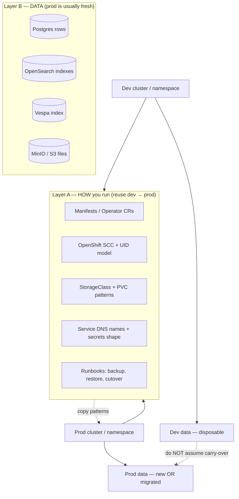

| Layer | Reuse from dev? | What “from scratch” means |
|-------|-----------------|---------------------------|
| **A — Platform** | **Yes** — same YAML/CR structure, bigger CPU/RAM/disk | New namespace/cluster, re-apply manifests |
| **B — Data** | **Only if you plan migration** | Empty prod, or `pg_dump` + object copy + reindex |

---

## 2) Current Onyx stack (what you run today in dev)

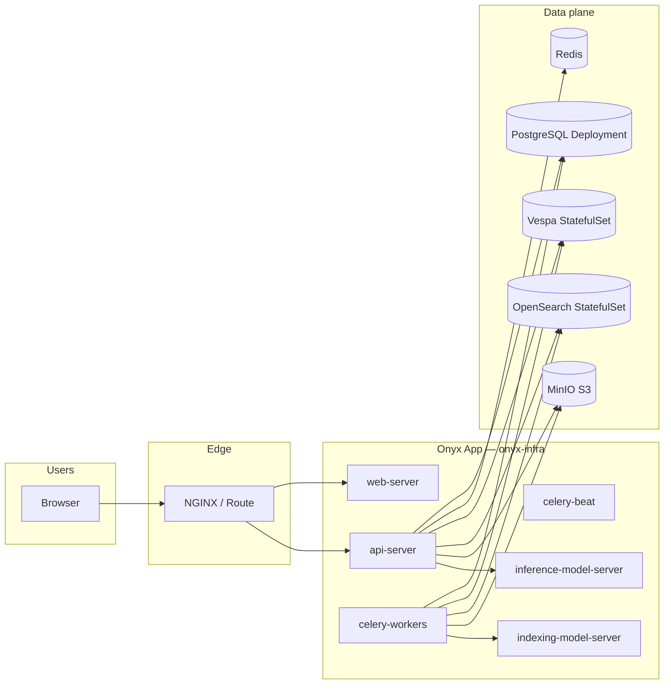

**Manifest anchors in this repo:**

| Component | File |
|-----------|------|
| Env wiring | `new_manifests_values_yaml/02-configmap.yaml` |
| Postgres | `new_manifests_values_yaml/03-postgresql.yaml` |
| OpenSearch | `new_manifests_values_yaml/11-opensearch.yaml` |
| OpenSearch image | `new_manifests_values_yaml/opensearch-custom/Dockerfile` |
| MinIO | `new_manifests_values_yaml/12-minio.yaml` |

---

## 3) Decision — prod with same stack vs operators later

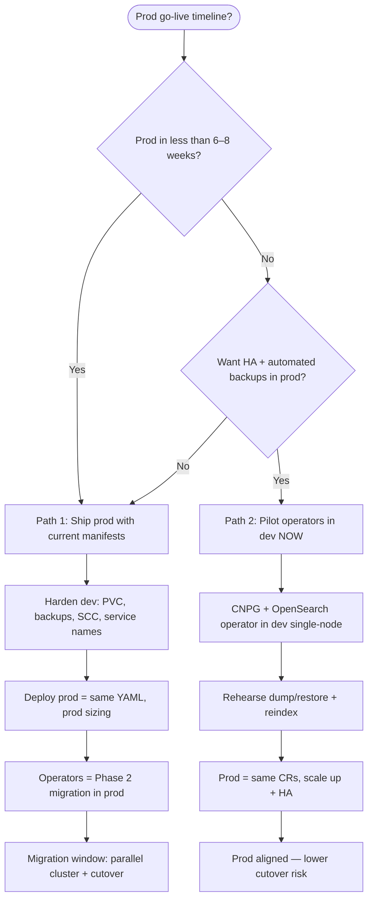

| Path | Best when | Prod effort | Switch to operators later |
|------|-----------|-------------|----------------------------|
| **Path 1** | Need prod soon; stabilizing incidents | **Lower** — replay manifests | **Medium** — dump/restore + reindex project |
| **Path 2** | Prod 2+ months away; platform team capacity | **Higher** upfront in dev | **Lower** — mostly scale + secrets |

**Neither path avoids a maintenance window** if you change Postgres host or OpenSearch cluster with existing data.

---

## 4) Recommended phased roadmap (exact steps)

### Phase 0 — Stabilize dev (do this first) ⚠️ HIGH FOCUS

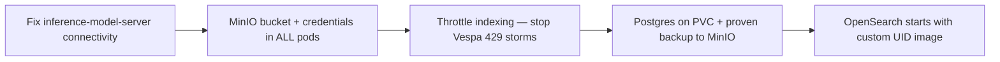

| Step | Action | Verify |
|------|--------|--------|
| 0.1 | Confirm `inference-model-server` Service has endpoints | `curl` or Python from api pod to `:9000/health` |
| 0.2 | Align S3 env on api + all celery workers | No `NoCredentials` / `AccessDenied` in logs |
| 0.3 | Lower `NUM_INDEXING_WORKERS` / Celery concurrency if Vespa 429 | Vespa feed errors drop |
| 0.4 | Add **PVC** to Postgres if missing | Data survives pod restart |
| 0.5 | `pg_dump` → MinIO → `pg_restore` drill | Documented time + size |
| 0.6 | OpenSearch pod `Running` with arbitrary UID | No permission denied on `/data` |

**Pay attention to:** Fixing prod-shaped issues in dev **before** copying YAML to prod. Otherwise you copy broken assumptions.

---

### Phase 1 — Lock platform contract (dev) 🔶 MEDIUM-HIGH FOCUS

Goal: prod is “same chart, different values,” not a redesign.

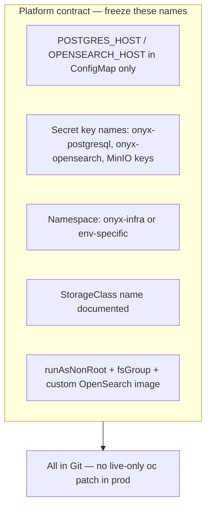

| Step | Action | Why it matters |
|------|--------|----------------|
| 1.1 | Single source of truth: `new_manifests_values_yaml/` | Prod replay is `kubectl apply -f` |
| 1.2 | Never hardcode pod names in app config | Operators change pod names; Services stay stable |
| 1.3 | Document StorageClass + SCC used in dev | Prod must use compatible classes |
| 1.4 | Pin image tags (no floating `latest` for Onyx) | Reproducible prod deploy |
| 1.5 | Build/push OpenSearch custom image to **prod registry** | Dev registry URLs break prod |

**Technical awareness:**

- OpenShift **arbitrary UID** — do not pin `runAsUser: 1000` on OpenSearch; use `opensearch-custom/Dockerfile` pattern.
- **fsGroup** on volumes must match what Postgres/OpenSearch expect.
- API **Alembic migrations** run on api-server start — prod Onyx version must match DB major version (15.x).

---

### Phase 2 — Choose data plane for prod (fork)

#### Path 1 — Same manifests as dev (faster prod)

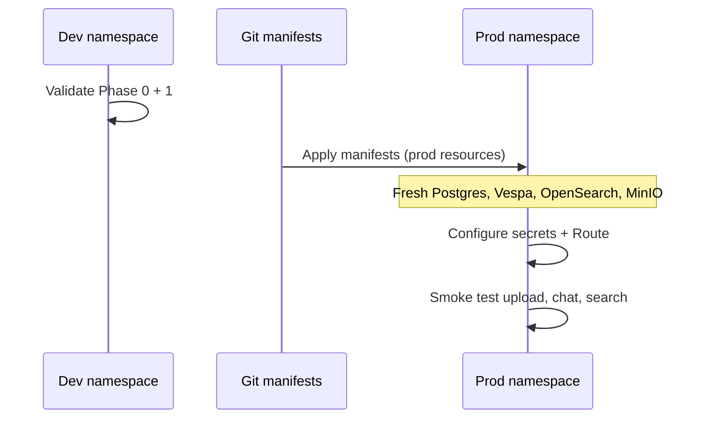

| Step | Action |
|------|--------|
| 2.1 | Create prod namespace + SCC/SA bindings |
| 2.2 | Apply infra: Postgres PVC, Redis, Vespa, OpenSearch, MinIO, model servers |
| 2.3 | Apply secrets (new passwords — not dev passwords) |
| 2.4 | Apply ConfigMap with prod `WEB_DOMAIN` / `DOMAIN` |
| 2.5 | Apply api-server, workers, web, nginx |
| 2.6 | Create MinIO bucket `onyx-file-store`; test upload |
| 2.7 | Run connector sync / indexing test |

#### Path 2 — Operators in dev first, then prod

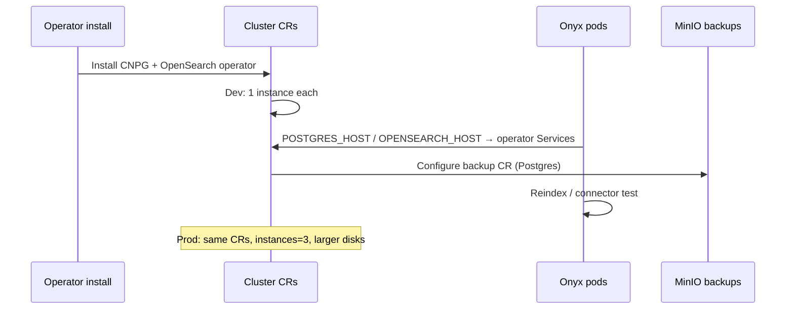

| Step | Action |
|------|--------|
| 2.1 | Install operators (cluster-scoped or namespace-scoped per policy) |
| 2.2 | Deploy CNPG `Cluster` (1 node dev → 3 node prod) |
| 2.3 | Deploy `OpenSearchCluster` CR with **same** securityContext / custom image |
| 2.4 | Point `02-configmap.yaml` at operator Service DNS |
| 2.5 | Backup drill to MinIO |
| 2.6 | Failover drill in dev (prod only if HA required) |

---

### Phase 3 — Prod go-live (exact cutover if migrating data from dev)

Only needed if prod must contain **dev content** (unusual for true prod; common for UAT).

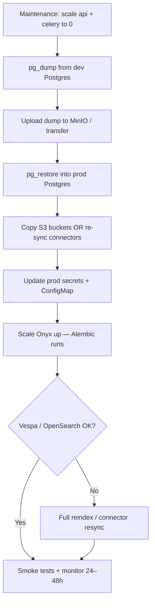

| Step | Focus | Attention ⚠️ |
|------|-------|----------------|
| 3.1 | Freeze writers | Any write during dump → inconsistency |
| 3.2 | `pg_dump -Fc` | Use real `POSTGRES_DB` from api env |
| 3.3 | Transfer | Large DBs need MinIO/NFS, not UI copy |
| 3.4 | Restore | Same major Postgres version (15) |
| 3.5 | Vespa/OpenSearch | Plan **reindex** unless you accept empty search until sync |
| 3.6 | Rollback | Keep dev DB until prod validated |

**Downtime:** plan **30 min – 2 h** for DB; search may lag hours if full reindex.

---

### Phase 4 — Switch to operators later in prod (if Path 1 now)

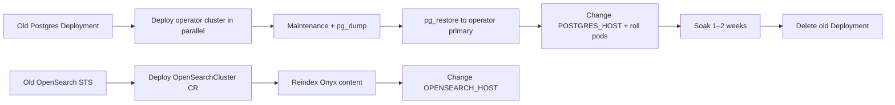

| Step | Weeks (typical) | Risk |
|------|-----------------|------|
| Install operator | 0.5 | Low |
| Parallel cluster + dev test | 1–2 | Medium |
| Backup automation | 1–2 | Medium |
| Prod cutover | 0.5 | **High** if not rehearsed |
| Decommission old | 0.5 | Low |

See [POSTGRES-OPENSEARCH-OPERATOR-MIGRATION-RESEARCH.md](./POSTGRES-OPENSEARCH-OPERATOR-MIGRATION-RESEARCH.md) for effort tables.

---

## 5) What to focus on vs what can wait

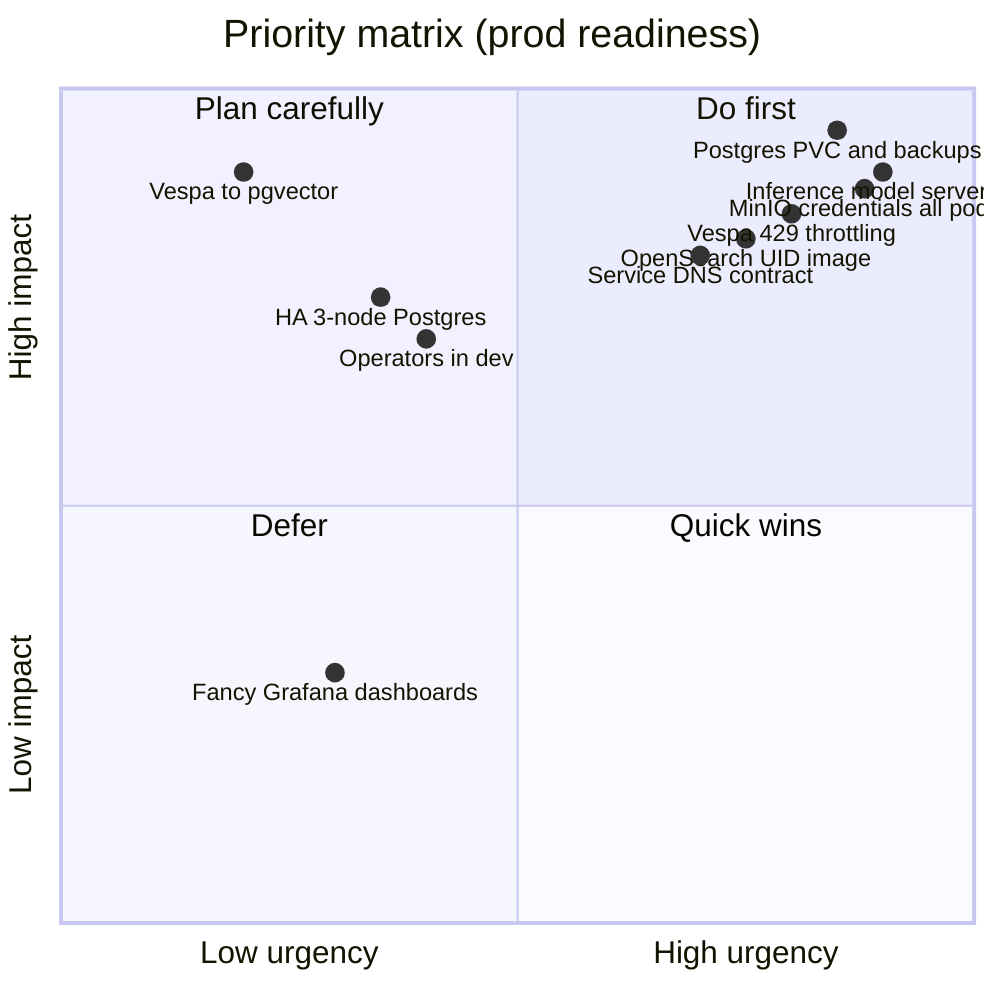

### Do first (blocking prod quality)

| Item | Technical reason |
|------|------------------|
| Postgres **persistent volume** | Without PVC, restart = data loss |
| Backup + restore rehearsed | Prod recovery depends on this |
| Model server reachable from api/celery | Embedding/indexing hard-fail otherwise |
| MinIO working end-to-end | File upload and dump storage |
| Vespa not permanently 429 | Indexing backlog poisons UX |
| Stable image tags + Git manifests | No “works in dev, unknown in prod” |

### Plan carefully (high impact, not day-1 blockers)

| Item | Technical reason |
|------|------------------|
| Operators (CNPG / OpenSearch) | Changes ops model; needs CRD install + cutover |
| HA (3 nodes) | Failover drills required |
| Full monitoring / alerts | Needs baselines from stable dev |
| Ingress TLS / corporate CA | Prod security policy |

### Defer (separate program)

| Item | Why defer |
|------|-----------|
| Vespa → pgvector | Changes retrieval architecture — not “prod deploy” |
| OpenSearch for retrieval | Your config has indexing on, retrieval often Vespa |
| Multi-region / DR | After single-region prod is stable |

---

## 6) Technical things you must be aware of

### 6.1 OpenShift-specific

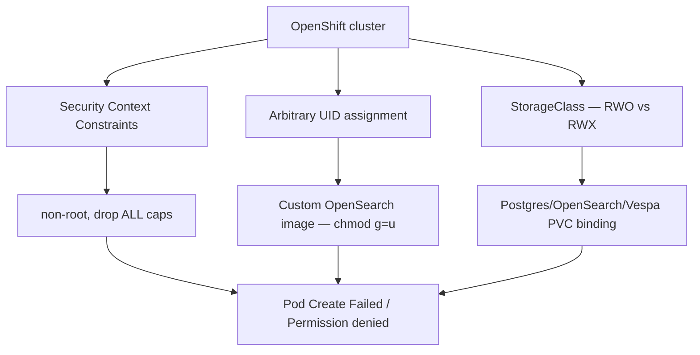

| Topic | Symptom | Mitigation |
|-------|---------|------------|
| **SCC** | `unable to validate against any SCC` | Dedicated ServiceAccount + rolebinding |
| **Arbitrary UID** | `Permission denied` on data dir | `fsGroup`, group-writable volumes, custom image |
| **StorageClass** | PVC pending | Use cluster default or request from platform team |
| **Routes** | TLS mismatch | Align `WEB_DOMAIN` with Route host |

### 6.2 Onyx application chain

| Topic | What happens | Pay attention |
|-------|--------------|---------------|
| **Alembic** | api-server init migrates schema | DB version + app image version must match |
| **Celery queues** | Indexing async | All workers need same env as api for S3/DB |
| **search_settings** | Embedding model switch | Needs `model_dim`, valid `api_url`; reindex required |
| **Vespa hostname** | Stable DNS `vespa-0.vespa-service...` | StatefulSet headless service — do not rename casually |
| **OpenSearch flags** | `ENABLE_OPENSEARCH_*` | Indexing vs retrieval split — know which path prod uses |

### 6.3 Data consistency model

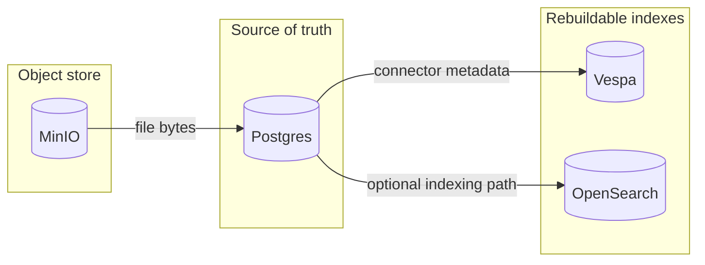

- **Postgres loss = catastrophic** — backup is mandatory.
- **Vespa/OpenSearch loss = painful but recoverable** — full reindex (hours/days depending on corpus).
- **MinIO loss = uploaded files gone** — bucket policy + backups if compliance requires.

### 6.4 Connection wiring (prod cutover = change these)

From `new_manifests_values_yaml/02-configmap.yaml`:

| Variable | Points to | Changes when |
|----------|-----------|--------------|
| `POSTGRES_HOST` | `postgresql.onyx-infra...` | Operator migration → new Service |
| `OPENSEARCH_HOST` | `opensearch.onyx-infra...` | Operator migration → new Service |
| `VESPA_HOST` | `vespa-0.vespa-service...` | Rarely — only if Vespa naming changes |
| `S3_ENDPOINT_URL` | MinIO internal URL | If MinIO HA or external S3 |
| `MODEL_SERVER_HOST` | inference-model-server | If split namespaces |

**Rule:** After any host change → **roll all** Deployments that consume `env-configmap`.

---

## 7) Pre-prod checklist (copy into ticket)

### Platform

- [ ] All manifests in Git; no prod-only manual patches
- [ ] Postgres on PVC; storage size documented
- [ ] `pg_dump` / restore tested; RPO/RTO agreed
- [ ] MinIO bucket + credentials in api + celery
- [ ] OpenSearch image in prod registry; pod runs non-root
- [ ] Vespa storage class validated under load
- [ ] Inference + indexing model servers healthy
- [ ] StorageClass + SCC documented for prod namespace

### Onyx app

- [ ] Image tags pinned for api, web, workers, model servers
- [ ] `WEB_DOMAIN` / `DOMAIN` match prod Route
- [ ] Embedding/search_settings documented for prod model
- [ ] Indexing concurrency tuned (no Vespa 429 in soak test)
- [ ] Smoke test: login, upload, chat, search, connector sync

### If operators planned

- [ ] Operator installed in dev; CRs in Git
- [ ] Backup CR to MinIO tested
- [ ] Failover drill (if HA)
- [ ] Cutover runbook reviewed

### Explicitly out of scope for prod day 1

- [ ] Vespa → pgvector (separate program)
- [ ] OpenSearch retrieval cutover (unless product requires it)

---

## 8) One-page visual — your journey

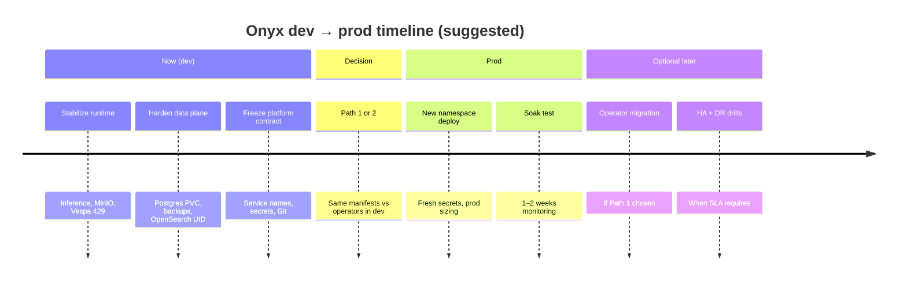

---

## 9) Quick answers

| Question | Answer |
|----------|--------|
| Is prod from scratch? | **New cluster/namespace + fresh prod data** — yes. **Same deployment patterns as dev** — yes, that is the goal. |
| Can we switch to operators later in prod easily? | **Manageable with a migration project**, not a config flip. Rehearse in dev first. |
| What is the #1 mistake? | Copying dev **data** expectations to prod without migration plan, or deploying prod without **PVC/backups**. |
| What should dev optimize for? | **Layer A** (how to run), not preserving **Layer B** (data). |

---

## 10) Related repository files

| Topic | Path |
|-------|------|
| **OpenShift operator pilot (step-by-step)** | `implementation/OPENSHIFT-OPERATOR-PILOT-STEP-BY-STEP.md` |
| Operator effort & risks | `implementation/POSTGRES-OPENSEARCH-OPERATOR-MIGRATION-RESEARCH.md` |
| Operator sample YAML | `new_manifests_values_yaml/operators/` |
| Postgres dump/restore | `docs/migrations/MIGRATING-POSTGRES-TO-NEW-CLUSTER.md` |
| OpenShift UID | `implementation/COLLEAGUE-UID-TEST-EASY-DIAGRAM.md` |
| Deployment risks | `implementation/DEPLOYMENT-RISK-DEEP-RESEARCH-AND-SOLUTION-ARCHITECTURE.md` |

---

*Document version: 1.0 — 2026-05-26*
