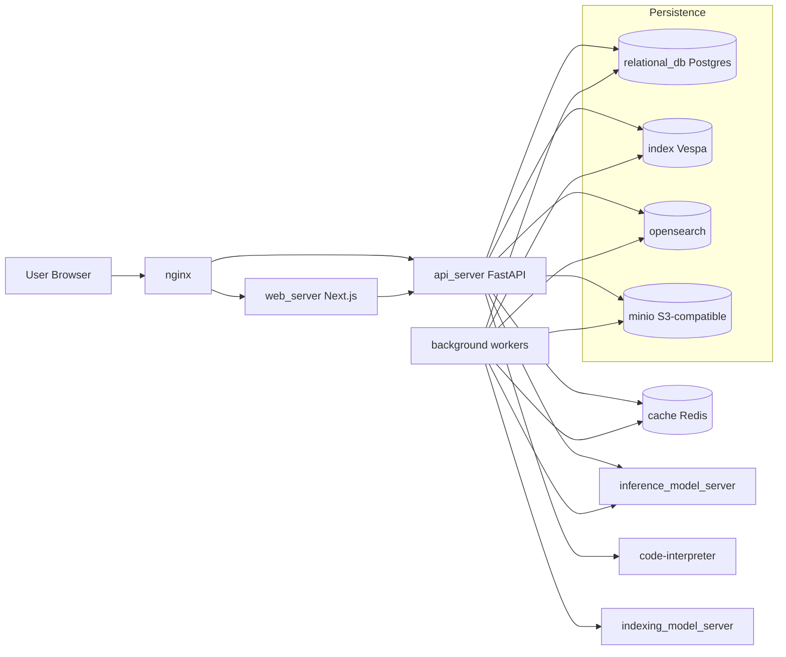

# Onyx Latest Architecture (Docker Compose)

This diagram is based on the latest cloned `onyx-dot-app/onyx` (`de0f42f`) from the `deployment/docker_compose` stack.

## 1) Default stack architecture

## 2) Component breakdown from `deployment/docker_compose`

- `nginx`: ingress/reverse proxy, handles external traffic and forwards to web/api.
- `web_server`: frontend UI.
- `api_server`: request handling, auth, orchestration, chat APIs, connector APIs.
- `background`: async pipeline workers/schedulers for indexing, sync, cleanup jobs.
- `relational_db` (Postgres): system of record (users, chats, metadata, permissions, app state).
- `index` (Vespa): primary retrieval/vector/search index used for RAG retrieval.
- `opensearch`: secondary search/index capability, enabled by default in compose.
- `cache` (Redis): cache + async queue coordination for background processing.
- `inference_model_server` / `indexing_model_server`: embedding/model-serving split for query path vs indexing path.
- `minio`: S3-compatible object/file storage backend.
- `code-interpreter`: isolated code execution service.

## 3) Onyx Lite profile (reduced mode)

`docker-compose.onyx-lite.yml` disables heavy data/indexing components by default:

- `DISABLE_VECTOR_DB=true`
- `FILE_STORE_BACKEND=postgres`
- `CACHE_BACKEND=postgres`
- `AUTH_BACKEND=postgres`
- `index`, `opensearch`, `cache`, `minio`, `background`, and model servers are moved behind profiles.

This keeps chat working but removes/limits full indexing + connector-driven RAG behavior.

## 4) Why OpenSearch is integrated

OpenSearch is integrated to cover search/indexing workloads that are complementary to Vespa and to support deployment flexibility:

- **Operational flexibility**: teams already standardized on OpenSearch can reuse their observability/ops model.
- **Search feature coverage**: text-centric retrieval/filters/aggregations are easier to model in OpenSearch for some use cases.
- **Workload isolation**: offloading certain indexing/query patterns avoids overloading the primary vector path during spikes.
- **Failure-domain control**: if one index backend is degraded, the platform can still operate in reduced capability instead of total outage.
- **Scaling trade-off**: separate backends let teams tune JVM heap/storage/IO independently by workload type.

In practical production terms: OpenSearch adds another service to operate (heap tuning, disk growth, shard strategy, recovery procedures), but it can reduce bottlenecks and improve resilience for mixed search workloads.

