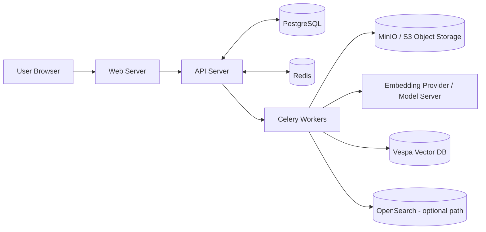
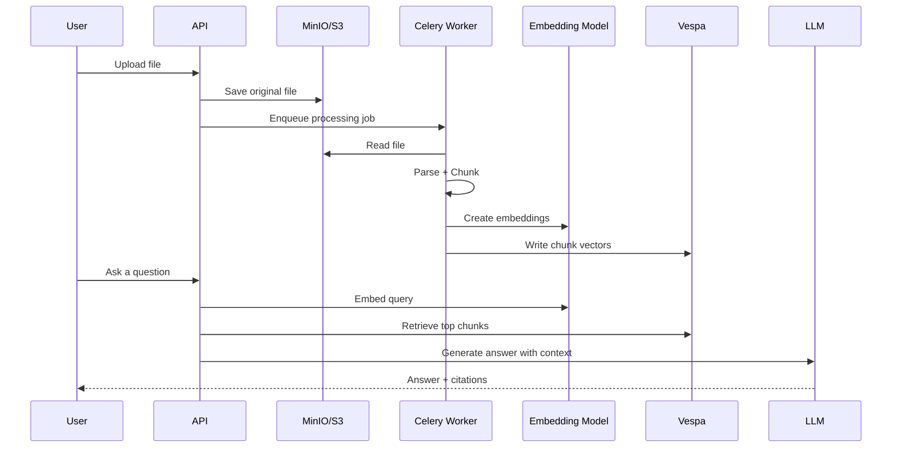
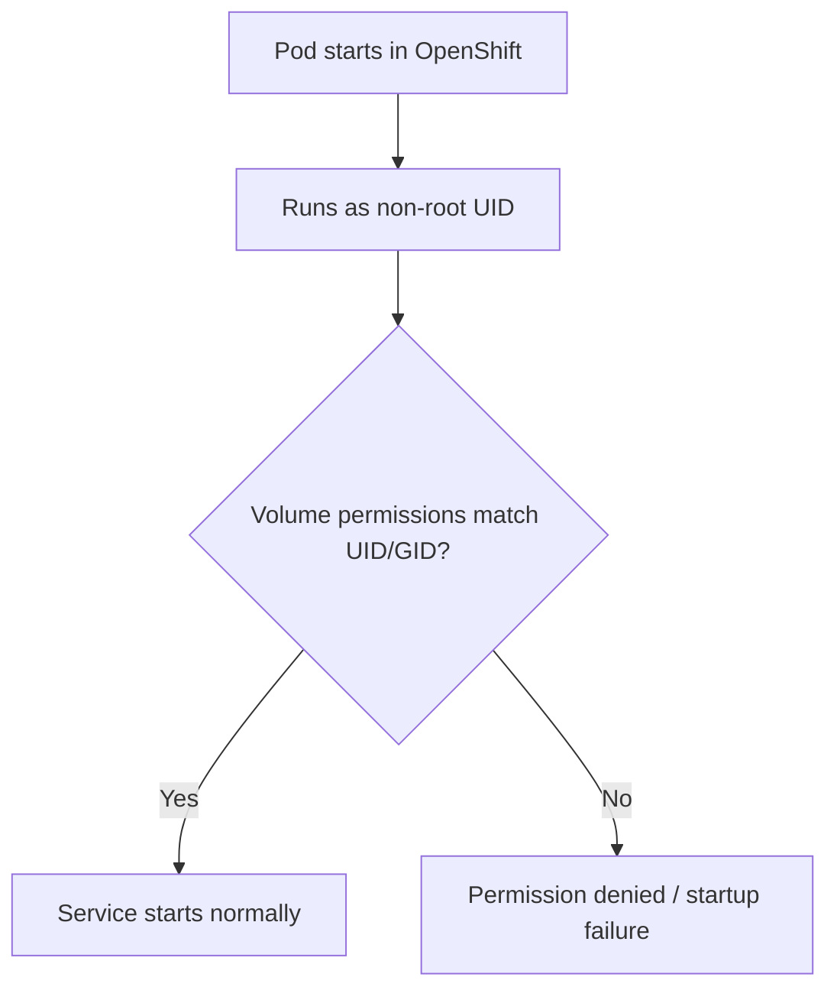
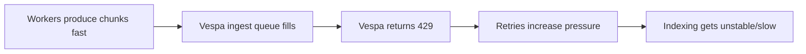

# OpenShift + Onyx: Easy Explanation for Beginners

This guide explains, in very simple language, what happened in your deployment and why.

It focuses on the real problems you faced:
- Permission errors in OpenShift (non-root containers)
- MinIO/S3 credential and bucket issues
- Why we need object storage **and** vector database
- Why embedding switch failed
- Why Vespa returned `429 Too Many Requests`

---

## 1) Big Picture: What each component does

Think of the system as a team:

- **Web/API** = receives user actions
- **Postgres** = stores system metadata (users, settings, statuses)
- **MinIO (S3)** = stores original files (PDF, DOCX, etc.)
- **Vespa** = stores searchable chunk vectors
- **Celery workers** = do background jobs (parse, chunk, embed, index)
- **Model servers / providers** = create embeddings and LLM outputs

### Architecture Diagram

---

## 2) Why object storage and vector DB both exist

This is the most common confusion.

- **MinIO/S3** stores the original file bytes safely.
- **Vespa** stores chunk embeddings for fast semantic search.

If you only had object storage:
- You can save files, but retrieval is slow and not semantic.

If you only had vector DB:
- You can search vectors, but you lose original file durability and lifecycle.

### Simple mental model

- Object storage = warehouse of documents
- Vector DB = smart index for finding the right document pieces quickly

---

## 3) Upload to answer flow (RAG flow)

---

## 4) OpenShift permissions issue (why services failed)

OpenShift often runs containers with a **non-root random UID**.

If the mounted volume does not allow that UID to write:
- service fails with `Permission denied`
- this happened with OpenSearch and can happen with MinIO/Postgres too

### Permission Diagram

### Safe baseline controls used

- `runAsNonRoot: true`
- `allowPrivilegeEscalation: false`
- `capabilities.drop: [ALL]`
- compatible file ownership/permissions inside image/volume

---

## 5) MinIO/S3 errors you saw and what they mean

## 5.1 `Unable to locate credentials`

Meaning:
- App pod has no S3 credentials in env/secret injection.

Fix:
- Ensure secret keys are present and mapped:
  - `S3_AWS_ACCESS_KEY_ID`
  - `S3_AWS_SECRET_ACCESS_KEY`
- Restart API + workers after secret update.

## 5.2 `AccessDenied` for bucket

Meaning:
- Credentials are present but not authorized for that bucket.

Fix:
- Ensure bucket exists (for example `onyx-file-store`).
- Ensure credentials used by Onyx have read/write/list permissions.

## 5.3 Signature mismatch when using `mc alias set`

Meaning:
- Wrong access key/secret pair (or hidden whitespace/old values).

Fix:
- Read keys directly from K8s secret and use those exact values.

---

## 6) Embedding switch issue (why UI failed)

You hit this validation error:
- missing `model_dim`
- `api_url` was null for LiteLLM path

So backend rejected the model switch request before reindex started.

### What this means for beginners

Switching embedding model is not just a dropdown change.
You must provide complete model metadata:
- model name
- model dimension
- provider type
- provider URL (for LiteLLM path)

If missing, no switch happens.

---

## 7) Vespa `429 Too Many Requests` explanation

`429` means Vespa is overloaded by indexing feed rate.

You are producing chunks faster than Vespa can ingest.

### Backpressure Diagram

### Stability-first tuning

- reduce docprocessing concurrency
- reduce indexing worker count
- reduce batch size
- disable expensive indexing options until stable

---

## 8) Quick “what to check first” checklist

When something breaks:

1. **Permissions**  
   - pod UID + volume write access compatible?

2. **Credentials**  
   - S3 keys present in running pods?

3. **Bucket existence/policy**  
   - bucket exists? principal has list/get/put/delete?

4. **Embedding config completeness**  
   - model_dim + provider_url present?

5. **Ingestion pressure**  
   - Vespa 429? then reduce producer rate.

---

## 9) One-line summary for someone new

On OpenShift, most RAG deployment pain is not “AI logic”, it is:
- runtime user/permission alignment,
- storage credentials/policies,
- and indexing throughput control.

Once these are stable, retrieval quality and LLM behavior become much more consistent.
