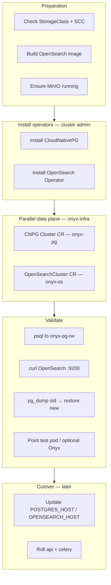

# OpenShift Pilot: Postgres + OpenSearch Operators (Step-by-Step)

**Goal:** Try **CloudNativePG** (Postgres) and the **OpenSearch Kubernetes Operator** on your OpenShift dev cluster **without** breaking the current Onyx stack. Run operators **in parallel**, validate, then cut over.

**Namespace used in this repo:** `onyx-infra`

**Related:**

- Architecture & phases: [DEV-TO-PROD-DEPLOYMENT-GUIDE-WITH-DIAGRAMS.md](./DEV-TO-PROD-DEPLOYMENT-GUIDE-WITH-DIAGRAMS.md)
- Effort & risks: [POSTGRES-OPENSEARCH-OPERATOR-MIGRATION-RESEARCH.md](./POSTGRES-OPENSEARCH-OPERATOR-MIGRATION-RESEARCH.md)
- Sample YAML: `new_manifests_values_yaml/operators/`

---

## 1) Operators and components you need (names)

| # | Component | Official name | Purpose | Install scope |
|---|-----------|---------------|---------|---------------|
| 1 | **CloudNativePG** | [CloudNativePG](https://cloudnative-pg.io/) (`cloudnative-pg` controller) | Manages PostgreSQL clusters (HA, backup, failover) | Cluster-wide (typical) |
| 2 | **OpenSearch Kubernetes Operator** | [opensearch-k8s-operator](https://github.com/opensearch-project/opensearch-k8s-operator) | Manages `OpenSearchCluster` CRs | Cluster-wide (typical) |
| 3 | **cert-manager** (optional) | [cert-manager](https://cert-manager.io/) | TLS for operator webhooks / OpenSearch | Only if webhook certs fail without it |
| 4 | **MinIO** (already in repo) | MinIO Deployment | S3 backups for CNPG + Onyx file store | Namespace `onyx-infra` |
| 5 | **Onyx custom OpenSearch image** | `onyx-opensearch:3.4.0-uid-arbitrary` | OpenShift arbitrary UID | Your registry |

**Not required for the pilot (keep as-is):**

- Vespa — still your primary retrieval path in current config
- Redis, model servers, api/celery — only change DB/OpenSearch **host** after validation

**Alternatives (if your platform team standardizes elsewhere):**

| Instead of | Alternative |
|------------|-------------|
| CloudNativePG | **Crunchy PostgreSQL Operator (PGO)** |
| OpenSearch Operator | Hand-written StatefulSet (what you have today) |

This guide uses **CloudNativePG + OpenSearch Operator** because that matches your migration research.

---

## 2) Prerequisites checklist

### 2.1 Access and tools

| Requirement | Who | Notes |
|-------------|-----|-------|
| `oc` CLI logged in | You | `oc whoami` |
| **cluster-admin** or permission to install CRDs/operators | Platform / cluster admin | One-time per cluster |
| **admin** on project `onyx-infra` | You | Deploy Onyx + CRs |
| `helm` 3.x (optional) | You | Easiest for OpenSearch operator |
| `kubectl` compatible with `oc` | You | Same kubeconfig |

### 2.2 Cluster capabilities

```bash
# Storage — you need a default StorageClass or a known name
oc get storageclass

# Can your project create PVCs?
oc get pvc -n onyx-infra

# OpenShift version
oc version
```

Document your StorageClass name — you will paste it into CNPG and OpenSearch CRs (e.g. `gp3-csi`, `ocs-storagecluster-ceph-rbd`).

### 2.3 Onyx already running (recommended)

Pilot is easier if Onyx works on the **existing** Postgres/OpenSearch Services:

- `postgresql.onyx-infra.svc.cluster.local`
- `opensearch.onyx-infra.svc.cluster.local`

You will add **new** Services (`onyx-pg-rw`, operator OpenSearch Service) and only switch ConfigMap when ready.

### 2.4 Secrets already present

From `new_manifests_values_yaml/01-secrets-template.yaml`:

| Secret | Keys used |
|--------|-----------|
| `onyx-postgresql` | `username`, `password` |
| `onyx-opensearch` | `opensearch_admin_username`, `opensearch_admin_password` |
| `onyx-objectstorage` | MinIO / S3 keys for backups |

### 2.5 Custom OpenSearch image (OpenShift)

Build and push before OpenSearch operator pilot:

```bash
cd new_manifests_values_yaml/opensearch-custom
docker build -t <your-registry>/onyx-opensearch:3.4.0-uid-arbitrary .
docker push <your-registry>/onyx-opensearch:3.4.0-uid-arbitrary
```

---

## 3) High-level flow (diagram)



---

## 4) Step-by-step — Phase A: Prepare OpenShift project

### Step A1 — Create / confirm namespace

```bash
oc apply -f new_manifests_values_yaml/00-namespace.yaml
oc project onyx-infra
```

### Step A2 — Label namespace (if your cluster requires monitoring labels)

```bash
# Example — adjust to your org policy
oc label namespace onyx-infra openshift.io/cluster-monitoring=true --overwrite
```

### Step A3 — Deploy MinIO (for CNPG backups + Onyx files)

If not already running:

```bash
oc apply -f new_manifests_values_yaml/12-minio-pvc.yaml
oc apply -f new_manifests_values_yaml/12-minio.yaml
```

Create bucket for backups (exec into MinIO pod or use `mc`):

```bash
# Example bucket names
# onyx-file-store     — Onyx uploads (already in configmap)
# onyx-pg-backups     — CNPG barman backups
```

### Step A4 — ServiceAccount for operator-managed pods (OpenShift SCC)

Apply the pilot ServiceAccount manifest:

```bash
oc apply -f new_manifests_values_yaml/operators/00-serviceaccount-openshift.yaml
```

**Pay attention:** On OpenShift, pods often need a bound SCC (`nonroot` or `restricted`). If pods stay `FailedCreate`, ask your admin to run:

```bash
oc adm policy add-scc-to-user nonroot -z onyx-data-plane -n onyx-infra
# If volume permissions still fail (OpenSearch), your admin may need anyuid — document the exception
```

---

## 5) Step-by-step — Phase B: Install CloudNativePG operator

### Step B1 — Install CNPG controller (cluster admin)

**Option 1 — Official manifest (pin version)**

```bash
# Check latest stable: https://github.com/cloudnative-pg/cloudnative-pg/releases
export CNPG_VERSION=1.25.1

oc apply --server-side -f \
  https://raw.githubusercontent.com/cloudnative-pg/cloudnative-pg/release-1.25/releases/cnpg-${CNPG_VERSION}.yaml
```

**Option 2 — Helm**

```bash
helm repo add cnpg https://cloudnative-pg.github.io/charts
helm repo update
helm install cnpg cnpg/cloudnative-pg \
  --namespace cnpg-system \
  --create-namespace \
  --set config.data.INHERITED_ANNOTATIONS='*' \
  --set config.data.INHERITED_LABELS='*'
```

### Step B2 — Verify operator

```bash
oc get pods -n cnpg-system
oc get crd clusters.postgresql.cnpg.io
```

Expected: `cnpg-controller` pod **Running**, CRD `clusters.postgresql.cnpg.io` exists.

### Step B3 — Create MinIO backup secret for CNPG

Edit and apply (replace keys with real MinIO credentials from `onyx-objectstorage`):

```bash
oc apply -f new_manifests_values_yaml/operators/cnpg/01-backup-s3-secret.yaml
```

### Step B4 — Deploy Postgres cluster CR (single instance for pilot)

Edit `new_manifests_values_yaml/operators/cnpg/02-cluster-pilot.yaml`:

- Set `storageClass` to your class
- Set `storage.size` (e.g. `20Gi`)

```bash
oc apply -f new_manifests_values_yaml/operators/cnpg/02-cluster-pilot.yaml
```

### Step B5 — Wait for cluster healthy

```bash
oc get cluster.postgresql.cnpg.io -n onyx-infra
oc get pods -n onyx-infra -l cnpg.io/cluster=onyx-pg
```

Wait until:

```bash
oc get cluster onyx-pg -n onyx-infra -o jsonpath='{.status.phase}'
# Want: Cluster in healthy / Ready state (CNPG prints phase in status)
```

### Step B6 — Get connection Service DNS

CNPG creates Services automatically:

| Service | DNS (pilot) | Use |
|---------|-------------|-----|
| Read-write | `onyx-pg-rw.onyx-infra.svc.cluster.local:5432` | Onyx apps |
| Read-only | `onyx-pg-ro.onyx-infra.svc.cluster.local:5432` | Reporting (optional) |

```bash
oc get svc -n onyx-infra | grep onyx-pg
```

### Step B7 — Get CNPG-generated superuser secret

```bash
# CNPG creates app secret — name matches cluster
oc get secret -n onyx-infra | grep onyx-pg
oc get secret onyx-pg-app -n onyx-infra -o jsonpath='{.data.username}' | base64 -d; echo
oc get secret onyx-pg-app -n onyx-infra -o jsonpath='{.data.password}' | base64 -d; echo
```

For Onyx you can either:

- **A)** Sync passwords to existing `onyx-postgresql` secret, or  
- **B)** Update Onyx deployments to use `onyx-pg-app` secret keys (more native to CNPG)

### Step B8 — Test Postgres connectivity

```bash
oc run psql-test --rm -it --restart=Never -n onyx-infra \
  --image=postgres:15-alpine \
  --env="PGHOST=onyx-pg-rw.onyx-infra.svc.cluster.local" \
  --env="PGUSER=app" \
  --env="PGPASSWORD=<from-secret>" \
  --command -- psql -d app -c 'SELECT version();'
```

### Step B9 — (Optional) Configure backup to MinIO

Uncomment `backup` section in `02-cluster-pilot.yaml` after bucket `onyx-pg-backups` exists, re-apply, then:

```bash
# Manual backup test (CNPG plugin)
oc cnpg backup onyx-pg -n onyx-infra
oc get backup -n onyx-infra
```

Install CNPG plugin if `oc cnpg` missing: see https://cloudnative-pg.io/documentation/current/kubectl-plugin/

---

## 6) Step-by-step — Phase C: Install OpenSearch operator

### Step C1 — Install operator (cluster admin)

**Helm (recommended)**

```bash
helm repo add opensearch-operator https://opensearch-project.github.io/opensearch-k8s-operator/
helm repo update

# Pin chart version — check: https://github.com/opensearch-project/opensearch-k8s-operator/releases
export OS_OPERATOR_VERSION=2.8.0

helm install opensearch-operator opensearch-operator/opensearch-operator \
  --version ${OS_OPERATOR_VERSION} \
  --namespace opensearch-operator-system \
  --create-namespace \
  --set manager.extraEnv[0].name=SKIP_INIT_CONTAINER \
  --set manager.extraEnv[0].value=true
```

**OpenShift required:** `SKIP_INIT_CONTAINER=true` disables the root `chmod` init helper that SCC blocks. Also set `general.setVMMaxMapCount: false` in the cluster CR (already in the pilot YAML).

**Verify**

```bash
oc get pods -n opensearch-operator-system
oc get crd opensearchclusters.opensearch.org
# If older chart: opensearchclusters.opensearch.opster.io
```

### Step C2 — Apply OpenSearchCluster CR (pilot, single node)

Edit `new_manifests_values_yaml/operators/opensearch/02-opensearch-cluster-pilot.yaml`:

- `spec.general.version` — match image tag (e.g. `3.4.0`)
- Replace image with your registry build
- Set `storageClass` in persistence

```bash
oc apply -f new_manifests_values_yaml/operators/opensearch/02-opensearch-cluster-pilot.yaml
```

### Step C3 — Wait for cluster

```bash
oc get opensearchcluster -n onyx-infra
oc get pods -n onyx-infra | grep onyx-os
```

First start can take **5–15 minutes** (JVM + PVC bind).

### Step C4 — Find OpenSearch URL

```bash
oc get svc -n onyx-infra | grep -i onyx-os
# Typical pattern from operator: onyx-os (serviceName from CR)
```

Test (from a test pod):

```bash
curl -sk -u admin:'<password>' \
  https://onyx-os.onyx-infra.svc.cluster.local:9200
# Or http if security disabled in pilot CR
```

**Pay attention:** Operator enables security/TLS by default in many versions. Onyx needs matching `OPENSEARCH_ADMIN_*` and may need `https` — align with your CR `security` block.

### Step C5 — OpenShift UID / SCC troubleshooting

If pod crashes with `Permission denied` on data path:

1. Confirm custom image is used (`onyx-opensearch:3.4.0-uid-arbitrary`)
2. Confirm `securityContext` in CR podTemplate: `runAsNonRoot: true`, `fsGroup` set
3. Confirm PVC bound and writable

See `new_manifests_values_yaml/opensearch-custom/Dockerfile`.

---

## 7) Step-by-step — Phase D: Migrate data (pilot test)

Run this in **dev** before changing Onyx production traffic.

### Step D1 — Freeze writes (dev maintenance)

```bash
oc scale deployment api-server -n onyx-infra --replicas=0
oc scale deployment celery-beat -n onyx-infra --replicas=0
# Scale all celery-worker deployments to 0
```

### Step D2 — Dump from OLD Postgres

```bash
OLD_POD=$(oc get pod -n onyx-infra -l app=postgresql -o jsonpath='{.items[0].metadata.name}')
oc exec -n onyx-infra "$OLD_POD" -- \
  pg_dump -U postgres -d postgres -Fc -f /tmp/onyx.dump
oc cp onyx-infra/"$OLD_POD":/tmp/onyx.dump /tmp/onyx.dump
```

### Step D3 — Restore into CNPG

```bash
# Copy dump to CNPG primary pod
PG_POD=$(oc get pod -n onyx-infra -l cnpg.io/cluster=onyx-pg,role=primary -o jsonpath='{.items[0].metadata.name}')
oc cp /tmp/onyx.dump onyx-infra/"$PG_POD":/tmp/onyx.dump
oc exec -n onyx-infra "$PG_POD" -- \
  pg_restore -U postgres -d postgres --clean --if-exists /tmp/onyx.dump
```

Adjust `-U` / `-d` to match CNPG bootstrap user/database from your CR.

### Step D4 — Validate Postgres

```sql
SELECT count(*) FROM document;
SELECT version_num FROM alembic_version;
```

### Step D5 — OpenSearch

**Expectation:** Indexes do not move automatically. Options:

| Option | Action |
|--------|--------|
| **A (simplest)** | Accept empty OpenSearch pilot; re-sync connectors / reindex |
| **B** | Keep old `opensearch` Service until operator cluster reindexed |

### Step D6 — Point Onyx at operator Services (cutover test)

Patch ConfigMap `env-configmap`:

```yaml
POSTGRES_HOST: "onyx-pg-rw.onyx-infra.svc.cluster.local"
OPENSEARCH_HOST: "onyx-os.onyx-infra.svc.cluster.local"   # match your CR serviceName
```

```bash
oc apply -f new_manifests_values_yaml/02-configmap.yaml
oc rollout restart deployment api-server -n onyx-infra
# Restart all celery deployments
```

### Step D7 — Smoke test

- Login
- Upload file
- Chat / search
- Check `index_attempt` in Postgres for failures

### Step D8 — Rollback (if needed)

Revert ConfigMap hosts to old Services, restart pods, scale old Postgres back up.

---

## 8) What to focus on during the pilot

| Priority | Item | Why |
|----------|------|-----|
| **P0** | PVC binds, pods Running | Nothing else works otherwise |
| **P0** | `onyx-pg-rw` accepts connections | Onyx depends on Postgres |
| **P0** | SCC — pods not blocked | Common OpenShift failure |
| **P1** | pg_dump / pg_restore rehearsed | Prod cutover confidence |
| **P1** | MinIO backup bucket + CNPG backup CR | Recovery story |
| **P2** | OpenSearch security (http vs https) | Onyx auth errors if mismatch |
| **P2** | Reindex plan for OpenSearch | No automatic index portability |

---

## 9) Technical gotchas (OpenShift + Onyx)

| Topic | Gotcha | Mitigation |
|-------|--------|------------|
| **SCC** | Operator pods denied | `onyx-data-plane` SA + `nonroot` SCC |
| **UID** | OpenSearch data dir permissions | Custom image + `fsGroup` |
| **Storage** | PVC Pending | Fix StorageClass / quota |
| **CNPG secret** | App uses `onyx-postgresql` but CNPG created `onyx-pg-app` | Align secret or bootstrap with same password |
| **Service names** | Operator creates different DNS than old YAML | Update ConfigMap only after `oc get svc` |
| **Alembic** | api init container runs migrations | One api replica during cutover if nervous |
| **Dual Postgres** | Two primaries if both old and new running | Scale old Deployment to 0 after cutover |
| **Webhooks** | Operator install fails | Install cert-manager or fix corporate CA |
| **Resources** | OpenSearch JVM OOM | Raise limits (`OPENSEARCH_JAVA_OPTS`) |
| **Vespa** | Unaffected by DB operator pilot | Still monitor 429 during reindex |

---

## 10) File map in this repository

```
new_manifests_values_yaml/operators/
  00-serviceaccount-openshift.yaml
  README.md
  cnpg/
    01-backup-s3-secret.yaml
    02-cluster-pilot.yaml
  opensearch/
    02-opensearch-cluster-pilot.yaml
```

---

## 11) Uninstall (dev cleanup only)

```bash
# Remove clusters first
oc delete -f new_manifests_values_yaml/operators/cnpg/02-cluster-pilot.yaml
oc delete -f new_manifests_values_yaml/operators/opensearch/02-opensearch-cluster-pilot.yaml

# Remove operators (cluster admin)
helm uninstall opensearch-operator -n opensearch-operator-system
oc delete -f https://raw.githubusercontent.com/cloudnative-pg/cloudnative-pg/release-1.25/releases/cnpg-1.25.1.yaml
```

**Warning:** Deleting CNPG cluster CR may delete PVCs depending on `retentionPolicy` — backup first.

---

## 12) Pilot completion criteria

- [ ] CloudNativePG operator Running
- [ ] `onyx-pg` cluster healthy, `onyx-pg-rw` accepts SQL
- [ ] OpenSearch operator Running
- [ ] `onyx-os` cluster green, `:9200` responds
- [ ] pg_dump / pg_restore tested once
- [ ] (Optional) CNPG backup to MinIO succeeded
- [ ] Onyx smoke test passed with updated ConfigMap hosts
- [ ] Rollback steps documented and tested

---

*Document version: 1.0 — 2026-05-26*
