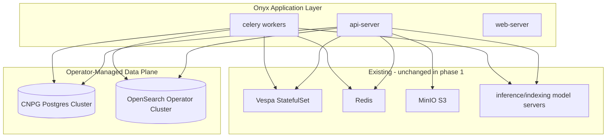

# Postgres & OpenSearch Operator Migration — Deep Research

**Audience:** Platform / DevOps / engineering leads evaluating operator adoption for Onyx on OpenShift/Kubernetes.

**Purpose:** Answer three questions your colleague is asking:

1. **What does switching to Postgres + OpenSearch operators actually mean?**
2. **How do we do it safely for Onyx?**
3. **How hard is it, and how long will it take?**

**Related docs in this repo:**

- Current manifests: `new_manifests_values_yaml/03-postgresql.yaml`, `11-opensearch.yaml`, `02-configmap.yaml`
- Postgres logical migration: `docs/migrations/MIGRATING-POSTGRES-TO-NEW-CLUSTER.md`
- Vector backend change (separate program): `litellm-integration/VESPA-TO-PGVECTOR-MIGRATION.md`
- OpenSearch OpenShift image work: `new_manifests_values_yaml/opensearch-custom/Dockerfile`

---

## Executive summary (for your colleague)

| Area | Current state (this repo) | Operator target | Effort (pilot → prod-ready) | Risk |
|------|---------------------------|-----------------|-----------------------------|------|
| **Postgres** | Single `Deployment`, no PVC in values YAML, secrets `onyx-postgresql` | CNPG or Crunchy PGO cluster CR | **2–6 weeks** (pilot + cutover); **4–8+ weeks** with HA, backups, DR drills | **Medium** — data loss risk if backup/restore not tested |
| **OpenSearch** | Single-node `StatefulSet` + PVC + custom image for arbitrary UID | OpenSearch Kubernetes Operator (`OpenSearchCluster` CR) | **3–8 weeks** (operator + cluster + validation); longer if reindex/rebuild | **Medium–High** — SCC/UID, operator API churn, index rebuild |
| **Combined program** | Both + Onyx wiring + runbooks | Full platform hardening | **8–16 weeks** typical | **High** if done during active production incidents |

**Recommendation:** Treat this as a **platform hardening program**, not a quick manifest swap. Stabilize Onyx runtime first (inference model server, MinIO/S3, Vespa backpressure), then run operators in a **non-prod namespace**, prove backup/restore and failover, then cut over with a maintenance window.

**Important distinction:** Moving Postgres/OpenSearch to operators is **not** the same as migrating Onyx search from **Vespa → pgvector**. Operators change **how databases run**; pgvector migration changes **what stores vectors**. You can do either independently; doing both at once multiplies risk.

---

## 1) Current baseline in this repository

### 1.1 PostgreSQL

```yaml
# new_manifests_values_yaml/03-postgresql.yaml (summary)
kind: Deployment
replicas: 1
image: postgres:15.2-alpine
# Secrets: onyx-postgresql (username/password)
# No PersistentVolumeClaim in current values YAML
```

Onyx connects via ConfigMap:

```yaml
POSTGRES_HOST: "postgresql.onyx-infra.svc.cluster.local"
POSTGRES_PORT: "5432"
POSTGRES_DB: "postgres"
```

**Production implications today:**

- Single replica → no automatic failover.
- **Ephemeral storage risk:** without a PVC, pod reschedules can lose data unless storage was added elsewhere outside this file.
- API server runs Alembic migrations on startup (schema lifecycle is tied to app version).
- Postgres is the **system of record** (users, connectors, chat, `search_settings`, etc.). Vespa/OpenSearch are indexes that can be rebuilt; Postgres cannot be casually recreated.

### 1.2 OpenSearch

```yaml
# new_manifests_values_yaml/11-opensearch.yaml (summary)
kind: StatefulSet
replicas: 1
image: your-registry/onyx-opensearch:3.4.0-uid-arbitrary  # custom build
PVC: opensearch-pvc
securityContext: runAsUser 1001000000, fsGroup 1000
discovery.type: single-node
```

ConfigMap flags:

```yaml
OPENSEARCH_HOST: "opensearch.onyx-infra.svc.cluster.local"
ENABLE_OPENSEARCH_INDEXING_FOR_ONYX: "true"
ENABLE_OPENSEARCH_RETRIEVAL_FOR_ONYX: "false"   # Vespa still primary for retrieval in this baseline
```

**Production implications today:**

- You already solved a hard OpenShift problem: **non-root arbitrary UID** via custom Dockerfile (`opensearch-custom/Dockerfile`).
- OpenSearch is used for **indexing path** in this config; retrieval may still be Vespa-heavy depending on feature flags.
- Operator migration must preserve **the same OpenShift constraints** (SCC, volume permissions, resource limits).

### 1.3 What operators would replace

| Component | Today | With operator |
|-----------|-------|---------------|
| Postgres pod YAML | Hand-written Deployment/Service | `Cluster` CR (CNPG) or `PostgresCluster` CR (PGO) + generated Services |
| Postgres ops (backup, failover, upgrades) | Manual scripts / runbooks | Operator reconciliation + backup CRs |
| OpenSearch StatefulSet | Hand-written + custom image | `OpenSearchCluster` CR + operator-managed StatefulSets |
| OpenSearch ops (rolling restart, certs, scaling) | `kubectl`/UI edits | CR spec changes |

**What operators do *not* replace:**

- Onyx application config (`env-configmap`, secrets for `POSTGRES_*`, `OPENSEARCH_*`)
- Vespa stack (unless you deliberately decommission it)
- MinIO/S3, Redis, model servers, Celery workers
- Business logic migrations (`alembic_version` still driven by API init)

---

## 2) Operator landscape (what to choose)

### 2.1 PostgreSQL operators

| Operator | Model | Strengths | Weaknesses / fit for you |
|----------|-------|-----------|----------------------------|
| **CloudNativePG (CNPG)** | Kubernetes-native HA (no Patroni in-cluster) | CNCF sandbox, active releases, clean CRDs, Barman/S3 backups, good K8s integration | Team must learn CNPG CRs; OpenShift SCC still your problem |
| **Crunchy PGO** | Patroni + pgBackRest ecosystem | Long production history, strong backup/restore story, familiar to enterprise teams | Heavier footprint; more moving parts |
| **Zalando Postgres Operator** | Patroni-based | Battle-tested at scale | More complex CR surface; less “modern” than CNPG for greenfield |
| **Managed RDS / Azure / Cloud SQL** | Off-cluster | Lowest ops burden | Different networking, compliance, cost model — may be preferable if policy allows |

**For OpenShift + Onyx (this repo):**

- **CNPG** is a strong default if you want open-source, Kubernetes-native operations and are building in-house platform skills.
- **PGO** is a strong default if your org already runs Crunchy elsewhere or wants pgBackRest-first operations with a long track record.

Both require the same Onyx cutover mechanics: **new hostname, credentials, pg_dump/pg_restore or operator backup restore**.

### 2.2 OpenSearch operator

Official project: [opensearch-project/opensearch-k8s-operator](https://github.com/opensearch-project/opensearch-k8s-operator)

| Topic | Detail |
|-------|--------|
| **CRD** | `OpenSearchCluster` (API migrating `opensearch.opster.io` → `opensearch.org`; plan for API updates) |
| **Versions (2026)** | Operator 2.8.x / 3.0 alpha supports OpenSearch 2.19.2 through 3.x — align with your `3.4.0` image choice |
| **Features** | Rolling upgrades, scaling, security, dashboards sidecar, Prometheus hooks |
| **OpenShift** | Runs on OpenShift, but **SCC/UID fixes are not fully “operator-native”** — you still need arbitrary-UID-safe images and volume permissions (you already started this) |
| **Maturity** | Improving rapidly; 3.0 had a large stabilization push — still treat as **validate in lower env first** |

**Alternative (lower effort, less “operator”):**

- Keep hand-written StatefulSet, harden with PVC + custom image + backup cronjobs.
- Use operator only when you need multi-node HA, frequent rolling upgrades, or many clusters.

---

## 3) How migration works (technical paths)

### 3.1 PostgreSQL: recommended cutover (logical dump)

This matches `docs/migrations/MIGRATING-POSTGRES-TO-NEW-CLUSTER.md`.


**Steps (condensed):**

1. Deploy operator + `Cluster` CR in **parallel** namespace or same namespace with different Service name (e.g. `onyx-pg-rw.onyx-infra.svc`).
2. Configure storage class, backups, connection pooling (optional PgBouncer).
3. Maintenance window: scale down `api-server`, Celery workers, beat.
4. `pg_dump -Fc` from old pod → object storage.
5. `pg_restore` into operator-managed primary.
6. Point `POSTGRES_HOST` / secrets at new Service; roll Onyx.
7. Verify: `alembic_version`, `search_settings`, document counts, login, connector sync.

**Downtime:** Typically **30 minutes to 2 hours** for moderate DB sizes if rehearsed; longer without rehearsal or with large DBs.

**Rollback:** Keep old Deployment scaled to 0 but not deleted until new cluster is validated; revert `POSTGRES_HOST` if restore fails validation.

### 3.2 PostgreSQL: operator-native backup/restore (later maturity)

Once CNPG/PGO backups are configured to MinIO (you already deploy MinIO in this repo):

- Use scheduled backups + PITR (if enabled) instead of ad-hoc pod exec dumps.
- DR drills become **restore into fresh namespace** exercises.

Extra effort: **+1–2 weeks** to implement and test backup CRs, retention, and restore runbook.

### 3.3 OpenSearch: migration paths

**Path A — Greenfield cluster (simpler, requires reindex)**

1. Install OpenSearch operator (cluster-scoped or namespace-scoped).
2. Create `OpenSearchCluster` CR (single node for dev; 3 nodes for prod HA).
3. Apply same security constraints (non-root, `fsGroup`, storage class).
4. Update `OPENSEARCH_HOST` to operator-generated Service.
5. **Reindex Onyx content** (connector sync / full reindex) because index data is not automatically portable between disparate clusters unless you snapshot/restored PVCs with identical node layout.

**Downtime:** Low for Onyx app if Vespa still serves retrieval; indexing path may pause during cutover.

**Path B — PVC snapshot migration (advanced)**

1. Quiesce OpenSearch indexing.
2. Snapshot PVC / copy data directory with compatible UID paths.
3. Attach to new operator-managed volume set.

**Risk:** High on OpenShift due to UID/fsGroup mismatches; only attempt with a tested procedure.

**Path C — Stay on StatefulSet, defer operator**

If OpenSearch is single-node and stable after your custom image fix, operators may be **optional** until you need HA or multi-cluster standardization.

### 3.4 Onyx application impact checklist

| Config / secret | Likely change |
|-----------------|---------------|
| `POSTGRES_HOST`, `POSTGRES_USER`, `POSTGRES_PASSWORD` | New operator Service DNS + credentials |
| `OPENSEARCH_HOST` | Operator Service name (e.g. `onyx-os-cluster.onyx-infra.svc`) |
| TLS | Operator may generate certs; Onyx must trust CA or use `https` + secret mounts |
| Init migrations | Unchanged — API still runs Alembic |
| Indexing | Expect **reindex** after OpenSearch endpoint change unless you restore data |
| Monitoring | Add `PodMonitor`/`ServiceMonitor` for operator metrics |

No Onyx **source code** changes are strictly required if connection strings and credentials are correct — this is primarily **platform + manifest + runbook** work.

---

## 4) OpenShift-specific constraints (do not skip)

Your environment already hit:

- **Arbitrary UID** enforcement (`runAsUser: 1001000000` experiments).
- **SCC** restrictions (non-root, dropped caps).
- **Volume permissions** (`drwxrwsrwx`, `fsGroup`, custom OpenSearch image).

Operators **do not remove** these requirements. They shift **who** creates the Pod spec (operator controller instead of your YAML).

| Risk | Mitigation |
|------|------------|
| OpenSearch entrypoint permission denied | Keep custom image pattern; set `securityContext` in CR pod templates |
| Postgres data dir not writable | `fsGroup`, `supplementalGroups`, compatible storage class (RWX vs RWO) |
| SCC denied | Pre-create `ServiceAccount`, bind `anyuid` / `nonroot` SCC only if policy allows — document exception |
| Routes vs Ingress | OpenShift supports Ingress; operator Route integration is manual ([operator issue #197](https://github.com/opensearch-project/opensearch-k8s-operator/issues/197)) |

**Effort adder for OpenShift:** **+20–40%** time vs plain Kubernetes due to SCC/image testing and storage class quirks.

---

## 5) Effort & time estimates (realistic ranges)

Assumptions: 1–2 platform engineers part-time, existing `onyx-infra` namespace, non-prod cluster available, Onyx already deployed.

### 5.1 Phase breakdown

| Phase | Activities | Calendar time |
|-------|------------|---------------|
| **0 — Stabilize** | Fix inference-model-server, MinIO credentials, Vespa 429 tuning | 1–2 weeks (parallel; not operator work but blocks safe migration) |
| **1 — Discovery** | Inventory data sizes, Postgres version, OpenSearch index size, RPO/RTO | 3–5 days |
| **2 — Pilot Postgres operator** | Install operator, deploy 1-instance Cluster, restore test dump, connect test Onyx | 1–2 weeks |
| **3 — Pilot OpenSearch operator** | Install operator, single-node CR, custom security context, smoke index | 1–2 weeks |
| **4 — Production hardening** | HA (3-node PG, 3-node OS), backups to MinIO, alerts, failover drill | 2–4 weeks |
| **5 — Production cutover** | Maintenance window, dump/restore, config flip, validation | 1–2 days (+ rehearsal day) |
| **6 — Decommission old** | Remove old Deployment/StatefulSet after soak period | 2–3 days |

### 5.2 Summary table (answer for colleague)

| Scenario | Calendar time | Engineering effort | Hardness (1–5) |
|----------|---------------|--------------------|------------------|
| **Postgres operator only, single instance, logical migration** | 2–4 weeks | ~8–15 person-days | 3 |
| **Postgres operator + HA + automated backups + DR test** | 4–8 weeks | ~20–35 person-days | 4 |
| **OpenSearch operator only, single node, reindex acceptable** | 3–6 weeks | ~10–20 person-days | 3–4 |
| **OpenSearch operator + HA + data migration without full reindex** | 6–10 weeks | ~25–40 person-days | 4–5 |
| **Both operators, production-grade, OpenShift** | **8–16 weeks** | **~45–80 person-days** | **4** |

**Hardness scale:**

- **1** = apply Helm chart, change env var
- **3** = parallel cluster + dump/restore + rehearsal
- **5** = HA failover drills + OpenSearch data migration + zero surprises on SCC/storage

### 5.3 Cost of *not* migrating (honest trade-off)

Staying on manual Deployments/StatefulSets is valid when:

- Single-node Postgres/OpenSearch is acceptable for current SLA.
- You have working backups via `pg_dump` cron and PVC snapshots.
- Team size is small and operator CRDs add operational learning curve.

Migrate when:

- You need **HA failover** without custom scripts.
- You need **standardized backups/PITR** audited for compliance.
- You run **multiple environments** and want the same CR pattern everywhere.
- OpenSearch must scale beyond one node with safe rolling upgrades.

---

## 6) Risk register

| ID | Risk | Likelihood | Impact | Mitigation |
|----|------|------------|--------|------------|
| R1 | Postgres data loss during cutover | Medium | Critical | Rehearse dump/restore; keep old PVC/pod until soak complete |
| R2 | Schema mismatch after restore | Low | High | Match Postgres major version (15.x); verify `alembic_version` |
| R3 | OpenSearch UID/SCC regression | Medium | High | Reuse `opensearch-custom` patterns in CR podTemplate |
| R4 | Full reindex overloads Vespa/model servers | Medium | High | Throttle `NUM_INDEXING_WORKERS` during reindex window |
| R5 | Operator API deprecation (`opensearch.opster.io`) | Medium | Medium | Pin operator version; plan CRD migration |
| R6 | Combined with pgvector/Vespa migration | High | Critical | **Decouple programs** — operators first OR vector migration first |
| R7 | Secret drift (wrong `POSTGRES_HOST` in one deployment) | Medium | Medium | GitOps single source; validate all Onyx pods with one script |

---

## 7) Recommended target architecture



**Service naming convention (example):**

- `onyx-pg-rw.onyx-infra.svc.cluster.local:5432` (CNPG read-write Service)
- `onyx-opensearch.onyx-infra.svc.cluster.local:9200` (operator-generated)

Update `new_manifests_values_yaml/02-configmap.yaml` and secrets accordingly.

---

## 8) Implementation blueprint (what to build in this repo)

### 8.1 Suggested new directories

```
new_manifests_values_yaml/
  operators/
    cnpg/
      00-operator-subscription.yaml    # or Helm install doc
      01-postgres-cluster.yaml
      02-backup-schedule.yaml
    opensearch/
      00-operator-install.md
      01-opensearch-cluster.yaml
      02-securityconfig-secret.yaml
```

### 8.2 Example CNPG Cluster skeleton (illustrative)

```yaml
apiVersion: postgresql.cnpg.io/v1
kind: Cluster
metadata:
  name: onyx-pg
  namespace: onyx-infra
spec:
  instances: 3
  imageName: ghcr.io/cloudnative-pg/postgresql:15
  storage:
    size: 50Gi
    storageClass: <your-sc>
  bootstrap:
    initdb:
      database: postgres
      owner: onyx
  backup:
    barmanObjectStore:
      destinationPath: s3://onyx-backups/postgres/
      endpointURL: http://minio.onyx-infra.svc.cluster.local:9000
      s3Credentials:
        accessKeyId:
          name: onyx-minio
          key: ACCESS_KEY
        secretAccessKey:
          name: onyx-minio
          key: SECRET_KEY
```

### 8.3 Example OpenSearchCluster skeleton (illustrative)

```yaml
apiVersion: opensearch.org/v1
kind: OpenSearchCluster
metadata:
  name: onyx-os
  namespace: onyx-infra
spec:
  general:
    version: "3.4.0"
    httpPort: 9200
    serviceName: onyx-opensearch
  nodePools:
    - component: nodes
      replicas: 1
      diskSize: "50Gi"
      resources:
        requests:
          memory: "4Gi"
          cpu: "2"
        limits:
          memory: "8Gi"
          cpu: "4"
      roles:
        - cluster_manager
        - data
      persistence:
        pvc:
          storageClass: <your-sc>
      # OpenShift: merge podTemplate with securityContext + custom image
```

**Note:** Exact CR fields depend on operator version — pin version in pilot and generate YAML from official samples.

---

## 9) Decision guide (quick answers for standup)

| Question | Short answer |
|----------|--------------|
| Should we do both at once? | **No** — sequence Postgres first (smaller blast radius), then OpenSearch. |
| CNPG or PGO? | CNPG for K8s-native greenfield; PGO if org standard is Crunchy/pgBackRest. |
| OpenSearch operator or stay StatefulSet? | Operator if you need HA/standard ops; StatefulSet OK if single-node is enough after UID fix. |
| Will Onyx need code changes? | **Unlikely** — env/secret/DNS changes only. |
| Downtime? | Postgres: **yes** (short) for dump/restore. OpenSearch: **partial** (indexing) if reindex; retrieval may stay on Vespa. |
| Biggest hidden work? | Backup/restore drills, OpenShift SCC, reindex capacity planning. |

---

## 10) Proposed program timeline (Gantt-style)

| Week | Postgres track | OpenSearch track |
|------|----------------|------------------|
| 1 | Discovery + sizing; install CNPG in dev | Discovery; install OS operator in dev |
| 2 | Test dump/restore; connect dev Onyx | Single-node CR + UID/SCC validation |
| 3 | HA + backup to MinIO | Indexing smoke test; performance baseline |
| 4 | Failover drill | Decide HA vs single-node |
| 5 | Prod rehearsal (dry run) | Prod rehearsal (reindex plan) |
| 6 | **Prod cutover** | **Prod cutover** (or week 7–8) |
| 7–8 | Soak + decommission old Deployment | Soak + decommission old StatefulSet |

Adjust **+2–4 weeks** if team is part-time or production fires continue.

---

## 11) Prerequisites before starting (gate checklist)

- [ ] Postgres data on **persistent** storage with known size and growth rate
- [ ] Documented RPO/RTO (how much data loss / downtime is acceptable)
- [ ] Working object storage for backups (MinIO bucket + credentials) — see `12-minio.yaml`
- [ ] Non-prod OpenShift project with same SCC/storage class as prod
- [ ] Reindex throttle plan (`NUM_INDEXING_WORKERS`, Vespa 429 mitigation)
- [ ] Agreement **not** to combine with Vespa→pgvector migration in same window

---

## 12) References

- [CloudNativePG documentation](https://cloudnative-pg.io/documentation/current/)
- [Crunchy PGO documentation](https://access.crunchydata.com/documentation/postgres-operator/latest/)
- [OpenSearch Kubernetes Operator](https://github.com/opensearch-project/opensearch-k8s-operator)
- [OpenSearch on OpenShift SCC discussion](https://github.com/opensearch-project/opensearch-k8s-operator/issues/197)
- Repo: `docs/migrations/MIGRATING-POSTGRES-TO-NEW-CLUSTER.md`
- Repo: `implementation/DEPLOYMENT-RISK-DEEP-RESEARCH-AND-SOLUTION-ARCHITECTURE.md`

---

## 13) One-paragraph reply you can paste to your colleague

> We run Postgres as a single Deployment and OpenSearch as a single-node StatefulSet (with a custom OpenShift-friendly image). Moving to **CloudNativePG or Crunchy PGO** plus the **OpenSearch Kubernetes Operator** is feasible but is a **multi-week platform program**, not a config tweak: expect **~8–16 weeks** for production-grade HA, backups, OpenShift SCC validation, and cutover rehearsals. Postgres migration is **logical dump/restore** with a short maintenance window; OpenSearch likely needs **reindex** unless we do advanced volume migration. Recommend **Postgres operator first**, stabilize backups/failover in dev, then OpenSearch operator — and **do not** combine with Vespa→pgvector in the same release. Effort is roughly **45–80 engineer-days** combined for prod-ready outcomes on OpenShift.

---

*Document version: 1.0 — 2026-05-26*
