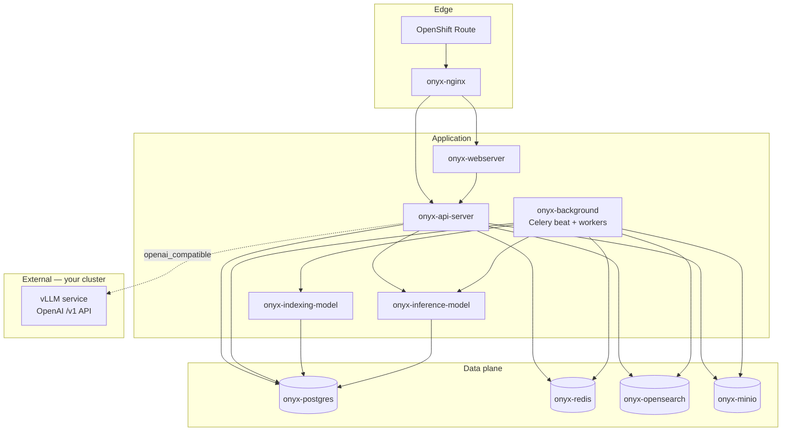

# Onyx on OpenShift — Production Manifests

Kubernetes/OpenShift manifests mirroring the **standard** Onyx stack from `deployment/docker_compose` and `deployment/helm/charts/onyx`, hardened for production.

**LLM provider:** external **vLLM** (OpenAI-compatible API). Chat models are configured in the Admin UI / Postgres — not in these manifests.

---

## Architecture & Service Dependencies



### Tier 1 — Must run (nothing works without these)

| Service | Role | Depends on |
|---------|------|------------|
| **onyx-postgres** | App DB, metadata, auth | — |
| **onyx-redis** | Celery broker, cache | — |
| **onyx-api-server** | FastAPI backend, migrations | postgres, redis, opensearch, minio, inference-model |
| **onyx-webserver** | Next.js UI | api-server |
| **onyx-nginx** | Reverse proxy, long LLM timeouts | api-server, webserver |

### Tier 2 — Required for RAG / file upload / connectors

| Service | Role | Depends on |
|---------|------|------------|
| **onyx-opensearch** | Vector + keyword index | — |
| **onyx-minio** | File blob store (S3-compatible) | — |
| **onyx-background** | Celery beat + workers (indexing, delete, sync) | postgres, redis, opensearch, minio, both model servers |
| **onyx-inference-model** | Embeddings + rerank at query time | postgres |
| **onyx-indexing-model** | Embeddings during indexing | postgres |

### Tier 3 — External (you deploy separately)

| Service | Role |
|---------|------|
| **vLLM** | LLM inference (`/v1/chat/completions`) |
| **Optional: corporate IdP** | OIDC/SAML if `AUTH_TYPE` ≠ `basic` |

---

## Production hardening included

| Risk (from local/docker testing) | Mitigation in these manifests |
|----------------------------------|-------------------------------|
| OpenSearch OOM (exit 137) | `512m` JVM heap, `1536Mi` memory limit, `memory_lock=false`, startup/readiness probes |
| Nginx 502 after API restart | Route → nginx only; nginx upstreams re-resolve pods |
| LLM timeouts | `LLM_SOCKET_READ_TIMEOUT=180`, nginx `proxy_read_timeout 900s` |
| File upload `FAILED` | OpenSearch health gates + resource limits |
| Stale secrets | Documented `onyx-secrets` rotation |
| OpenShift SCC | Model-server pods annotated; SCC grant documented below |

---

## Prerequisites

- OpenShift 4.12+ cluster
- `oc` CLI logged in
- StorageClass for PVCs (default OK)
- Cluster capacity (minimum **single-node dev**):

| Component | CPU request | Memory request |
|-----------|-------------|----------------|
| Postgres | 250m | 512Mi |
| Redis | 100m | 128Mi |
| OpenSearch | 500m | 1Gi |
| MinIO | 250m | 512Mi |
| API | 500m | 1Gi |
| Background | 500m | 2Gi |
| Inference model | 1 | 3Gi |
| Indexing model | 1 | 3Gi |
| Web + Nginx | 300m | 768Mi |
| **Total (approx)** | **~4 CPU** | **~12 Gi** |

Production: scale memory (OpenSearch 4–8Gi, model servers with GPU nodes).

---

## Quick deploy

```bash
cd onyx/deployment/openshift

# 1. Edit secrets (REQUIRED before production)
cp secrets/onyx-secrets.yaml.example secrets/onyx-secrets.yaml
# Set passwords — see file comments

# 2. Edit config for your domain
#    manifests/configmap-env.yaml → WEB_DOMAIN, DOMAIN

# 3. Apply
oc apply -k .

# 4. Wait for rollouts
oc rollout status deployment/onyx-api-server -n onyx --timeout=600s
oc rollout status deployment/onyx-background -n onyx --timeout=600s

# 5. Get URL
oc get route onyx -n onyx
```

---

## vLLM configuration

vLLM is **not** bundled here. Deploy it in the same or a trusted namespace, then configure Onyx:

### Option A — Admin UI (recommended)

1. Open `https://<your-route>/admin`
2. **LLM** → Add provider
3. Type: **`openai_compatible`**
4. API Base: `http://vllm-service.vllm.svc.cluster.local:8000/v1` (adjust)
5. API Key: `not-needed` (or your vLLM auth token)
6. Default model: name served by vLLM (e.g. `meta-llama/Llama-3.1-8B-Instruct`)

### Option B — SQL bootstrap (after first admin login)

See `docs/vllm-provider-bootstrap.sql`.

### Env tuning (already in ConfigMap)

```yaml
LLM_SOCKET_READ_TIMEOUT: "180"
LITELLM_EXTRA_BODY: '{"think": false}'   # disable thinking models if needed
```

---

## OpenShift-specific notes

### Security Context Constraints

Model server images may need **`anyuid`** or **`privileged`** SCC (same as upstream Helm chart):

```bash
oc adm policy add-scc-to-user anyuid -z default -n onyx
# Or create a dedicated ServiceAccount — see manifests/serviceaccount.yaml
```

### Routes vs Ingress

This deployment uses an **OpenShift Route** to `onyx-nginx:8080`. TLS edge termination is enabled by default.

### Image tags

Pin images in `kustomization.yaml`:

```yaml
images:
  - name: onyxdotapp/onyx-backend
    newTag: "v4.0.5"   # match your tested version
```

### External managed services

Disable bundled StatefulSets and point ConfigMap to external endpoints:

| Bundled | Replace with | ConfigMap keys |
|---------|--------------|----------------|
| onyx-postgres | RDS / Cloud SQL | `POSTGRES_HOST` |
| onyx-redis | ElastiCache | `REDIS_HOST`, `REDIS_SSL` |
| onyx-opensearch | AWS OpenSearch | `OPENSEARCH_HOST`, disable opensearch STS |
| onyx-minio | S3 / OCS | `S3_ENDPOINT_URL`, bucket name |

---

## Alternative: Helm on OpenShift

For teams preferring the official chart, use:

```bash
helm upgrade --install onyx ../helm/charts/onyx \
  -f ../helm/charts/onyx/values.yaml \
  -f values-openshift-helm.yaml \
  -n onyx --create-namespace
```

See `values-openshift-helm.yaml` for OpenShift-tuned overrides.

---

## Operations

```bash
# Health
oc get pods -n onyx
oc logs deployment/onyx-api-server -n onyx --tail=50
oc logs deployment/onyx-background -n onyx --tail=50 | grep -i failed

# FAILED user files
oc exec -it statefulset/onyx-postgres -n onyx -- \
  psql -U postgres -d postgres -c "SELECT name,status FROM user_file WHERE status='FAILED';"

# Redis delete queue depth
oc exec deployment/onyx-redis -n onyx -- redis-cli -n 15 LLEN user_file_delete:1

# OpenSearch
oc exec statefulset/onyx-opensearch -n onyx -- \
  curl -sk -u admin:$OS_PASS https://localhost:9200/_cluster/health
```

---

## File layout

```
openshift/
├── README.md                          # This file
├── kustomization.yaml
├── values-openshift-helm.yaml         # Helm overlay alternative
├── docs/
│   ├── ARCHITECTURE.md
│   └── vllm-provider-bootstrap.sql
├── secrets/
│   └── onyx-secrets.yaml.example
└── manifests/
    ├── namespace.yaml
    ├── serviceaccount.yaml
    ├── configmap-env.yaml
    ├── configmap-nginx.yaml
    ├── infrastructure/                # postgres, redis, opensearch, minio
    ├── app/                             # api, web, nginx, background, models
    └── routes/
        └── onyx-route.yaml
```
