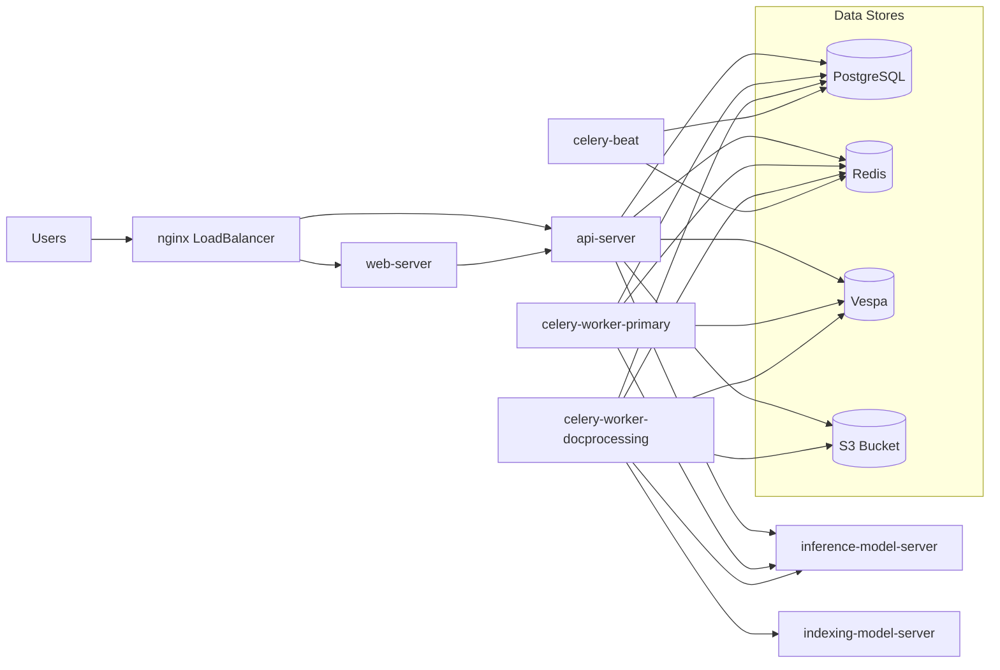

# New Onyx Deployment Architecture

## Service relationship summary

- `nginx` exposes one endpoint and routes traffic to `web-server` and `api-server`.
- `api-server` is the synchronous request path for auth, chat, search, and uploads.
- Celery workers process asynchronous indexing and file-processing workloads.
- `Redis` is queue coordination and short-lived cache.
- `PostgreSQL` is source of truth for users, metadata, and connector state.
- `Vespa` stores and serves retrieval/index data.
- Model servers are split for query-time and indexing-time loads.
- S3 stores uploaded files and document binary content.

## Reliability choices in this deployment

- Stable pinned images (`v3.1.1` for Onyx components)
- API/web replicas > 1 to reduce single-pod failures
- Increased NGINX upstream timeouts to reduce user-facing 504s
- Separate docprocessing workers to isolate indexing pressure
- OpenSearch indexing disabled by default for baseline stability
