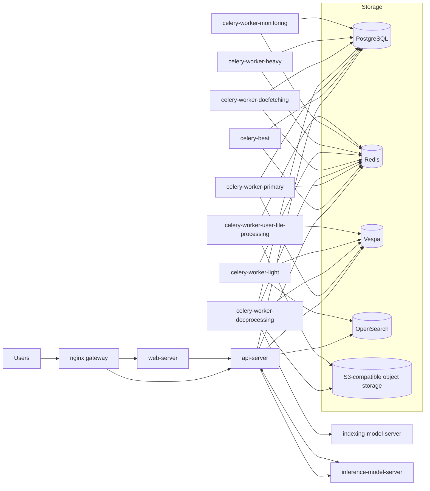

# Onyx Architecture (values.yaml coverage, external S3)

## Linking summary

- `nginx` exposes the external endpoint and routes to `web-server` and `api-server`.
- `api-server` is the synchronous path (auth, chat, uploads orchestration).
- Celery workers run the asynchronous pipeline (document fetch, processing, indexing, sync).
- `Redis` coordinates background/queue state.
- `Vespa` provides retrieval/vector search.
- `OpenSearch` provides text-oriented indexing/search capability.
- Object binaries and uploaded files are stored in your **external S3-compatible storage**.
