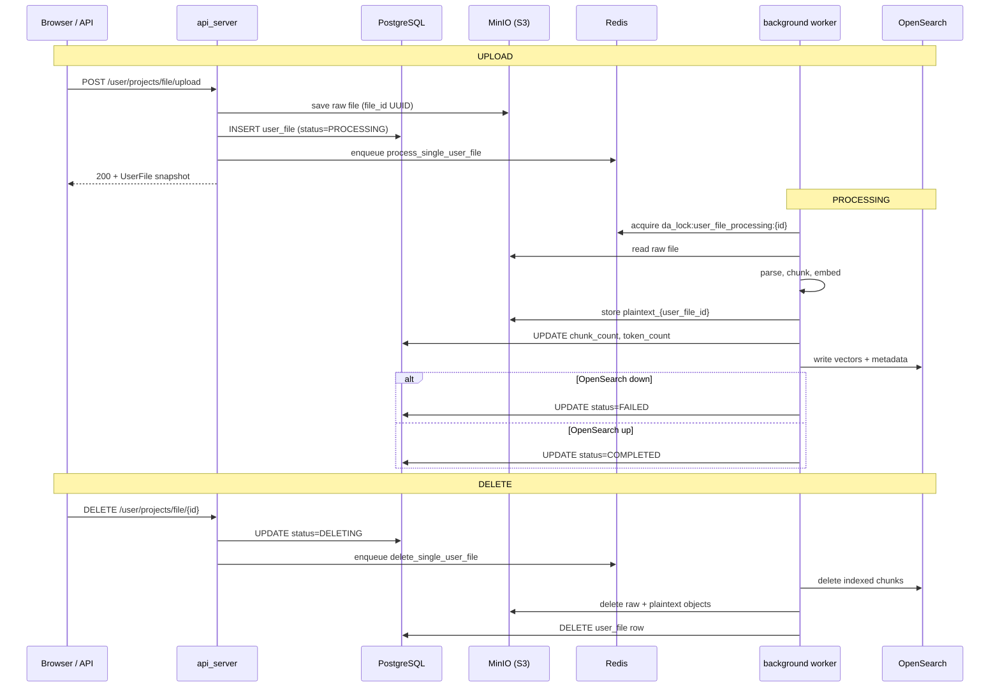

# Onyx File Upload & Delete — Behind-the-Scenes Trace Report

**Date:** 2026-06-05  
**Onyx version:** v4.0.5  
**Environment:** `onyx/deployment/docker_compose` (Docker Compose)  
**Test file:** `test-upload-report.txt` (491 bytes, plain text)  
**Test user:** `chihebmhamdi79@gmail.com` (ADMIN)

---

## Executive Summary

This report traces what happens when a user uploads a file and then deletes it in Onyx v4.0.5, with live observations from **PostgreSQL**, **Redis**, **MinIO**, and **Celery worker logs**.

| Phase | Result |
|-------|--------|
| Upload (API + MinIO + Postgres) | **Succeeded** |
| Background processing (`process_single_user_file`) | **Partial** — parsed 1 chunk, stored plaintext in MinIO, **OpenSearch write failed** → status `FAILED` |
| Delete (`delete_single_user_file`) | **Blocked** — delete task started but **crashed on OpenSearch cleanup** → file stuck in `DELETING` |

**Root cause for both failures:** `onyx-opensearch-1` is crash-looping (`Restarting (137)`). Workers cannot resolve or reach `opensearch:9200`.

Raw capture files are in `trace-captures/` next to this document.

---

## Test Method

1. Captured baseline state (Postgres, Redis, MinIO).
2. Uploaded `test-upload-report.txt` via API:
   ```bash
   POST /api/user/projects/file/upload
   ```
3. Polled state at T+0s, T+1s, T+4s, T+12s, T+27s during processing.
4. Deleted the file via API:
   ```bash
   DELETE /api/user/projects/file/a4e30ebe-3505-4392-a6de-453af3f84b32
   ```
5. Polled state during delete (T+0s through T+12s).
6. Correlated with `onyx-api_server-1` and `onyx-background-1` logs.

### Test File Identifiers

| Field | Value |
|-------|-------|
| `user_file.id` (Postgres PK) | `a4e30ebe-3505-4392-a6de-453af3f84b32` |
| `user_file.file_id` (MinIO object key suffix) | `e28fc4bb-ca56-4721-88be-e6c7f7d85119` |
| Celery processing task ID | `d88734b3-3e6f-40f7-adf5-139c22d13a6a` |
| Celery delete task IDs (failed) | `9b006a91-27ba-4bb7-bf55-8d1cbe2c499c`, `aa240cae-462a-41a7-9440-94604385c234` |

---

## High-Level Architecture



---

## Phase 1 — Upload (Synchronous API Path)

### HTTP Request

```
POST http://localhost:3000/api/user/projects/file/upload
Content-Type: multipart/form-data
Field: files=@test-upload-report.txt
```

**Handler:** `upload_user_files()` → `upload_files_to_user_files_with_indexing()`  
**Source:** `onyx/server/features/projects/api.py`, `onyx/db/projects.py`

### Step-by-Step (What Actually Happened)

| Step | Component | Action |
|------|-----------|--------|
| 1 | API | Validates auth (`BASIC_ACCESS`), receives multipart file |
| 2 | `categorize_uploaded_files()` | Token-counts file, accepts/rejects by limits |
| 3 | `upload_files()` | Writes raw bytes to MinIO via `file_store.save_file()` |
| 4 | Postgres | `INSERT INTO user_file` with new UUID primary key |
| 5 | Postgres | *(skipped)* No `project_id` passed → no `project__user_file` row |
| 6 | Celery client | `send_task(PROCESS_SINGLE_USER_FILE)` on queue `user_file_processing` |
| 7 | API | Returns `200` with file metadata |

### API Response (T+0ms)

```json
{
  "user_files": [{
    "id": "a4e30ebe-3505-4392-a6de-453af3f84b32",
    "name": "test-upload-report.txt",
    "status": "PROCESSING",
    "file_id": "e28fc4bb-ca56-4721-88be-e6c7f7d85119",
    "token_count": 116,
    "file_type": "text/plain",
    "chunk_count": null
  }],
  "rejected_files": []
}
```

### API Server Log

```
Triggered indexing for user_file_id=a4e30ebe-3505-4392-a6de-453af3f84b32
  with task_id=d88734b3-3e6f-40f7-adf5-139c22d13a6a
POST /user/projects/file/upload HTTP/1.1" 200
```

---

## Phase 2 — Background Processing (Celery)

### Task

| Property | Value |
|----------|-------|
| Task name | `process_single_user_file` |
| Queue | `celery:user_file_processing` (Redis list) |
| Worker | `user_file_processing@...` in `onyx-background-1` |
| Priority | `HIGH` |
| Expires | 60 seconds (`CELERY_USER_FILE_PROCESSING_TASK_EXPIRES`) |

### Redis During Processing

| Key pattern | Purpose | Observed |
|-------------|---------|----------|
| `public:da_lock:user_file_processing:{user_file_id}` | Per-file worker lock (30 min TTL) | Present at T+1s, gone after task finished |
| `public:da_lock:user_file_queued:{user_file_id}` | Beat guard — prevents duplicate enqueue | Not observed (direct API enqueue, not beat) |
| `celery:user_file_processing` | Broker queue length | **0** at all sample points (task consumed immediately) |

> Redis keys are tenant-prefixed (`public:`) for application locks. Celery broker queues use unprefixed names on a separate Redis logical DB.

### Celery Beat (Safety Net — Not Used for This Upload)

Every ~20 seconds, beat runs:

- `check_for_user_file_processing` — scans `user_file` where `status IN (PROCESSING, INDEXING)` and enqueues missing tasks
- `check_for_user_file_project_sync` — syncs files linked to projects
- `check_for_user_file_delete` — scans `status = DELETING` and enqueues delete tasks

All beat cycles during our test logged `Enqueued 0` because the API already enqueued the task directly.

### Processing Timeline (Observed)

| Time (UTC) | Event |
|------------|-------|
| 12:59:38 | Upload completes; Postgres row `PROCESSING`; MinIO raw object created |
| 12:59:38 | Celery task `d88734b3...` picked up |
| 12:59:38–12:59:50 | Parse file via `LocalFileConnector`, chunk (1 chunk), embed |
| 12:59:50 | **ERROR:** `Failed to write document chunks to vector db` |
| 12:59:51 | Plaintext cache written to MinIO (`plaintext_a4e30ebe...`) |
| 12:59:51 | Postgres: `chunk_count=1`, `status=FAILED` |
| 12:59:51 | Worker raises `RuntimeError: Indexing pipeline failed` |

### Worker Log (Excerpt)

```
process_user_file_impl - Starting id=a4e30ebe-3505-4392-a6de-453af3f84b32
Failed to write document chunks for 'a4e30ebe-3505-4392-a6de-453af3f84b32' to vector db
_process_user_file_with_indexing - Indexing pipeline failed id=a4e30ebe-...
ConnectionError: HTTPSConnection(host='opensearch', port=9200): Failed to resolve 'opensearch'
```

### Postgres Changes — Upload + Processing

#### `user_file` table

| Column | Before upload | After upload (T+0) | After processing (T+27s) |
|--------|---------------|------------------|------------------------|
| `id` | — | `a4e30ebe-3505-4392-a6de-453af3f84b32` | same |
| `user_id` | — | `44ede7f6-67ff-4fd3-97be-a59d603a2263` | same |
| `name` | — | `test-upload-report.txt` | same |
| `file_id` | — | `e28fc4bb-ca56-4721-88be-e6c7f7d85119` | same |
| `status` | — | `PROCESSING` | **`FAILED`** |
| `token_count` | — | `116` | `116` |
| `chunk_count` | — | `NULL` | **`1`** |
| `file_type` | — | `text/plain` | same |
| `created_at` | — | `2026-06-05 12:59:38` | same |

**No changes** to: `project__user_file`, `persona__user_file`, `chat_message`, or other tables.

#### Status lifecycle (intended vs observed)

```
PROCESSING → INDEXING → COMPLETED   (happy path)
PROCESSING → FAILED                 (observed — OpenSearch down)
```

Even on `FAILED`, the adapter's `post_index()` still ran far enough to:
- Set `chunk_count = 1`
- Store plaintext cache in MinIO

Chat can still use the file via **direct context injection** (reads plaintext from MinIO) even when RAG indexing failed.

---

## Phase 3 — Delete

### HTTP Request

```
DELETE http://localhost:3000/api/user/projects/file/a4e30ebe-3505-4392-a6de-453af3f84b32
```

**Handler:** `delete_user_file()` in `onyx/server/features/projects/api.py`

### Step-by-Step (API — Succeeded)

| Step | Component | Action |
|------|-----------|--------|
| 1 | API | Load `user_file`, verify ownership |
| 2 | API | Check associations with projects/assistants → none found |
| 3 | Postgres | `UPDATE user_file SET status = 'DELETING'` |
| 4 | Celery client | `send_task(DELETE_SINGLE_USER_FILE)` on queue `user_file_delete` |
| 5 | API | Returns `200 {"has_associations": false}` |

### API Log

```
Triggered delete for user_file_id=a4e30ebe-3505-4392-a6de-453af3f84b32
  with task_id=9b006a91-27ba-4bb7-bf55-8d1cbe2c499c
DELETE /user/projects/file/a4e30ebe-... HTTP/1.1" 200
```

### Delete Worker — Intended Flow (`delete_user_file_impl`)

| Phase | Action |
|-------|--------|
| 1 | Read `user_file` from Postgres (get `file_id`, `chunk_count`) |
| 2 | Delete chunks from OpenSearch/Vespa (`document_id == user_file_id`) |
| 3 | Delete MinIO objects: raw `file_id` + `plaintext_{user_file_id}` |
| 4 | `DELETE FROM user_file WHERE id = ...` |

### Delete Worker — What Actually Happened

| Time (UTC) | Event |
|------------|-------|
| 13:00:41 | `delete_user_file_impl` starts (task `9b006a91...`) |
| 13:00:41 | **CRASH** at Phase 2 — OpenSearch connection error |
| 13:00:55 | Beat re-enqueues delete (task `aa240cae...`) |
| 13:00:55 | **CRASH** again — same OpenSearch error |

### State After Delete Attempt (T+12s)

| Store | Expected (happy path) | Observed |
|-------|----------------------|----------|
| Postgres `user_file` | Row deleted | Row **still exists**, `status=DELETING` |
| MinIO raw object | Deleted | **Still present** (`e28fc4bb...`) |
| MinIO plaintext | Deleted | **Still present** (`plaintext_a4e30ebe...`) |
| OpenSearch | Chunks removed | N/A (never indexed successfully) |
| Redis queues | 0 | `user_file_delete=0` |

**Important production behavior:** Delete is **not transactional across stores**. When OpenSearch cleanup fails, the worker throws **before** MinIO and Postgres cleanup run. The file remains in `DELETING` status; beat will keep retrying every ~20s until OpenSearch is reachable or manual intervention.

---

## MinIO — Object Layout

**Bucket:** `onyx-file-store-bucket` (configured via `S3_FILE_STORE_BUCKET_NAME`)  
**Prefix:** `onyx-files/public/` (configured via `S3_FILE_STORE_PREFIX`)

| Object key | Size | Purpose | Created | After delete |
|------------|------|---------|---------|--------------|
| `onyx-files/public/e28fc4bb-ca56-4721-88be-e6c7f7d85119` | 491 B | Raw uploaded file | 12:59:38 | **Still exists** |
| `onyx-files/public/plaintext_a4e30ebe-3505-4392-a6de-453af3f84b32` | 490 B | Parsed plaintext cache for fast chat injection | 12:59:51 | **Still exists** |

Naming convention:
- **Raw file:** `file_id` returned by `file_store.save_file()` (random UUID)
- **Plaintext cache:** `plaintext_{user_file.id}` via `user_file_id_to_plaintext_file_name()`

---

## Redis — Queues, Locks, and Guards

### Celery Broker Queues (Redis lists)

| Queue name | Purpose | Length during test |
|------------|---------|-------------------|
| `celery:user_file_processing` | Index new uploads | 0 (instant consume) |
| `celery:user_file_delete` | Delete files | 0 |
| `celery:user_file_project_sync` | Re-sync project-scoped search | 0 |

Monitor task logs every 10s confirm all queue depths at 0.

### Application Redis Keys (tenant-prefixed)

| Key | TTL | Set by | Cleared by |
|-----|-----|--------|------------|
| `da_lock:user_file_processing:{id}` | 30 min | Worker on task start | Worker on task end |
| `da_lock:user_file_queued:{id}` | 60s | Beat before enqueue | Worker on task pickup |
| `da_lock:user_file_delete:{id}` | 30 min | Delete worker | Delete worker on finish |
| `da_lock:user_file_delete_queued:{id}` | 60s | Beat before delete enqueue | Delete worker on pickup |
| `da_lock:check_user_file_processing_beat` | short | Beat scheduler | Beat on finish |
| `da_lock:check_user_file_delete_beat` | short | Beat scheduler | Beat on finish |

### Backpressure Guards

| Guard | Threshold | Effect |
|-------|-----------|--------|
| `USER_FILE_PROCESSING_MAX_QUEUE_DEPTH` | 500 | Beat skips enqueue if queue too deep |
| `USER_FILE_DELETE_MAX_QUEUE_DEPTH` | 500 | Same for delete queue |
| Per-file `queued` NX key | 60s TTL | Prevents duplicate tasks for same file |

---

## PostgreSQL — Tables Touched

### Primary table: `user_file`

All file metadata lives here. Relevant columns:

```
id, user_id, file_id, name, status, token_count, chunk_count,
file_type, content_type, created_at, last_accessed_at,
needs_project_sync, needs_persona_sync, last_project_sync_at, link_url
```

**Status enum values:** `PROCESSING`, `INDEXING`, `COMPLETED`, `FAILED`, `DELETING`, `SKIPPED`

### Association tables (not touched in this test)

| Table | When written | FK |
|-------|--------------|-----|
| `project__user_file` | Upload with `project_id` form field | `project_id` + `user_file_id` |
| `persona__user_file` | User attaches file to an assistant | `persona_id` + `user_file_id` |

### Tables NOT affected by upload/delete

- `user`, `chat_session`, `chat_message` — no direct writes
- `document` / connector tables — user files use a separate indexing adapter
- `index_attempt` — not used for user-file pipeline in v4

---

## OpenSearch / Vector DB

User files are indexed into the active search settings index (OpenSearch in this deployment). Document ID = `user_file.id`.

| Operation | Index target | Observed |
|-----------|--------------|----------|
| Upload processing | Write 1 chunk + embeddings | **Failed** — host `opensearch` unresolvable |
| Delete | Remove chunks by `document_id` | **Failed** — same error, blocks full delete |

**Container status at test time:**
```
onyx-opensearch-1   Restarting (137)   # likely OOM kill
```

This is the same failure mode as the pre-existing `ML-IhebMejri.pdf` file (`status=FAILED`, 2 chunks parsed, 806 tokens).

---

## Comparison: Pre-existing File vs Test File

| File | Status | Chunks | MinIO raw | MinIO plaintext | OpenSearch |
|------|--------|--------|-----------|-----------------|------------|
| `ML-IhebMejri.pdf` | FAILED | 2 | `5b3cb3ff...` (59 KiB) | `plaintext_5b7f468f...` (2.3 KiB) | Not indexed |
| `test-upload-report.txt` | DELETING (stuck) | 1 | `e28fc4bb...` (491 B) | `plaintext_a4e30ebe...` (490 B) | Not indexed |

---

## Key Code References

| Step | File |
|------|------|
| Upload endpoint | `backend/onyx/server/features/projects/api.py` |
| Create DB row + enqueue processing | `backend/onyx/db/projects.py` |
| Store to MinIO | `backend/onyx/server/documents/connector.py` → `upload_files()` |
| Process task | `backend/onyx/background/celery/tasks/user_file_processing/tasks.py` |
| Indexing adapter (status, plaintext) | `backend/onyx/indexing/adapters/user_file_indexing_adapter.py` |
| Plaintext cache naming | `backend/onyx/file_store/utils.py` |
| Delete endpoint + enqueue | `backend/onyx/server/features/projects/api.py` |
| Delete implementation | `tasks.py` → `delete_user_file_impl()` |
| Redis lock constants | `backend/onyx/configs/constants.py` |

---

## Recommendations

### 1. Fix OpenSearch (blocks indexing AND delete)

```bash
cd onyx/deployment/docker_compose
docker compose logs opensearch --tail 100    # check for OOM / heap errors
docker compose restart opensearch
```

Once healthy, stuck `DELETING` files will be picked up automatically by `check_for_user_file_delete` beat (~every 20s).

### 2. Verify end-to-end after OpenSearch recovery

```bash
# Should show COMPLETED after re-processing, or row gone after delete completes
docker exec onyx-relational_db-1 psql -U postgres -d postgres \
  -c "SELECT id, name, status FROM user_file WHERE id='a4e30ebe-3505-4392-a6de-453af3f84b32';"

# MinIO should have no objects for this file
docker exec onyx-minio-1 mc ls local/onyx-file-store-bucket/onyx-files/public/ --recursive | grep a4e30ebe
```

### 3. Operational monitoring

Watch these in production:
- `onyx-background-1` logs for `user_file` + `vector db` errors
- Redis queue depth: `LLEN celery:user_file_processing`, `LLEN celery:user_file_delete`
- Postgres: `SELECT status, count(*) FROM user_file GROUP BY status` — alert on `FAILED` or `DELETING` spikes
- OpenSearch container restarts

### 4. Design note (failure mode)

Delete is ordered **OpenSearch first, then MinIO, then Postgres**. If the vector store is down, you get **orphaned MinIO objects** and rows stuck in `DELETING`. A more resilient design would:
- Delete MinIO + Postgres even when vector delete fails (with a compensating retry queue), or
- Mark vector-delete failures separately and allow storage cleanup to proceed

---

## Appendix — Raw Capture Files

| File | Contents |
|------|----------|
| `trace-captures/01_pre_upload.txt` | Baseline (1 existing file) |
| `trace-captures/03_immediately_after_upload.txt` | T+0 after upload |
| `trace-captures/07_27s_after_processing.txt` | Final processing state |
| `trace-captures/08_background_logs_upload.txt` | Worker logs during upload |
| `trace-captures/09_api_logs_upload.txt` | API logs during upload |
| `trace-captures/10_delete_response.txt` | Delete API response |
| `trace-captures/11–14_*_after_delete.txt` | Delete polling snapshots |
| `trace-captures/15_background_logs_delete.txt` | Worker logs during delete |

---

## Current System State (End of Test)

- `test-upload-report.txt` is **stuck in `DELETING`** with MinIO objects still present.
- `ML-IhebMejri.pdf` remains in **`FAILED`** (unchanged).
- OpenSearch is **down** — fix required before indexing or delete can complete.
