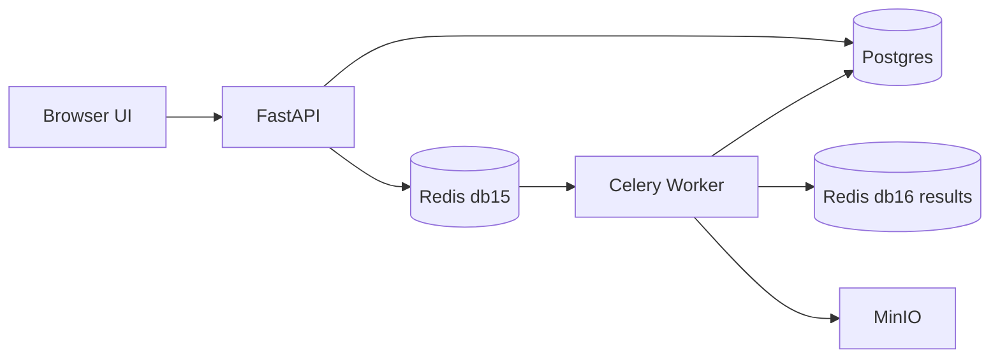

# Tutorial: Onyx-like File Lifecycle with API + Redis + Celery + Postgres + MinIO

This tutorial imitates the Onyx file lifecycle in a simple way:

1. Upload a file from UI
2. Store object in MinIO
3. Insert row in Postgres with `status = COMPLETED`
4. Click delete in UI
5. API updates row to `status = DELETING` and enqueues Celery task in Redis
6. Celery worker dequeues task, deletes object from MinIO, then **deletes the row** from Postgres

This mirrors the relevant Onyx behavior for `user_file`: row is marked `DELETING` first, then removed by background worker once external cleanup is done.

---

## Architecture



---

## Services and ports

| Service | Port (host) | Notes |
|---------|-------------|-------|
| API | `8010` | Web UI + endpoints |
| Redis | `6380` | Broker db15, result db16 |
| Postgres | `5433` | `demo/demo` database `demo` |
| MinIO API | `9000` | S3 endpoint |
| MinIO Console | `9001` | UI (`minioadmin` / `minioadmin123`) |

---

## Start

```bash
cd tutorials/onyx-like-file-lifecycle-demo
docker compose up -d
docker compose ps
```

Open:

- App UI: http://localhost:8010
- MinIO console: http://localhost:9001

---

## What to test (step by step)

## Step 1 — Upload a file from UI

1. Open http://localhost:8010
2. Use **Upload File** form
3. File should appear in table with status `COMPLETED`

### Verify in Postgres

```bash
docker compose exec postgres psql -U demo -d demo -c "SELECT id, filename, status, object_key, created_at FROM file_record ORDER BY created_at DESC;"
```

Expected: new row with `status = COMPLETED`.

### Verify in MinIO

```bash
docker compose exec minio mc alias set local http://localhost:9000 minioadmin minioadmin123
docker compose exec minio mc ls local/demo-files --recursive
```

Expected: uploaded object key exists under `uploads/<uuid>/...`.

---

## Step 2 — Request delete from UI

Click **Delete** on any file row in the UI.

Immediate expected behavior:

- Postgres row changes to `DELETING`
- Celery task is enqueued to Redis queue `file_delete`

### Verify queue enqueue

```bash
docker compose exec redis redis-cli -a redispass -n 15 LLEN file_delete
```

Expected: queue length briefly increases.

### Verify DB interim status

```bash
docker compose exec postgres psql -U demo -d demo -c "SELECT id, filename, status FROM file_record ORDER BY created_at DESC;"
```

Expected: target row shows `DELETING` before worker completes.

---

## Step 3 — Watch worker dequeue and execute

```bash
docker compose logs -f worker
```

You should see task receive/start/complete logs for `demo.delete_file_from_storage`.

### Inspect worker active tasks

```bash
docker compose exec worker celery -A app.celery_app.celery_app inspect active
docker compose exec worker celery -A app.celery_app.celery_app inspect reserved
```

---

## Step 4 — Verify final delete state

### Postgres (row removed)

```bash
docker compose exec postgres psql -U demo -d demo -c "SELECT id, filename, status FROM file_record ORDER BY created_at DESC;"
```

Expected: deleted file row no longer exists.

### Audit table (history preserved)

```bash
docker compose exec postgres psql -U demo -d demo -c "SELECT file_id, filename, event, message, created_at FROM delete_audit ORDER BY created_at DESC LIMIT 20;"
```

Expected:

- `DELETE_REQUESTED` event from API
- `ROW_DELETED` event from worker

### MinIO object removed

```bash
docker compose exec minio mc ls local/demo-files --recursive
```

Expected: object key for deleted file is gone.

---

## Monitor everything live (recommended)

Open 4 terminals:

### Terminal A: queue depth
```bash
while true; do docker compose exec redis redis-cli -a redispass -n 15 LLEN file_delete; sleep 1; done
```

### Terminal B: worker logs
```bash
docker compose logs -f worker
```

### Terminal C: db state
```bash
watch -n 1 "docker compose exec -T postgres psql -U demo -d demo -c \"SELECT status, COUNT(*) FROM file_record GROUP BY status;\""
```

### Terminal D: app
- Use UI upload/delete buttons at http://localhost:8010

---

## Simulate backlog (worker stopped)

Stop worker:

```bash
docker compose stop worker
```

Delete multiple files in UI. Then inspect queue:

```bash
docker compose exec redis redis-cli -a redispass -n 15 LLEN file_delete
```

Expected: backlog grows (`> 0`).

Restart worker:

```bash
docker compose start worker
docker compose logs -f worker
```

Expected: queue drains to 0; DB rows disappear after processing.

---

## Key Onyx-style takeaway

For user-file delete behavior, the practical lifecycle is:

1. **API status update**: `DELETING` (visible in DB/UI)
2. **Async cleanup**: worker deletes index/object-store artifacts
3. **DB row removal**: row deleted once cleanup succeeds

So if you see many `DELETING` rows, root causes are usually:

- queue backlog
- worker not running / too slow
- external dependency failures (MinIO/Vespa/OpenSearch)

---

## Troubleshooting

### API not reachable
```bash
docker compose logs --tail=100 api
```

### Worker not consuming
```bash
docker compose logs --tail=200 worker
docker compose exec redis redis-cli -a redispass -n 15 LLEN file_delete
```

### Redis DB confusion
Use `-n 15` for broker queues and `-n 16` for results.

---

## Stop / cleanup

```bash
docker compose down -v
```
